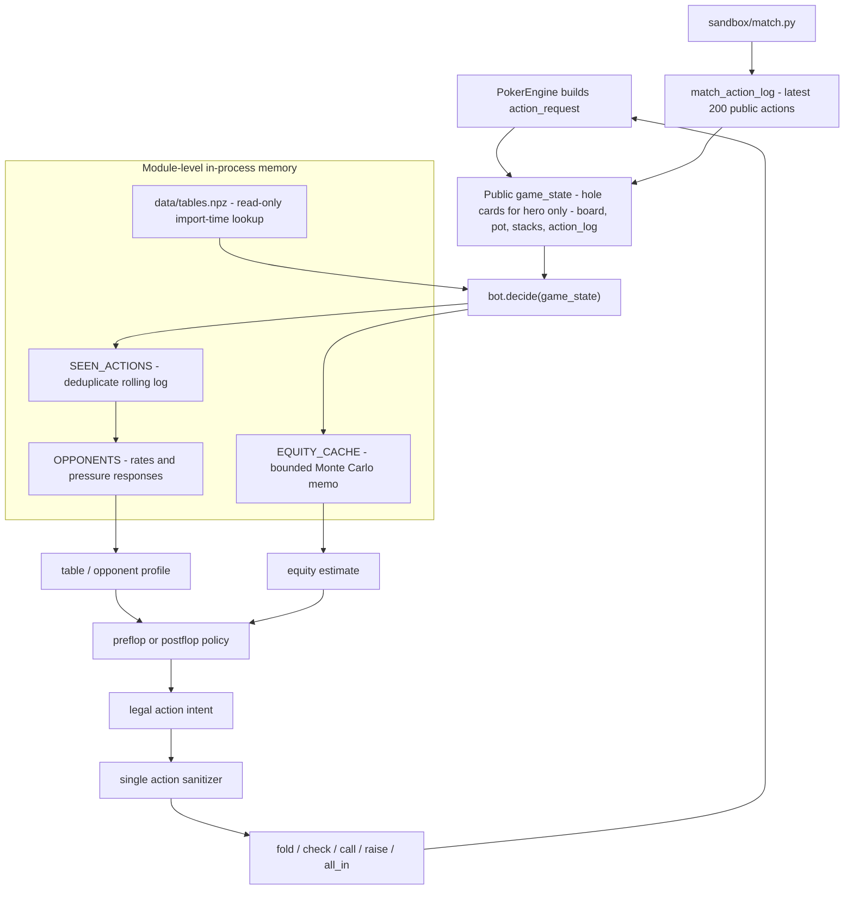
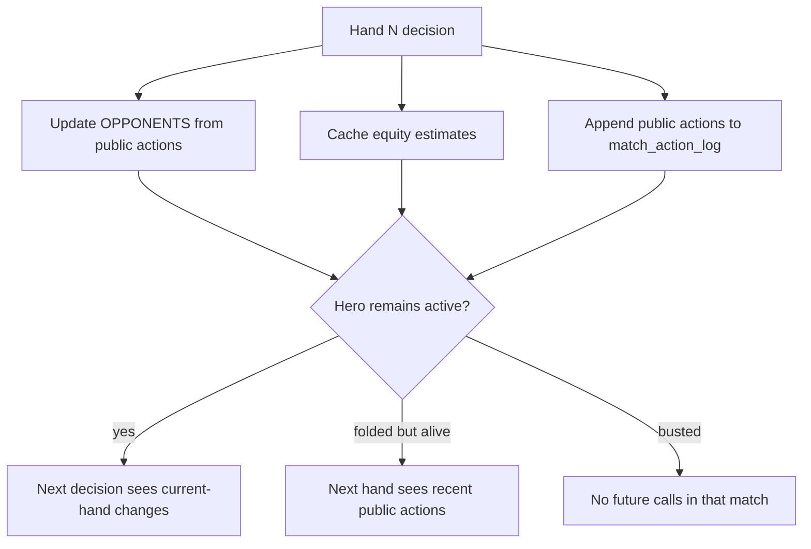

# Bot State, History, And In-Memory Storage

Reviewed: 2026-05-28.

## What `decide()` Receives

The engine calls:

```python
def decide(game_state: dict) -> dict:
    ...
```

Every normal call receives an `action_request` dict for the current decision. The core fields are built in `engine/game.py`:

| Field | Meaning |
| --- | --- |
| `type` | Usually `"action_request"` during gameplay. |
| `hand_id` | Current hand identifier. |
| `street` | `"preflop"`, `"flop"`, `"turn"`, or `"river"`. |
| `seat_to_act` | Your seat index for this action. |
| `pot` | Total chips currently in the pot. |
| `community_cards` | Public board cards as strings. Empty preflop. |
| `current_bet` | Highest total bet on the current street. |
| `min_raise_to` | Minimum legal total bet if raising. |
| `amount_owed` | Chips needed to call. Zero means a free check is possible. |
| `can_check` | Whether you can check. |
| `your_cards` | Your two private hole cards. |
| `your_stack` | Your remaining stack. |
| `your_bet_this_street` | Chips you already put in this street. |
| `players` | Public state for every active seat. |
| `action_log` | Public action history for the current hand. |
| `match_action_log` | Rolling public action history across the current match, injected by `sandbox/match.py`. |

Each `players` entry includes public fields:

```python
{
    "seat": 0,
    "bot_id": "opponent",
    "stack": 9900,
    "state": "active",
    "is_folded": False,
    "is_all_in": False,
    "bet_this_street": 100,
    "hole_cards": None,
}
```

Opponent `hole_cards` are hidden during play.

## What History Is Available

This is not a one-call Markov-only setup. The bot receives public history and can keep its own memory.

Available history:

- `action_log`: current-hand public actions, including blinds, folds, calls, raises, all-ins, and amounts.
- `match_action_log`: up to the latest 200 public action entries across the current match.
- Persistent in-process Python memory, such as module-level dicts and counters.

`match_action_log` entries currently look like:

```python
{
    "hand_num": 12,
    "seat": 3,
    "bot_id": "The Shark",
    "action": "raise",
    "amount": 600,
}
```

Important limits:

- You do not receive opponents' hidden hole cards during play.
- You do not receive other bots' code or private state.
- You do not receive a clean hand-complete callback inside `decide()`.
- You only get called when it is your turn to act.
- If you fold, you are not called again in that hand.
- If you still have chips, your next call in a later hand includes the rolling `match_action_log`, so you can observe public actions that happened after you folded, subject to the 200-entry cap.
- If you bust to zero chips, you are not seated in later hands of that match.

## State And Memory Flow





## What Happens After Your Decision

If you remain active in a hand, the next call to `decide()` will reflect all public changes that occurred before your next turn:

- Other players' public actions.
- Updated pot and stacks.
- Updated current bet and amount owed.
- New community cards if the hand advanced to a later street.
- Updated current-hand `action_log`.
- Updated rolling `match_action_log`.

If you fold, the bot does not act again until a later hand, assuming it still has chips. At that later call, it can inspect `match_action_log` to learn recent public actions after the fold. It cannot see hidden or mucked cards unless those cards are explicitly exposed in a state it receives, which normal action requests do not provide.

## In-Memory Storage Is Allowed

Bots may keep internal numbers in RAM. Use normal Python state:

- Module-level globals.
- Dictionaries, lists, sets, counters, and simple classes.
- Cached features derived from public actions.
- Precomputed data loaded from `data/` at module-import time.

Do not use file I/O, databases, subprocesses, network calls, threads, async event loops, or external services to manage state.

Example:

```python
OPPONENT_STATS = {}
SEEN_ACTIONS = set()

def update_memory(state):
    for action in state.get("match_action_log", []):
        key = (
            action.get("hand_num"),
            action.get("seat"),
            action.get("bot_id"),
            action.get("action"),
            action.get("amount"),
        )
        if key in SEEN_ACTIONS:
            continue
        SEEN_ACTIONS.add(key)

        bot_id = action["bot_id"]
        stats = OPPONENT_STATS.setdefault(bot_id, {
            "actions": 0,
            "raises": 0,
            "calls": 0,
            "folds": 0,
        })

        stats["actions"] += 1
        if action["action"] == "raise":
            stats["raises"] += 1
        elif action["action"] == "call":
            stats["calls"] += 1
        elif action["action"] == "fold":
            stats["folds"] += 1

def decide(state):
    update_memory(state)

    if state["can_check"]:
        return {"action": "check"}
    return {"action": "fold"}
```

## Memory Lifetime

In-memory state persists for the lifetime of the bot process. In local matches, `sandbox/match.py` starts one `BotProcess` per bot for one match and stops it when the match ends.

Practical consequences:

- Memory persists across hands within the same match.
- Memory is lost if the bot process crashes or is restarted.
- Memory is not a reliable way to persist across separate matches, Swiss rounds, submissions, or container restarts.
- The 768 MB memory limit includes imports, loaded data, lookup tables, and any in-memory opponent model.

For cross-hand strategy inside a match, module-level memory is the right tool. For cross-match knowledge, train or prepare offline and ship read-only artifacts in `data/`.

## Current Heuristic Usage

`bots/heuristic/bot.py` currently follows this pattern:

- `OPPONENTS`: per-`bot_id` action and pressure-response statistics.
- `SEEN_ACTIONS`: de-duplicates rolling `match_action_log` entries.
- `EQUITY_CACHE`: memoizes bounded Monte Carlo equity estimates.
- `data/tables.npz`: optional read-only import-time lookup table for preflop scores and reserved tuning arrays.

The promoted strategy uses only public state, in-memory counters, bounded
Monte Carlo, and import-time read-only numpy data. It does not write files or
persist state across matches.

Recent postflop feature work also derives a pot-odds-like sizing suspicion from
the same public pressure-response counters. This is intentionally approximate:
the rolling match log has action and amount fields but no pot-size or street
labels, so the bot cannot build true street-specific fold-to-size stats during
live play.
