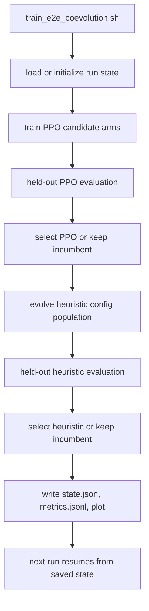

# E2E Coevolution Training

Reviewed: 2026-05-28.

This page is now a route map. The canonical training guide is
`docs/training-pipelines.md`; PPO runtime details are in
`docs/ppo-bot-logic.md`.

## Purpose

`scripts/train_e2e_coevolution.sh` alternates between:

- training PPO strong-mock candidates,
- evaluating PPO candidates against held-out lineups,
- evolving heuristic env-config candidates against the selected PPO,
- selecting the next heuristic and PPO incumbents by risk-adjusted metrics.

It is local-only infrastructure. It does not change the competition bot unless
you intentionally promote a generated heuristic config or PPO artifact.

## Flow



## Default Output

Runs are repo-local and git-ignored:

```text
runs/fullhouse_coevolution/<run-id>/
```

Important files:

| File | Meaning |
| --- | --- |
| `state.json` | Resume contract for next cycle. |
| `metrics.jsonl` | Per-cycle candidate and selected EV records. |
| `ev_progress.svg` | Progress plot generated from `metrics.jsonl`. |
| `ppo_candidates/` | Archived PPO candidate artifacts. |
| `heuristic_generated/` | Generated heuristic wrapper bots/configs. |

## Commands

Resume the default cumulative run:

```bash
WORKERS=0 PARALLEL_BACKEND=process scripts/train_e2e_coevolution.sh
```

Start a clean run:

```bash
RESET=1 WORKERS=0 PARALLEL_BACKEND=process scripts/train_e2e_coevolution.sh
```

Small sanity check:

```bash
RUN_ID=coevolve-smoke \
RESET=1 \
CYCLES=1 \
PPO_ARMS=stable \
PPO_INIT_SAMPLES=2000 \
PPO_GENERATIONS=1 \
PPO_MATCHES_PER_GENERATION=2 \
PPO_HANDS=8 \
EVAL_SEEDS=2 \
EVAL_HANDS=8 \
SELFPLAY_GENERATIONS=1 \
SELFPLAY_POPULATION=4 \
SELFPLAY_MATCHES=2 \
SELFPLAY_HANDS=8 \
scripts/train_e2e_coevolution.sh
```

## Current Guidance

- Treat small cycle runs as smoke tests only.
- Use at least 400-hand held-out matches for promotion decisions.
- Do not promote generated PPO artifacts unless `PROMOTE_PPO=1` is intentional.
- Do not promote heuristic env settings from coevolution without the final
  benchmark gate in `docs/heuristic-benchmark-results.md`.
