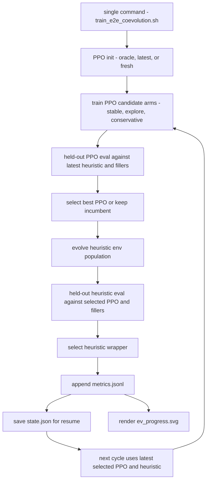

# E2E Coevolution Training

Reviewed: 2026-05-27.

This document records the new single-command pipeline for alternating between
unrestricted PPO-style opponent training and heuristic-bot fine tuning.

The referenced DeepCFR 6-player no-limit repo is not imported directly because
it uses the `pokers` environment and PyTorch checkpoints, while Fullhouse has
different state/action semantics and submission constraints. The parts adopted
here are the workflow ideas that transfer cleanly:

- bootstrap from a policy prior before self-play,
- continue from checkpoints,
- train against mixed/latest checkpoint pools,
- use replayed decision memory,
- clip/normalize learning targets,
- evaluate checkpoints before promotion,
- plot EV/profit progress over time.

Reference: https://github.com/dberweger2017/deepcfr-texas-no-limit-holdem-6-players

## Command

One command runs the full local loop:

```bash
scripts/train_e2e_coevolution.sh
```

By default this writes inspectable, git-ignored artifacts under
`runs/fullhouse_coevolution/coevolve-current/`. Running the same command again
continues from that run's `state.json`: the next cycle number is used, the
latest selected PPO checkpoint is used as the candidate initializer, the latest
selected heuristic wrapper is seated in training/evaluation, and the heuristic
population continues from its previous state.

Start over explicitly with:

```bash
RESET=1 scripts/train_e2e_coevolution.sh
```

Large laptop run:

```bash
WORKERS=0 \
PARALLEL_BACKEND=process \
CYCLES=4 \
PPO_ARMS=stable,explore,conservative \
PPO_INIT=auto \
PPO_INIT_SAMPLES=80000 \
PPO_GENERATIONS=8 \
PPO_MATCHES_PER_GENERATION=48 \
PPO_HANDS=140 \
HEURISTIC_POPULATION=14 \
HEURISTIC_ELITE=4 \
HEURISTIC_MATCHES_PER_GENERATION=24 \
HEURISTIC_HANDS=200 \
EVAL_SEEDS=6 \
EVAL_HANDS=180 \
scripts/train_e2e_coevolution.sh
```

Use a timestamped `RUN_ID` only when you intentionally want a separate
non-resumed experiment. To continue a specific experiment, reuse the same
`RUN_ID`.

Smoke run:

```bash
RUN_ID=coevolve-smoke \
RESET=1 \
CYCLES=1 \
PPO_ARMS=stable \
PPO_INIT_SAMPLES=2000 \
PPO_GENERATIONS=1 \
PPO_MATCHES_PER_GENERATION=2 \
PPO_HANDS=8 \
HEURISTIC_POPULATION=4 \
HEURISTIC_ELITE=2 \
HEURISTIC_MATCHES_PER_GENERATION=2 \
HEURISTIC_HANDS=12 \
EVAL_SEEDS=2 \
EVAL_HANDS=12 \
WORKERS=1 \
scripts/train_e2e_coevolution.sh
```

Outputs are written under:

```text
runs/fullhouse_coevolution/<run-id>/
├── state.json
├── metrics.jsonl
├── ev_progress.svg
├── summary.json
├── ppo_candidates/
└── heuristic_generated/
```

`ev_progress.svg` is generated by `tools/plot_training_progress.py`.

`state.json` is the resume contract. It records `next_cycle`, selected PPO and
heuristic paths, the heuristic population, and Python RNG state. The script
does not delete `metrics.jsonl` during normal operation, so plots accumulate
across repeated invocations.

## Flow



## PPO Changes

`tools/strong_mocks/train_real_policy.py` now has a more serious PPO-style
update:

- actor head for action logits,
- value head for a baseline,
- clipped policy-ratio update,
- replay over recent decision batches,
- feature normalization from collected rollouts,
- gradient clipping,
- strategic all-in masking during PPO training and model inference,
- checkpoint export gates and early stopping from the previous training fix.

The submitted heuristic bot does not import this trainer. The trained PPO
artifacts are benchmark opponents only unless explicitly promoted.

## Heuristic Fine Tuning

`tools/strong_mocks/self_train_heuristic.py` now accepts extra opponents, so
the latest selected PPO can be seated in every heuristic self-training
generation.

The mutation space includes:

- preflop thresholds and raise sizes,
- call/risk/value thresholds,
- bluff and delayed-probe controls,
- off-bucket sizing controls,
- blocker and board-pair controls.

This covers the previously deferred "full preflop matrix tuning" direction as
an offline threshold/action-policy search. It still does not hard-code a new
default into `bots/heuristic/bot.py`; promotion requires larger held-out
benchmarks.

## Parameter Choices

The pipeline avoids relying on a single blind PPO setting by evaluating arms:

| Arm | Purpose |
| --- | --- |
| `stable` | Lower learning rate, moderate entropy, default choice. |
| `explore` | Higher entropy and temperature to find new lines. |
| `conservative` | Lower temperature and stronger value baseline. |

The selected PPO can be initialized from:

| Init | Meaning |
| --- | --- |
| `oracle` | Train an oracle-imitation policy before real rollout fine tuning. |
| `latest` | Continue from the latest selected PPO artifact. |
| `fresh` | Start from random weights. |
| `auto` | Use oracle only for cycle 0 of a new run, then use latest thereafter. |

Use `auto` for normal cumulative runs. Use `oracle`, `latest`, or `fresh` only
when deliberately testing one initializer.

## Promotion Policy

The coevolution script archives candidates by default. It only overwrites
`bots/strong_mocks/ppo_policy/data/policy.npz` when `PROMOTE_PPO=1` is set.

Do not promote heuristic env settings directly from a small coevolution run.
Read the winning wrapper's `data/config.json`, then run the normal
`strong-screen`, promotion, and final benchmark gates.

## Validation

Run after changing this pipeline:

```bash
poetry run python -m py_compile tools/coevolve_training.py tools/plot_training_progress.py tools/strong_mocks/train_real_policy.py tools/strong_mocks/self_train_heuristic.py
poetry run pytest -q tests/test_coevolution_training.py tests/test_real_policy_training.py tests/test_league_training.py
bash -n scripts/train_e2e_coevolution.sh
```

Latest progress smoke:

- `coevolve-progress-codex`
- PPO incumbent score started at `-19000.0`.
- Cycle 0 selected oracle-initialized `stable` PPO at score `-6282.64`.
- Cycle 1 selected `explore` PPO at score `-6400.94` after rejecting the weaker
  cycle-1 incumbent score of `-14714.90`.
- PPO training deltas showed within-run learning in the selected arms:
  `stable` moved from `-5540.88` to `+9469.75`; `explore` moved from
  `+3698.13` to `+3835.13`.
- Heuristic cycle 0 held-out score was `3513.30`; cycle 1 selected a mutated
  `spr_anti_bucket` wrapper with positive held-out mean but lower risk score
  (`1530.16`), so this is evidence that the loop works, not evidence to promote
  that heuristic config.
- Plot generated at
  `runs/fullhouse_coevolution/coevolve-progress-codex/ev_progress.svg`.

The smoke proves the E2E loop, PPO candidate improvement, checkpoint gating,
metrics, and plotting work. It is not a promotion sample; it is intentionally
small.
