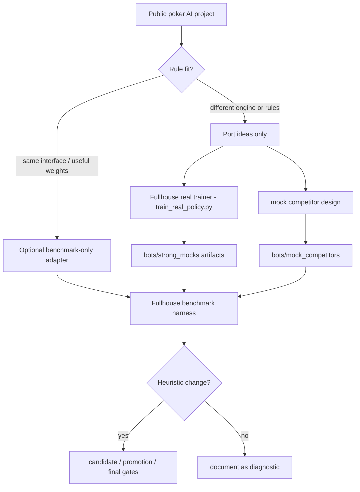

# External Poker AI Benchmark Plan

Reviewed: 2026-05-27.

This document records the public RL/deep-learning poker baselines that are realistic enough to consider for offline tuning of `bots/heuristic/bot.py`.

The goal is not to train or distill those systems. The goal is to run our heuristic bot against stronger or different opponents, then tune our own interpretable parameters.

Current status: local mock competitors are already implemented under
`bots/mock_competitors/` and are the primary rule-matched substitute for
external RL/NN/CFR systems. External projects remain optional diagnostics
because they do not match the Fullhouse interface as closely.

As of 2026-05-27, the local mock suite includes expanded families for equity
bots, bucket/CFR-like policies, trained numpy-policy variants, anti-heuristic
adaptation, heads-up pressure, and stronger benchmark-only trained opponents
under `bots/strong_mocks/`. These are more actionable than external projects
because they run directly through `sandbox/match.py` with Fullhouse state,
blinds, stacks, and action semantics.

## Rule-Matched Test Envelope

Use Fullhouse rules as the benchmark source of truth:

- Python `decide(game_state)` bot interface.
- No-Limit Texas Hold'em.
- 50/100 blinds, 10,000 starting stack.
- 400 hands per match.
- Usually 6-bot tables.
- Ranking signal is cumulative chip delta.
- 2 seconds per action.
- No network during gameplay.
- No runtime file writes.
- 768 MB RAM and 0.5 CPU per bot.
- Approved libraries are `eval7`, `numpy`, `scipy`, `treys`, and `scikit-learn`.

Sources:

- Fullhouse repo README: https://github.com/uzlez/fullhouse-engine
- Fullhouse website: https://fullhousehackathon.com/
- Local rule docs: `docs/restrictions.md`, `docs/project-overview.md`

Rule-matched local command:

```bash
poetry run python tools/select_heuristic_config.py \
  --preset final \
  --config baseline \
  --hands 400 \
  --progress \
  --json
```

## Refactoring Decision

Do not refactor `bots/heuristic/bot.py` for external models.

Reasons:

- The submitted bot should stay single-file and validator-shaped.
- Fullhouse does not allow PyTorch, TensorFlow, Ray, network calls, subprocess control, dynamic imports, or runtime file writes inside the submitted bot.
- External public models use different engines, action abstractions, stack depths, and dependencies.
- Any adapter should be benchmark-only and outside the submitted bot path.

Allowed benchmark-only structure:

```text
tools/external_benchmarks/
  README.md
  adapters/
    alpha_nl_holdem_adapter.py
    deepcfr_pokers_adapter.py
```

Do not put large checkpoints in git. Keep them under an ignored local path such as `external_models/` or `/private/tmp/fullhouse_external_models/`.

Current rule-matched mock structure:

```text
bots/mock_competitors/
  common.py                     # local-only helper shared by variants
  equity_tight/
  equity_loose/
  equity_pressure/
  bucket_halfpot/
  bucket_overbet/
  bucket_mixed/
  anti_heuristic/
  pressure_heads_up/
  numpy_policy_value/
    data/policy.npz
  numpy_policy_bluff/
    data/policy.npz
  numpy_policy_station/
    data/policy.npz
  numpy_policy_folder/
    data/policy.npz
  numpy_policy_pressure/
    data/policy.npz

bots/strong_mocks/
  oracle_imitation/
    data/policy.npz
    data/policy_value.npz
  ppo_policy/
    data/policy.npz
  cfr_bucket/
    data/policy.npz
  rollout_search/
  ensemble/
```

These mocks are benchmark-only and intentionally not submission-shaped as a
single portable package because several variants import shared local helpers.
Run them locally through the benchmark harness.

## External-To-Local Adaptation Flow



## Candidate Ranking

| Rank | Candidate | Practical Status | Fit For Our Goal | Verdict |
| ---: | --- | --- | --- | --- |
| 1 | AlphaNLHoldem | Provides week-trained checkpoints through Google Drive/Baidu; runnable against its neural-net UI; TensorFlow/Ray; heads-up only. | Useful as a heads-up neural opponent and bet-sizing sanity check. | Best pretrained option, but not rule-matched. |
| 2 | DeepCFR 6-player NLHE repo by dberweger2017 | Source-first, 6-player NLHE, PyTorch, `pokers` environment, checkpoint play supported; no official pretrained checkpoint in repo. | Best shape match to Fullhouse if we can train a small checkpoint locally. | Best trainable option; run only if install/training is smooth. |
| 3 | DecisionHoldem | Strong heads-up agent; blueprint data distributed through Baidu; C++/compiled components; AGPL; workstation-scale original training. | Potentially strong heads-up baseline if data and Mac build work. | High setup risk on Mac; not first choice. |
| 4 | jeffelin/CFR_pokerbot | MIT Pokerbots 2026 Toss Hold'em CFR+ and hybrid architecture. | Useful ideas: CFR+, explicit abstraction, opponent categories, hybrid selector. | Port concepts only; Toss rules are incompatible with Fullhouse. |
| 5 | Slumbot | Strong public heads-up benchmark through website/API. | Useful outside Fullhouse for sanity checks only. | Not rule-matched; network API cannot be part of Fullhouse local match/sandbox. |
| 6 | RLCard | Excellent research toolkit; supports no-limit-holdem and algorithms; model zoo mostly Leduc/limit/rule models. | Good for experiments, poor as a ready NLHE opponent. | Do not use as primary benchmark unless training a toy model. |
| 7 | OpenSpiel | High-quality game/RL framework with poker examples and algorithms. | Useful for theory and toy poker; not a pretrained NLHE opponent. | Not a practical benchmark opponent this week. |
| 8 | DeeperStack | Implements DeepStack-like HUNL; full counterfactual value models are not included. | Interesting architecture reference. | Reject for this week. |
| 9 | Pluribus clones | Public clones exist, but no credible released Pluribus policy/weights. | Tempting because 6-max, but not runnable as a real benchmark. | Reject. |
| 10 | G5 poker bot | Public C++/C# code; ACPC 6-max winner; Windows/Visual Studio oriented. | Strong historical opponent if buildable. | Too much platform/build risk on Mac this week. |

## Candidate Notes

### AlphaNLHoldem

Source: https://github.com/bupticybee/AlphaNLHoldem

Why it matters:

- It is explicitly a neural self-play no-limit Hold'em implementation.
- The project states that all checkpoint weights from about a week of training are released.
- It has a direct play-against-neural-net path.

Limitations:

- It is heads-up only.
- It uses RLCard no-limit Hold'em with 50 BB stacks, not Fullhouse 100 BB stacks.
- The README itself warns about environment issues such as pot sizes and postflop action order.
- It uses TensorFlow/Ray, so it is offline-benchmark-only.
- License is AGPL with an additional commercial-use warning in the README; treat it as research/reference only.

Recommendation:

- Use first if we want a pretrained neural opponent quickly.
- Do not use its win rate as a Fullhouse forecast.
- Use it to tune broad heads-up anti-neural parameters only: call margin, bluff frequency, value threshold, and raise-size families.

### DeepCFR 6-Player NLHE

Source: https://github.com/dberweger2017/deepcfr-texas-no-limit-holdem-6-players

Why it matters:

- It targets 6-player no-limit Hold'em.
- Current README says random-opponent training, checkpoint continuation, self-play from checkpoint, mixed checkpoint training, CLI play, and tests work.
- It uses a network with action probabilities and continuous raise sizing, which is closer to what we want to stress-test than fixed-size rule bots.

Limitations:

- No official pretrained checkpoint is present in the repo README.
- It uses the `pokers` engine, not Fullhouse.
- Training quality under 3 days on a MacBook Air M3 is uncertain; a small checkpoint is likely runnable, but strength is not guaranteed.

Recommendation:

- This is the best second step after AlphaNLHoldem.
- Try a small local checkpoint only after dependency install is isolated outside this repo.
- If it trains overnight, use its checkpoints as diverse local opponents, not as truth.

### DecisionHoldem

Source: https://github.com/AI-Decision/DecisionHoldem

Why it matters:

- It is a strong heads-up no-limit system with blueprint plus real-time search.
- The README says the required blueprint/cluster data can be obtained through Baidu Netdisk.

Limitations:

- Original blueprint training used a 48-core workstation for 3-4 days.
- The released project includes compiled pieces and C++ components.
- MacBook Air setup risk is high.
- Heads-up only.

Recommendation:

- Defer unless AlphaNLHoldem fails and a strong HUNL baseline is still needed.

### jeffelin/CFR_pokerbot

Source: https://github.com/jeffelin/CFR_pokerbot

Why it matters:

- It documents a CFR+ / hybrid CFR architecture with explicit hand/board
  abstraction, Bayesian opponent categories, and a strategy selector.
- It is closer to hackathon-style practical bot design than a pure academic
  solver.

Limitations:

- The repo targets MIT Pokerbots 2026 Toss Hold'em, not normal two-card
  Fullhouse NLHE.
- Toss Hold'em gives three hole cards and includes a face-up discard after the
  flop. Those mechanics do not exist in Fullhouse.
- MIT engine protocol and bot file layout are not compatible with
  `decide(game_state)`.

Adaptation:

- Do not copy Toss-specific code.
- Port the compatible training ideas into local Fullhouse tools:
  `--bucket-update cfr-plus` and `--abstraction cfr-pokerbot` in
  `tools/strong_mocks/train_real_policy.py`.
- Keep it benchmark-only under `bots/strong_mocks/cfr_bucket/data/policy.npz`.

### Slumbot

Source: https://www.slumbot.com/

Why it matters:

- Strong public HUNL opponent.
- Public API is useful for independent sanity checks.

Limitations:

- Network API, so not compatible with Fullhouse sandbox rules.
- Heads-up only.
- Cannot be used inside `sandbox/match.py` if we are trying to keep rule-matched local tests.

Recommendation:

- Keep out of Fullhouse match automation.
- Use manually or with a separate script only if we explicitly want a non-rule-matched HUNL sanity check.

## Immediate Execution Plan

1. Keep the Fullhouse benchmark harness and `bots/mock_competitors/` suites as the primary tuning signal.
2. Train/update mock numpy-policy variants before using the expanded mock
   suites if `policy.npz` files are stale:
   `poetry run python tools/train_mock_numpy_policy.py --all --samples 60000 --seed 7331`.
3. Train/update strong mock artifacts before using the strong suites if their
   `.npz` files are stale. See
   `docs/strong-mock-self-training-pipeline.md` for commands.
4. Use `tools/select_heuristic_config.py --preset mock-family` for a focused
   screen against the expanded local families.
5. Use `tools/select_heuristic_config.py --preset strong-screen` for a focused
   screen against stronger benchmark-only trained/rollout opponents.
6. Use the public model inventory only to choose optional external opponents.
7. If adding an external model, integrate it as a benchmark-only adapter and keep model artifacts ignored.
8. Do not promote bot defaults from external benchmarks alone; rerun the local candidate/promotion/final screens.
9. Prefer this order:
   1. AlphaNLHoldem pretrained checkpoint for quick neural heads-up pressure.
   2. DeepCFR 6-player small locally trained checkpoint if dependency install and smoke training pass.
   3. DecisionHoldem only if the Baidu data and Mac build are confirmed.
10. Do not change `bots/heuristic/bot.py` structure for external dependencies.

## What To Measure Against External Models

For any external baseline, record:

- Engine and stack-depth mismatch.
- Hands per run.
- Number of runs.
- Mean, median, min, max, standard deviation.
- Bust count.
- Invalid-action/error count.
- Which heuristic parameters changed.

Do not accept a tuning change unless it also passes:

```bash
poetry run pytest -q
poetry run python sandbox/validator.py bots/heuristic/bot.py
poetry run python tools/select_heuristic_config.py --preset final --config baseline --progress --json
```
