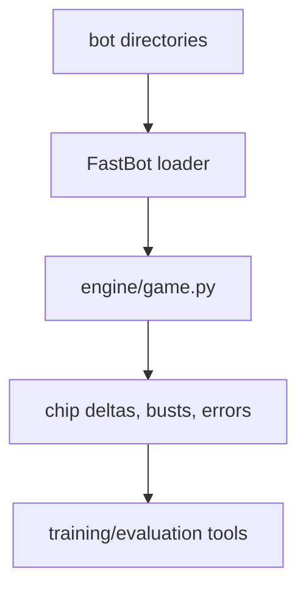

# Fast Training Runner

Reviewed: 2026-05-28.

`training/fast_match.py` is the unrestricted in-process match runner used by
local training and benchmark tooling. It is not the production sandbox.

## Use It For

- large local benchmark batches,
- PPO/bucket rollout collection,
- heuristic self-training,
- quick bot-directory smoke tests.

Use `sandbox/match.py` and `sandbox/validator.py` for final submission
compatibility.

## Flow



## Command Shape

```bash
poetry run python -m training.fast_match \
  bots/heuristic \
  bots/strong_mocks/ensemble \
  bots/shark \
  --hands 400 \
  --repeat 32 \
  --workers 0 \
  --parallel-backend process \
  --json
```

Shared guidance for parallelism, output locations, and promotion gates is in
`docs/training-pipelines.md`.
