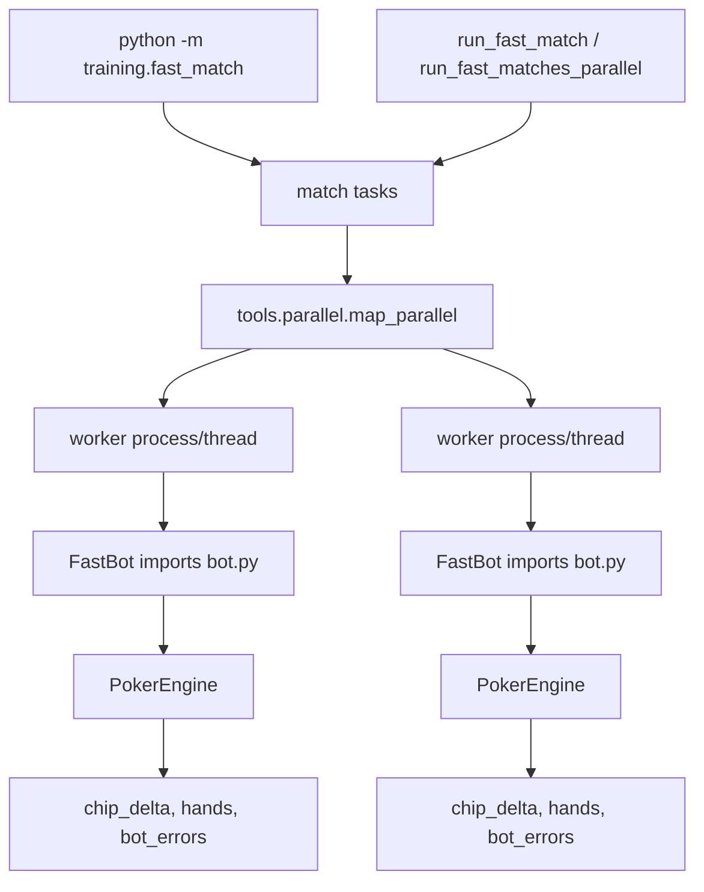
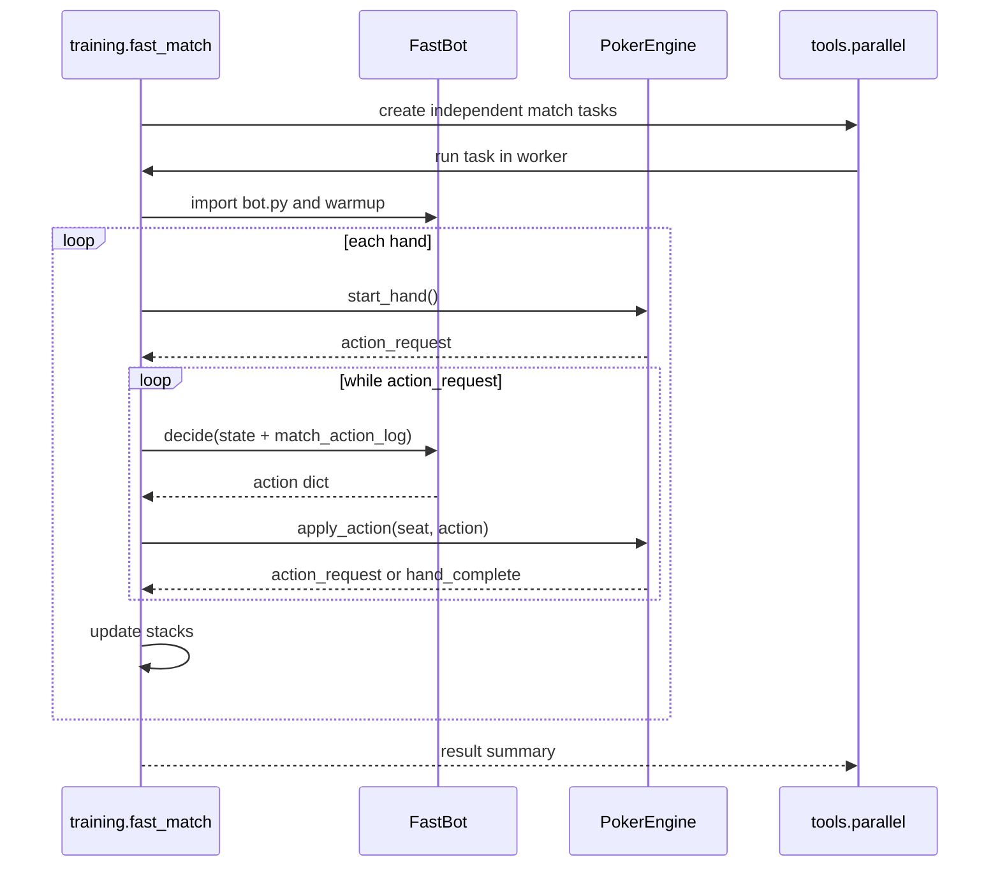

# Fast Training Runner

Reviewed: 2026-05-27.

## Goal

`training/fast_match.py` is the local-only match runner for fast opponent
training and large validation batches. It keeps `engine.game.PokerEngine` as
the single rule source, but bypasses the official sandbox process boundary:

- no Docker,
- no subprocess runner,
- no 2-second action timeout,
- no CPU or memory cap,
- process/thread parallelism across independent matches.

Use it for training and benchmark throughput. Use `sandbox/match.py`,
`sandbox/validator.py`, and `tools/harden_submission.py` for final
submission-like checks.

## Repo Structure

```text
training/
  __init__.py
  fast_match.py

tests/
  fast_bots/
    call_check/
    fold_check/
    min_raise/
    sleepy/
  test_fast_match.py

docs/
  fast-training-runner.md
```

The official frozen files stay unchanged:

```text
engine/game.py
sandbox/runner.py
db/schema.sql
```

This gives training tools a faster path without risking rule drift in the
competition code path.

## Architecture



`FastBot` loads `bot.py` in-process with a unique module name and sets
`BOT_PATH` and `BOT_DATA_DIR` during import so directory, single-file, and zip
submissions behave like the official match runner.

The real policy trainer also uses `FastBot` for `--opponent-pool adversarial`,
so trainable PPO/bucket policies can learn against real local `bot.py`
opponents without launching the official subprocess sandbox.

## Runtime Flow



## CLI

Single fast match:

```bash
poetry run python -m training.fast_match \
  bots/heuristic \
  bots/shark \
  bots/mathematician \
  --hands 400 \
  --seed 1 \
  --json
```

Parallel batch:

```bash
poetry run python -m training.fast_match \
  bots/heuristic \
  bots/strong_mocks/ensemble \
  bots/mock_competitors/equity_mc \
  bots/mock_competitors/opponent_modeler \
  bots/benchmarks/threshold_caller \
  bots/shark \
  --hands 400 \
  --repeat 64 \
  --workers 0 \
  --parallel-backend process \
  --json
```

`--workers 0` auto-selects up to `os.cpu_count()` workers, capped by task
count. Use `process` for serious training and validation. Use `thread` only
for quick local checks where process startup dominates.

## Python API

```python
from training.fast_match import run_fast_match, run_fast_matches_parallel

bot_paths = {
    "heuristic": "bots/heuristic",
    "shark": "bots/shark",
}

result = run_fast_match("debug", bot_paths, n_hands=400, seed=7)

tasks = [
    {"match_id": f"batch_{seed}", "bot_paths": bot_paths, "n_hands": 400, "seed": seed}
    for seed in range(64)
]
results = run_fast_matches_parallel(tasks, workers=0, backend="process")
```

## Parity Tests

The parity test compares `training.fast_match.run_fast_match()` against
`sandbox.match.run_match()` for deterministic bots and identical seeds. It
checks final stacks, chip deltas, compact per-hand results, and bot errors.

Run:

```bash
poetry run pytest -q tests/test_fast_match.py
```

Current coverage:

- deterministic parity with official sandbox orchestration,
- process-parallel batch equivalence with sequential fast matches,
- `--workers 0` auto-selection in the shared parallel helper,
- no action timeout in the fast runner.

## Limitations

- This is not a security sandbox. Do not use it to validate submission
  compliance.
- In-process imports are faster but weaker isolation than subprocesses. Bots
  with helper modules using the same import names can interact through
  `sys.modules`; use process workers for serious batches.
- Thread workers can run matches concurrently but share one Python process, so
  process workers are safer for stateful bots.
- The fast runner catches bot exceptions and folds, matching the practical
  match-level behavior, but it does not enforce validator restrictions.

## When To Use Which Runner

| Task | Runner |
| --- | --- |
| Fast training rollouts | `training.fast_match` |
| Large seed sweeps with unrestricted local bots | `training.fast_match` |
| Official-like local match with subprocess protocol | `sandbox.match` |
| Submission package validation | `sandbox.validator` |
| Final hardening before upload | `tools/harden_submission.py` |
