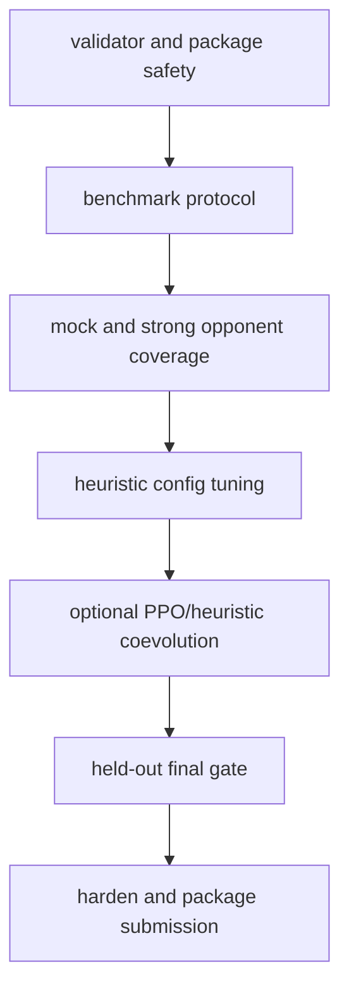

# Short-Horizon Execution Plan

Reviewed: 2026-05-28.

This file keeps the original four-day planning intent but removes stale
historical benchmark numbers. For current training commands, use
`docs/training-pipelines.md`. For active benchmark gates, use
`docs/heuristic-benchmark-results.md`.

## Constraints

- Keep `bots/heuristic/bot.py` validator-shaped and submission-safe.
- Do not import runtime-heavy ML libraries into the submitted bot.
- Use `data/` only for small read-only tables loaded at module import.
- Optimize against Fullhouse rules: 400-hand matches, 6-max tables,
  2 seconds/action, no network, no runtime file writes, 768 MB RAM, 0.5 CPU.
- Prefer changes that improve held-out benchmark score and reduce bust
  frequency.

## Current Status

| Area | Status | Next Action |
| --- | --- | --- |
| Mock competitor zoo | Implemented | Keep suites current when new opponent ideas appear. |
| Strong mocks | Implemented | Train and evaluate through `docs/training-pipelines.md`. |
| PPO strong mock | Implemented, still high variance | Use larger held-out samples and risk gates. See `docs/ppo-bot-logic.md`. |
| Heuristic self-training | Implemented | Treat generated configs as candidates until final gate. |
| Explicit 169 preflop table | Implemented | Retune thresholds only through candidate/final screens. |
| Optional lookup data | Implemented | Rebuild before packaging if table definitions change. |
| SPR/off-bucket controls | Active default knobs | Retune only against fresh incumbent comparisons. |
| Trap/probe/blocker controls | Candidate-only | Promote only after held-out final matrix. |
| Runtime bandit | Deferred | Keep learning offline until reward attribution is more reliable. |

## Work Order



## Near-Term Tasks

1. Keep documentation and skill references aligned with the current pipeline.
2. Run PPO-fix sanity checks with enough held-out seeds before trusting PPO
   selection.
3. Use `tools/select_heuristic_config.py --preset promotion` for candidate
   screens and `--preset final` for defaults.
4. Rebuild optional heuristic tables only when definitions change.
5. Package with `tools/harden_submission.py` before upload.

## Commands

Benchmark final incumbent:

```bash
poetry run python tools/select_heuristic_config.py \
  --preset final \
  --config baseline \
  --progress \
  --json
```

Run cumulative coevolution:

```bash
WORKERS=0 PARALLEL_BACKEND=process scripts/train_e2e_coevolution.sh
```

Harden submission:

```bash
poetry run python tools/harden_submission.py --json
```
