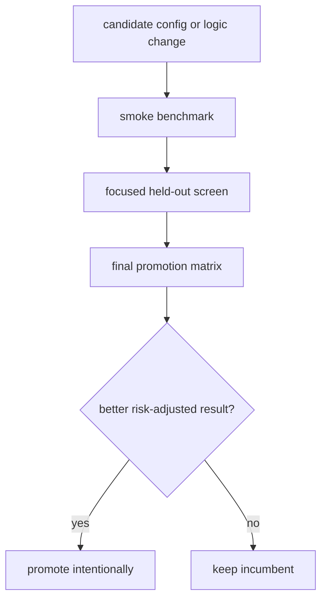

# Heuristic Benchmark Results

Reviewed: 2026-05-28.

This document is now the active benchmark protocol and result index. Historical
performance tables were removed from active guidance because they were easy to
misread as current performance.

Repo-local run artifacts live under `runs/`, which is git-ignored. Use those
JSON summaries and plots for exact numeric history.

## Current Source Of Truth

| Question | Source |
| --- | --- |
| What command should I run for a benchmark? | This file. |
| How does training and coevolution work? | `docs/training-pipelines.md`. |
| How does the heuristic bot decide? | `docs/heuristic-bot-logic.md`. |
| How does the PPO strong mock decide? | `docs/ppo-bot-logic.md`. |
| What exact numbers came from a run? | The matching `runs/**/summary.json`, `metrics.jsonl`, or saved JSON output. |

## Benchmark Principle

Use enough samples to make the result actionable. Tiny smoke tests only prove
that the harness runs.

For promotion decisions, prefer:

```text
400 hands per match
64-128 held-out seeds for focused screens
100+ runs per major configuration when time allows
```

## Metrics

Track at least:

| Metric | Why it matters |
| --- | --- |
| `mean_delta` | Primary chip-EV signal. |
| `median_delta` | Robustness against one huge outlier. |
| `stdev_delta` | Volatility. |
| `min_delta` | Worst-case risk. |
| `bust_count` / `bust_rate` | Tournament survival risk. |
| `positive_runs` | How often the config wins chips. |
| `error_count` | Reliability and invalid-action regressions. |

Risk-adjusted ranking should penalize variance, worst-case losses, busts, and
bot errors. Raw mean delta alone is not enough.

## Promotion Flow



## Core Commands

Focused selector run:

```bash
poetry run python tools/select_heuristic_config.py \
  --preset promotion \
  --config baseline \
  --progress \
  --json
```

Final selector run:

```bash
poetry run python tools/select_heuristic_config.py \
  --preset final \
  --config baseline \
  --progress \
  --json
```

Direct evaluator:

```bash
poetry run python tools/evaluate_heuristic.py \
  --preset final \
  --hands 400 \
  --seeds 100 \
  --json
```

Strong-mock focused screen:

```bash
poetry run python tools/select_heuristic_config.py \
  --preset strong-screen \
  --config baseline \
  --progress \
  --json
```

## What To Record For New Runs

When a run matters, write a short dated note in this file with:

- command,
- run artifact path under `runs/`,
- candidate/config names,
- hand count and seed count,
- mean/median/stdev/min delta,
- bust and error counts,
- decision: promote, reject, or rerun larger.

Do not paste large historical tables here. Keep exact bulk results in the run
artifact directory.

## Current Active Notes

- The active competition bot is `bots/heuristic`.
- Strong mocks are benchmark opponents only.
- PPO mock training previously had unstable learning due rollout/inference and
  call-off issues; see `docs/ppo-bot-logic.md` for the corrected runtime and
  training assumptions.
- Any future default change should be judged against a fresh final matrix, not
  against historical tables.
