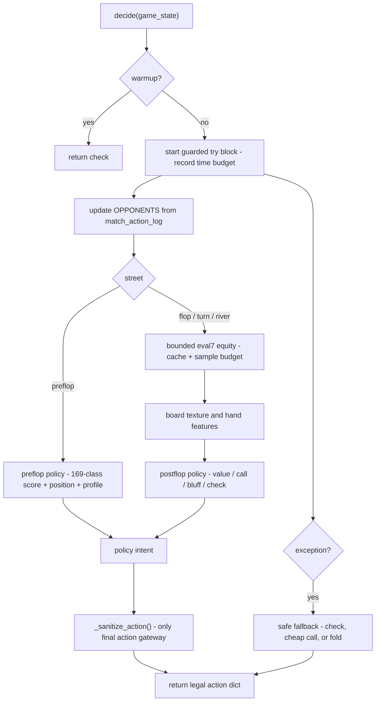
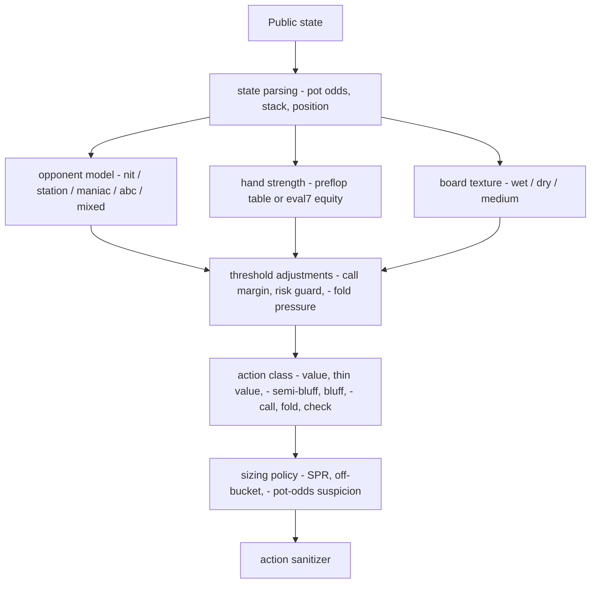
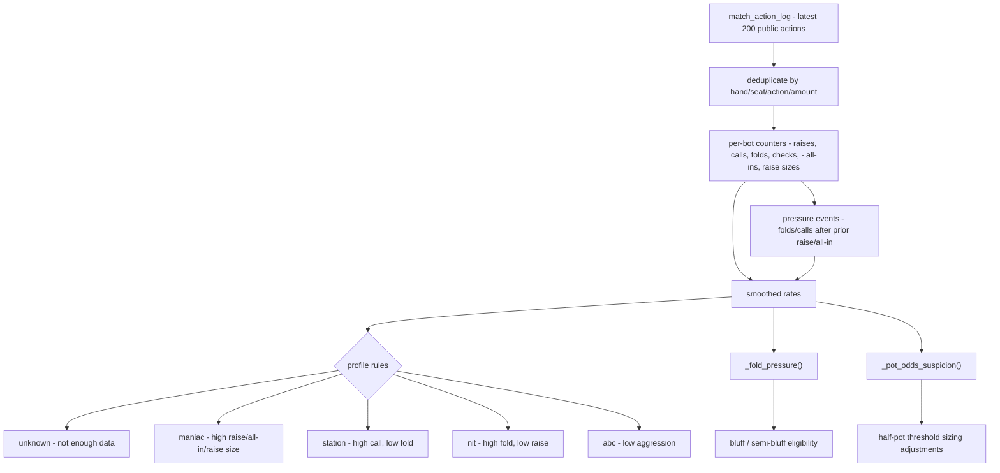

# Heuristic Bot Logic

Reviewed: 2026-05-28.

This document explains the current logic in `bots/heuristic/bot.py` and records improvement directions for future tuning.

## High-Level Design

The bot is an interpretable population-exploit bot. It is not a solver and does not try to approximate a full GTO strategy.

Its core idea:

1. Play a conservative tight-aggressive baseline.
2. Estimate hand strength fast enough to stay far below the 2-second action limit.
3. Track public opponent actions in memory.
4. Classify opponents into simple behavioral types.
5. Adjust call thresholds, bluff frequency, and bet sizing by table profile.
6. Route every final decision through one action sanitizer so illegal outputs are avoided.

The submitted bot is intentionally a single file:

```text
bots/heuristic/bot.py
```

That keeps the production submission close to the tournament's simplest valid format: one root `bot.py`.

## Runtime Contract

The only public entrypoint is:

```python
def decide(game_state):
    ...
```

The current implementation:

- Records `started_at = time.perf_counter()` for internal budget control.
- Returns `{"action": "check"}` for warmup states.
- Updates in-memory opponent statistics from `match_action_log`.
- Uses `_preflop_policy()` before the flop.
- Uses `_estimate_equity()` plus `_postflop_policy()` after the flop.
- Sanitizes every policy intent through `_sanitize_action()`.
- Catches all internal exceptions and returns a conservative fallback action.

This makes reliability a first-class strategy feature: crashes, malformed returns, and timeouts are often worse than a slightly conservative fold.

## Decision Flow



## Policy Layers



## Constants And Tunables

Important constants:

| Name | Current Value | Purpose |
| --- | ---: | --- |
| `BIG_BLIND` | `100` | Fullhouse blind size. |
| `DECIDE_BUDGET_S` | `1.65` | Internal soft limit below the engine's 2-second timeout. |
| `EQUITY_BUDGET_S` | `0.20` | Max time allocated to one Monte Carlo equity estimate. |
| `EQUITY_CACHE_MAX` | `4096` | Equity cache reset threshold. |
| `SEEN_ACTIONS_MAX` | `1200` | Action de-duplication reset threshold. |

Local tuning env vars:

| Env Var | Default | Purpose |
| --- | ---: | --- |
| `HEURISTIC_RNG_SEED` | unset | Optional deterministic bot-local RNG seed for evaluation. |
| `HEURISTIC_CALL_MARGIN_BASE` | `0.075` | Base call margin over raw pot odds. |
| `HEURISTIC_CALL_MARGIN_MULTIWAY` | `0.035` | Extra call margin per extra opponent. |
| `HEURISTIC_RISK_REQ_LOW` | `0.76` | Required equity when risking at least 28% of stack. |
| `HEURISTIC_RISK_REQ_MID` | `0.86` | Required equity when risking at least 45% of stack. |
| `HEURISTIC_RISK_REQ_HIGH` | `0.92` | Required equity when risking at least 70% of stack. |
| `HEURISTIC_RISK_CUTOFF_LOW` | `0.28` | Low stack-risk cutoff. |
| `HEURISTIC_RISK_CUTOFF_MID` | `0.45` | Mid stack-risk cutoff. |
| `HEURISTIC_RISK_CUTOFF_HIGH` | `0.70` | High stack-risk cutoff. |
| `HEURISTIC_VALUE_THRESHOLD_BASE` | `0.66` | Base postflop value-bet threshold. |
| `HEURISTIC_THIN_VALUE_BASE` | `0.59` | Base thin-value threshold. |
| `HEURISTIC_DRY_BLUFF_PROB` | `0.45` | Mixed bluff probability on dry boards. |
| `HEURISTIC_WET_BLUFF_PROB` | `0.25` | Mixed semi-bluff probability on wet boards. |
| `HEURISTIC_NORMAL_VALUE_FRACTION` | `0.52` | Normal postflop value bet fraction of pot. |
| `HEURISTIC_PRESSURE_VALUE_FRACTION` | `0.75` | Larger value bet fraction on wet boards or loose profiles. |
| `HEURISTIC_THIN_VALUE_FRACTION` | `0.45` | Thin-value bet fraction. |
| `HEURISTIC_DRY_BLUFF_FRACTION` | `0.42` | Dry-board bluff/steal bet fraction. |
| `HEURISTIC_WET_SEMI_BLUFF_FRACTION` | `0.55` | Wet-board draw semi-bluff fraction. |
| `HEURISTIC_HIGH_EQUITY_RAISE_FRACTION` | `0.85` | Rare high-equity raise fraction when facing a small bet. |
| `HEURISTIC_SPR_*` | promoted defaults | Stack-to-pot commitment and call-margin adjustments. |
| `HEURISTIC_OFF_BUCKET_*` | promoted defaults | Low-frequency sizing perturbations for bucket/threshold opponents. |
| `HEURISTIC_PREFLOP_*` | varies | Preflop open/call/reraise thresholds and bet sizes. |
| `HEURISTIC_EQUITY_ADJ_*` | varies | Context corrections applied after raw Monte Carlo equity. |
| `HEURISTIC_EXTRA_LARGE_BET_*` | `0.0` / `0.70` | Candidate-only extra penalty for large bets from non-maniac profiles. |
| `HEURISTIC_MIXED_PRESSURE_*` | `0.0` | Candidate-only call/risk guard bonuses for mixed high-pressure 6-max tables. |
| `HEURISTIC_HU_LEAD_MANIAC_*` | `0.04` / `0.08` | Heads-up stack-lead protection against maniacs; env-tunable for screens. |
| `HEURISTIC_TRAP_CHECK_*` | off by default | Candidate-only strong-hand trap checks versus maniac/mixed profiles. |
| `HEURISTIC_BLOCKER_BLUFF_*` | off by default | Candidate-only rare blocker/gutshot bluff line. |
| `HEURISTIC_DELAYED_PROBE_*` | off by default | Candidate-only turn probe/delayed c-bet line after checked weakness. |
| `HEURISTIC_TOP_PAIR_VALUE_DISCOUNT` | `0.0` | Candidate-only lower value threshold for top pair good kicker on non-wet boards. |
| `HEURISTIC_OVERPAIR_VALUE_DISCOUNT` | `0.0` | Candidate-only lower value threshold for overpairs. |
| `HEURISTIC_BOARD_PAIR_DANGER_PENALTY` | `0.0` | Candidate-only penalty for one-pair hands on paired boards. |
| `HEURISTIC_POT_ODDS_SIZING_*` | enabled, guarded | Threshold-caller suspicion and value/bluff sizing adjustments. |
| `HEURISTIC_*_SAMPLES` | `520/700/900` | Flop, turn, and river Monte Carlo sample counts. |
| `HEURISTIC_PROFILE_*` | varies | Opponent profile classification thresholds. |

Hand-class groups:

- `ULTRA_PREMIUM_CLASSES`: `AA`, `KK`
- `PREMIUM_CLASSES`: `AA`, `KK`, `QQ`, `JJ`, `AKs`, `AKo`
- `STRONG_CLASSES`: medium-high pairs and broadways like `TT`, `99`, `AQ`, `AJs`, `KQs`
- `SPECULATIVE_CLASSES`: small pairs, suited aces, and suited connectors

These classes drive preflop decisions and are deliberately easier to reason about than a learned model.

## In-Memory State

The bot uses module-level memory:

```python
OPPONENTS = {}
SEEN_ACTIONS = set()
EQUITY_CACHE = {}
```

`OPPONENTS` stores per-`bot_id` public action statistics. It persists across hands in one match because the bot process stays alive.

`SEEN_ACTIONS` prevents double-counting entries from the rolling `match_action_log`.

`EQUITY_CACHE` memoizes Monte Carlo equity estimates for repeated states.

At import time, the bot attempts to load optional read-only lookup data from
`data/tables.npz` with `np.load(..., allow_pickle=False)`. The current table
contains the same explicit 169-class preflop scores as the hard-coded fallback,
plus reserved bet-size and prior-bias arrays for later tuning. If the file is
absent or malformed, the bot keeps running from hard-coded constants.

No file writes, databases, network calls, subprocesses, threads, async tasks, pickle, or dynamic imports are used.

For local evaluation only, the bot supports deterministic randomness through:

```bash
HEURISTIC_RNG_SEED=123 poetry run python tools/evaluate_heuristic.py --json
```

If the env var is unset, the bot uses normal process-local randomness.

## Card And Hand Helpers

`_hand_class(cards)` converts two hole cards into a standard 169-class preflop label:

- Pair: `AA`, `77`, `22`
- Suited non-pair: `AKs`, `T9s`
- Offsuit non-pair: `AKo`, `QJo`

`_preflop_score(cards)` gives a numeric hand score:

- The bot contains an explicit `PREFLOP_SCORE_TABLE` for all 169 canonical hand classes.
- The table was generated by `tools/generate_preflop_table.py`.
- Generation used deterministic sampled heads-up all-in equity against one random hand, then normalized the class equities to a score range from `8` to `100`.
- The policy still applies position, table-profile, and pot-state adjustments around this score.

The score is not a true 6-max playable-hand EV estimate. Heads-up all-in equity undervalues some speculative hands, so the policy still keeps an explicit late-position speculative-hand path.

## State Parsing

The bot derives several helper facts from the `game_state`:

- `_players_in_hand(state)`: players not folded.
- `_active_opponent_count(state)`: non-hero players still in the hand.
- `_pot_odds(state)`: `amount_owed / (pot + amount_owed)`.
- `_facing_raise_preflop(state)`: whether current preflop bet exceeds the big blind.
- `_effective_stack(state)`: `your_stack + your_bet_this_street`.

`_position_bucket(state)` estimates position as `early`, `middle`, or `late`.

For 3+ player hands, it finds the small blind in `action_log`, infers the dealer as the seat before the small blind, then measures hero's relative seat. This is only an approximation, but it is better than treating raw seat number as position.

Heads-up is simplified:

- Preflop is treated as early.
- Postflop is treated as late.

## Opponent Model

The bot only uses public action history from `match_action_log`.

For each opponent, it tracks:

- `actions`
- `raises`
- `calls`
- `folds`
- `checks`
- `all_ins`
- `raise_total`
- `raise_count`
- `pressure_events`
- `pressure_folds`
- `pressure_calls`
- passive threshold-caller suspicion derived from low raise rate and mixed pressure call/fold responses

Actions ignored:

- `small_blind`
- `big_blind`
- missing actions

Rates use smoothing:

```python
(count + prior) / (actions + prior_mass)
```

Current behavior profiles:

| Profile | Condition |
| --- | --- |
| `unknown` | Fewer than 10 recorded actions or no clear pattern. |
| `maniac` | Raise rate above `0.33`, all-in rate above `0.10`, or average raise size above `8 BB`. |
| `station` | Call rate above `0.42` and fold rate below `0.25`, or low pressure-fold rate with high call rate. |
| `nit` | Fold rate above `0.42` and raise rate below `0.18`, or high pressure-fold rate with low raise rate. |
| `abc` | Raise rate below `0.20` and call rate below `0.34`. |

`_table_profile(state)` summarizes the remaining table. It returns a profile when that profile appears in at least half of visible non-hero, non-folded opponents. Otherwise it returns `mixed`.

`_fold_pressure(state)` maps table profile to an approximate fold likelihood:

| Table Profile | Fold Pressure |
| --- | ---: |
| `nit` | `0.72` |
| `abc` | `0.58` |
| `station` | `0.22` |
| `maniac` | `0.30` |
| other/mixed | `0.45` |

This value controls selective bluffing and semi-bluffing.

If enough direct pressure observations are available, `_fold_pressure()` uses the average observed pressure-fold rate of active opponents instead of the profile fallback. This is more useful than raw fold rate because it measures how players respond after another player raises or moves all-in.

`_pot_odds_suspicion()` is a guarded threshold-caller detector. Because
`match_action_log` does not include pot size or street, it cannot prove that an
opponent is a pot-odds bot. It only raises suspicion for opponents who rarely
raise, have enough pressure-response observations, and show both call and fold
responses. When suspicion crosses the env-tunable threshold, bluffs/semi-bluffs
are sized at least slightly above half pot and value/thin-value sizes are capped
near half pot unless the table profile is station.



## Equity Engine

Preflop:

- The bot does not run Monte Carlo preflop.
- It turns `_preflop_score()` into a rough equity-like number.
- It applies a multiway penalty of `0.055` per extra opponent.
- It clamps the final value to `[0.05, 0.86]`.

Postflop:

- Uses `eval7`.
- Samples unknown opponent hands and future board runouts.
- Compares hero's evaluated hand against sampled opponent hands.
- Splits ties as fractional wins.
- Caches by `(sorted_hole_cards, board_cards, opponent_count)`.
- Adjusts the raw estimate by betting context before policy thresholds.

Sampling schedule:

| Board Cards | Samples |
| ---: | ---: |
| Flop, 3 cards | `520` |
| Turn, 4 cards | `700` |
| River, 5 cards | `900` |

If there are 4+ opponents, sample count is reduced to 75%.

The estimate is also limited by `EQUITY_BUDGET_S = 0.20`, and the remaining `DECIDE_BUDGET_S` is checked before sampling. This keeps the bot well below the engine timeout in normal operation.

Context adjustment:

- Facing a nit or ABC table reduces usable equity.
- Facing a maniac slightly increases usable equity.
- Large bets from non-maniacs reduce usable equity again.
- Multiway spots receive an additional opponent-count penalty.
- Extra large-bet penalties are exposed as env tunables. They default to no
  additional effect unless a fresh promotion screen proves an improvement.

This is not true range-weighted Monte Carlo. It is a transparent correction for the biggest mistake in random-card simulation: treating every opponent continuation range as equally wide.

## Board Texture

`_board_texture(state)` classifies postflop boards:

- `wet`: three or more cards of a suit, or multiple close rank connections.
- `dry`: paired board or low suit/connection coordination.
- `medium`: everything in between.
- `none`: fewer than three board cards.

Texture adjusts value betting and bluffing:

- Wet boards require slightly stronger value thresholds.
- Dry boards are better candidates for continuation bets and small bluffs.

`_hand_features(state)` also extracts hero made-hand and draw features:

- Made-hand class from `eval7.handtype()`, ranked from high card through straight flush.
- Flush draw when hero+board have four cards of one suit before the river.
- Straight draw when hero+board cover four cards in a five-rank window before the river.
- Gutshot draw when hero+board have three ranks inside a five-rank window.
- Top pair, top pair with broadway kicker, second pair, and overpair flags.
- Paired-board danger for weak one-pair hands.
- Nut-flush blocker when hero holds the ace of a suit represented on the board.

Made straights or better slightly lower value thresholds. Wet-board semi-bluffs now require an actual flush, straight, or gutshot draw rather than only medium raw equity. The top-pair, overpair, board-pair, blocker-bluff, and delayed-probe adjustments are implemented as env-tunable candidate controls; their default values keep the promoted baseline behavior unless a benchmark config enables them.

## Bet Sizing

There are two sizing helpers:

`_raise_to_preflop(state, big_blinds)`:

- Used for preflop open raises and selected premium reraises.
- Targets a big-blind multiple, while respecting `min_raise_to`.
- Also ensures the target is at least `2.4x` the current bet when reraising.

`_raise_to_fraction(state, fraction)`:

- Used for postflop betting.
- Adds a fraction of the current pot to the current bet.
- Respects `min_raise_to`.
- Caps the amount at the hero's stack plus current street investment.

`_sizing_fraction(state, fraction, purpose, profile, texture, equity)`:

- Applies stack-to-pot and off-bucket sizing adjustments.
- Low-SPR value spots can use a larger fraction when equity is at least `0.74`.
- Against likely passive threshold callers, bluffs/semi-bluffs are pushed to at least `0.56` pot and value/thin-value is capped near `0.48` pot unless the profile is station.
- Against possible bucket/threshold bots, the bot occasionally shifts bluffs to `0.56+` pot and tight-value bets toward `0.49` pot.
- The promoted default off-bucket rate is intentionally small: `12%` of eligible sizing decisions.

Current sizing is intentionally simple:

- Preflop opens are usually around `3.0x` to `3.4x`.
- Postflop value bets are usually around half-pot to three-quarter-pot.
- Bluff/semi-bluff bets are smaller and only used against fold-prone tables.

## Action Sanitizer

`_sanitize_action(state, intent)` is the only place where policy intent becomes a final action dict.

It enforces:

- `check` becomes `call` if checking is not legal.
- `fold` becomes `check` if checking is free.
- `raise` amounts are converted to legal totals.
- Raises that cannot meet `min_raise_to` become all-in or call/check as appropriate.
- Unknown intents fall back to check, cheap call, or fold.

This is important because the policy functions can stay expressive without each branch duplicating legality rules.

## Preflop Policy

The preflop policy computes:

- Hand class.
- Preflop score.
- Position bucket.
- Table profile.
- Pot odds.
- Effective stack.
- Whether the bot is facing a raise.
- Whether the game is heads-up.

Position bonus:

- Late: `+8`
- Middle: `+3`
- Early: `+0`
- Extra `+5` against nits.
- Penalty `-8` when facing a raise from a maniac.

Facing a raise:

- Heads-up vs maniac: calls wider with medium-plus hands if stack risk is controlled.
- `AA` and `KK`: may reraise when the current bet is not too large and risk is low.
- Premium/very strong hands: prefer calls over stack-off reraises when risk is reasonable.
- Marginal late-position hands: call only at good odds.
- Most other hands fold.

Unopened or cheap pots:

- Premium and very high adjusted scores open-raise to about `3.4 BB`.
- Heads-up vs maniac: medium-plus hands open to about `2.8 BB`.
- Strong hands open to about `3.0 BB`.
- Medium late/middle hands may check or cheap-call.
- Weak hands check if free, otherwise fold unless the call is tiny and the score is acceptable.

The most important deliberate choice: the bot avoids frequent preflop all-in confrontations. It gives up some theoretical EV with premiums to reduce tournament-damaging variance.

## Postflop Policy

Postflop decisions use:

- Estimated equity.
- Pot odds.
- Opponent count.
- Table profile.
- Board texture.
- Whether checking is legal.
- Risk guard.

Value thresholds:

```text
value_threshold = 0.66 + 0.055 * extra_opponents
thin_value      = 0.59 + 0.045 * extra_opponents
```

Adjustments:

- Stations reduce value thresholds because they call too much.
- Maniacs slightly reduce value thresholds.
- Wet boards increase value threshold by `0.025`.
- Made straights or better reduce value and thin-value thresholds.
- Candidate controls can reduce value thresholds for overpairs and top pair good kicker.
- Candidate controls can add caution for one-pair hands on paired boards.
- Low-SPR spots lower value/call thresholds slightly.
- High-SPR large-bet calls receive a small extra margin.

When checking is legal:

- Strong equity value-bets.
- Thin value-bets against stations and maniacs.
- Candidate delayed-probe line can bet turn after checked weakness when fold pressure, equity/draw quality, and profile guards pass.
- Candidate blocker-bluff line can bluff with nut-flush blocker, straight draw, or gutshot against fold-prone non-station tables.
- Medium equity may bluff dry boards if fold pressure is high.
- Wet-board semi-bluffs require a real draw, enough equity, and non-station opponents.
- Otherwise the bot checks.

When facing a bet:

1. Compute a call margin.
2. Apply the risk guard.
3. Call if `equity >= pot_odds + margin`.
4. Rarely raise only with very high equity and low current risk.
5. Make very cheap defensive calls with at least minimal equity.
6. Otherwise fold.

## Call Margin

`_call_margin(state, profile)` adds conservatism to raw pot odds.

Baseline:

```text
0.075 + 0.035 * extra_opponents
```

Additional margin:

- Early position: `+0.025`
- Owed amount larger than 70% of pot: `+0.04`
- Nit or ABC profile: `+0.03`
- Heads-up stack-lead protection against maniacs: `+0.04`

Reduced margin:

- Maniac: `-0.055`
- Station: `-0.015`

The result is clamped to at least `0.015`.

## Risk Guard

`_passes_risk_guard(state, equity, profile)` protects the bot from overcommitting based on noisy Monte Carlo estimates.

It computes:

```text
risk = amount_owed / effective_stack
```

Required equity:

| Risk | Required Equity |
| ---: | ---: |
| `>= 0.70` | `0.92` |
| `>= 0.45` | `0.86` |
| `>= 0.28` | `0.76` |

Adjustments:

- 3+ opponents: `+0.04`
- Maniac: `-0.02`
- Heads-up stack leader facing a maniac and risking at least 20% of stack: `+0.08`

This is intentionally conservative. The tournament ranking is chip delta over finite hands, and busting can be much worse than folding a marginally profitable spot.

## Fallback Policy

If anything unexpected happens inside `decide()`, the bot returns:

- `check` if free.
- `call` only if the price is tiny: max of one big blind or 8% of pot.
- otherwise `fold`.

This fallback is deliberately simple and legal.

## Current Strengths

- Validator-clean.
- No forbidden imports or runtime behaviors.
- One-file submission shape.
- Bounded equity calculation.
- In-memory opponent model.
- Conservative stack-risk handling.
- Strong benchmark performance against current reference and mutant 6-max suites.
- Clear structure for future tuning without splitting the bot into packages.

## Current Weaknesses

1. Opponent modeling is still public-action-only.

   The bot tracks pressure folds and raise sizes, but it does not infer whether opponents showed down weak or strong hands during live play because normal action requests do not include a clean hand-complete callback.

2. Preflop strategy is hand-authored.

   The 169-class policy is a rough chart, not a solved range. Some hands are likely overplayed or underplayed by position.

3. Equity estimates still start from random-ish opponent hole cards.

   The policy applies context corrections after Monte Carlo, but the sampler itself does not yet draw from profile-specific hand ranges.

4. Heads-up anti-maniac behavior can still be high variance.

   Stack-lead protection reduces avoidable calls, but aggressor-heavy heads-up spots can still swing hard over short samples.

5. Board and hand features are better but still coarse.

   The bot recognizes top pair, overpair, gutshot, paired-board danger, and a nut-flush blocker. It still does not model full nut advantage, pair blockers to full houses, exact kicker distributions, or opponent range interaction.

6. Bet sizing is coarse.

   It still uses fixed fraction families and big-blind multiples. Off-bucket sizing is now promoted, but only at low frequency and within the same strategic action class.

7. Benchmark randomness must be interpreted carefully.

   The bot can use `HEURISTIC_RNG_SEED` for reproducible local evaluation, but some benchmark opponents also use their own random choices. Large benchmark samples are still more reliable than one seed.

## Future Improvements

### 1. Preflop Table Upgrade

Implemented as a generated 169-class score table. Future work should turn this score table into separate action matrices by:

- Position bucket.
- Unopened/limped/raised pot.
- Heads-up vs 6-max.
- Stack depth.
- Known opponent profile.

This would make the bot easier to tune and reduce accidental over/under-play.

### 2. True Range-Weighted Equity

Current Monte Carlo samples opponents from all unknown cards and then applies a transparent context adjustment. A better version would weight sampled opponent hands by action:

- Tight raisers get stronger ranges.
- Limp/call stations get wider ranges.
- Maniacs get very wide raising ranges.
- Nits get narrow continuing ranges.

This can still be done with simple weighted sampling, without building a neural net.

### 3. Richer Hand Category Detection

Partially implemented. The bot now detects:

- Overpair and top pair.
- Gutshots.
- Board-pair danger.
- Nut blockers.

Current use is deliberately guarded by env knobs. Future work should add richer
pair-blocker/full-house danger, exact kicker categories, four-liner straight
blockers, and suite-specific nut advantage before promoting more aggressive
defaults.

### 4. Street-Specific Opponent Model

The bot already tracks global pressure folds and normalized raise size. Future work should split those stats by street:

- Track actions by street.
- Track aggression after checking.
- Track fold-to-flop-bet and fold-to-turn-bet.
- Track limp/fold and raise/fold behavior.
- Normalize raise sizes by pot and stack.
- Track table-level looseness separately from individual profile.

### 5. Hand-History Patch Workflow

`tools/analyze_hand_history.py` can summarize exported JSON or newline-delimited JSON hand histories. After Day 1 hand histories are available, use it to compute population leaks:

- Showdown hand strength after calls.
- Bluff frequency after large bets.
- Fold rate by bet size.
- Overcalling patterns.
- All-in thresholds.

Then patch priors and thresholds rather than rewriting the whole bot.

### 6. Safer Heads-Up Maniac Mode

The current heads-up anti-maniac branch widened preflop defense, but one benchmark run still busted.

Future changes:

- Cap postflop call risk even more in heads-up.
- Add a "protect lead" mode when ahead in stack.
- Prefer smaller value lines over large confrontations unless equity is extremely high.
- Identify aggressor's deterministic raise-size patterns and counter those specifically.

### 7. Deterministic Evaluation Mode

Implemented through `HEURISTIC_RNG_SEED`. Future work should use this in benchmark tooling when exact reproducibility is more important than sampling varied bot randomness.

### 8. Threshold Search Harness

Implemented as:

- `tools/tune_heuristic_thresholds.py`: named env configurations.
- `tools/select_heuristic_config.py`: risk-aware candidate, promotion, and final ranking.

`baseline` means the active submitted default. Compare new configs against the
current incumbent and a fresh final benchmark matrix, not against historical
profiles.

Future work can expand the named configurations or replace them with random/grid search across:

- Preflop open thresholds.
- Call margins.
- Risk guard required equities.
- Bluff frequencies.
- Bet fractions.

Score with mean chip delta, worst-run result, bust rate, and bot errors.

Postflop feature candidate controls:

- `line-aware`, `blocker-probe`, and `pair-danger` are implemented as named candidate configs.
- Keep these knobs as diagnostics until a large held-out promotion gate proves
  one should become default.

### 9. Submission Packaging Check

Before final upload:

- Validate `bots/heuristic/bot.py`.
- Regenerate optional lookup data with `poetry run python tools/build_heuristic_tables.py --json`.
- Run `poetry run python tools/package_heuristic.py --json`.
- Run `poetry run python tools/harden_submission.py --json`.
- Confirm no extra `.py` files are inside `data/`.
- Run the exact validator against the final submission path.

## Latest Benchmark Reference

See `docs/heuristic-benchmark-results.md` for the active benchmark protocol.
Any future logic change should be compared against the current incumbent before
it is considered an improvement.
