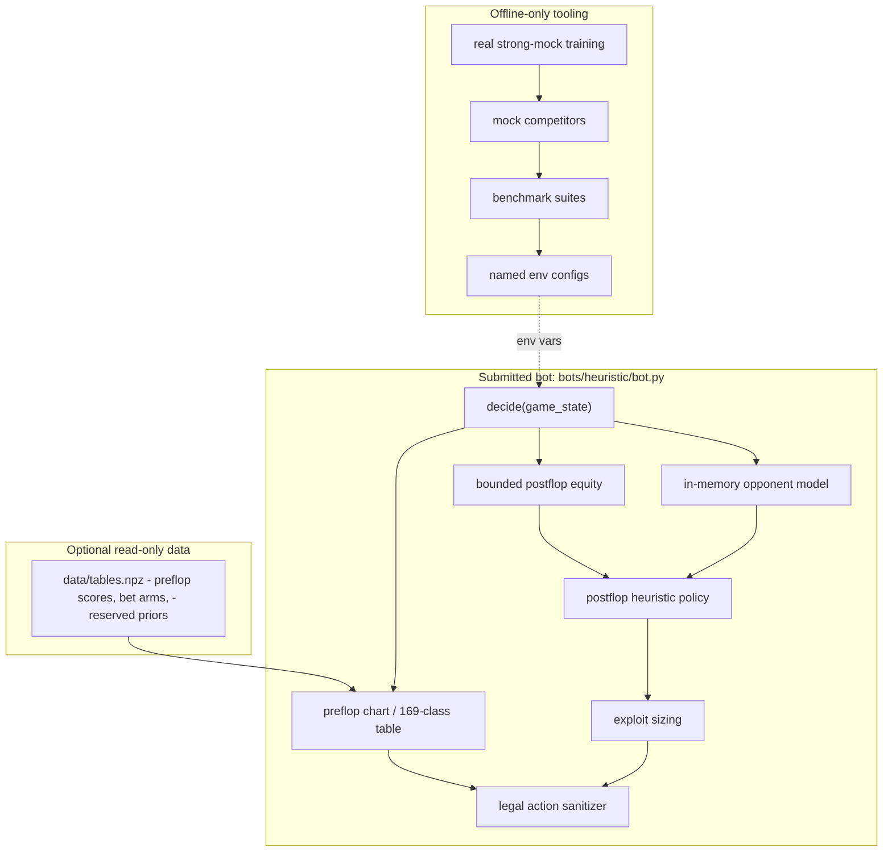

# Heuristic Bot Implementation Plan

Reviewed: 2026-05-27.

## Project Framing

Frame this bot as an interpretable, population-exploit poker bot for a resource-constrained 6-max No-Limit Hold'em tournament.

Do not frame it as a GTO poker AI. The practical edge is:

- Legal, crash-free, timeout-safe execution.
- Tight-aggressive default poker behavior.
- Fast equity estimates.
- Simple online opponent modeling from public action history.
- Bet sizing that exploits common weak bot patterns.

The strategy target is "good enough by default, ruthless against obvious mistakes."

## Implementation Shape

Primary submission path:

```text
bots/heuristic/
├── bot.py
└── data/
    └── tables.npz
```

Keep the production logic in one file because the simplest valid submission is
`bot.py`. Optional data is read-only and loaded at import time with
`np.load(..., allow_pickle=False)`.

Training and benchmark infrastructure is intentionally outside the submission
path. Strong mock opponents live under `bots/strong_mocks/`, and generated
self-training variants live under `bots/self_training/generated/` or a caller
provided temp root. They may import local helpers; `bots/heuristic/bot.py`
should not.

Planned `bot.py` sections:

1. Constants and tunables.
2. Card and hand-class helpers.
3. State parsing helpers.
4. In-memory opponent model.
5. Preflop policy.
6. Equity engine.
7. Board texture helpers.
8. Postflop policy.
9. Bet sizing policy.
10. Action sanitizer.
11. `decide(game_state)`.

Design rule: every policy function returns an intent, and only `sanitize_action()` produces the final action dict. This prevents legal-action fixes from being scattered through the bot.

## Strategy Architecture



## State And Memory Design

Use module-level memory only:

```python
OPPONENTS = {}
SEEN_ACTIONS = set()
EQUITY_CACHE = {}
```

Track only public information from `action_log`, `match_action_log`, and visible stack/pot state.

Per-opponent smoothed stats:

- `actions`
- `raises`
- `calls`
- `folds`
- `all_ins`
- normalized raise sizes
- aggression score
- looseness score

Classify opponents conservatively:

- `unknown`: not enough data.
- `maniac`: high raise/all-in rate.
- `station`: high call rate, low fold rate.
- `nit`: high fold rate, low raise rate.
- `abc`: low aggression, mostly honest large bets.

Use smoothing such as `(count + prior) / (total + prior_mass)` so three actions do not dominate strategy.

## Preflop Plan

Use a 169-class hand table:

- Premium: `AA`, `KK`, `QQ`, `JJ`, `AK`.
- Strong: `TT-88`, `AQ`, `AJs`, `KQs`.
- Speculative: small pairs, suited aces, suited connectors.
- Trash: everything else.

Position should be inferred from blinds and action order, not from raw seat number alone.

Preflop outputs:

- Open-raise strong enough hands.
- Tighten sharply against raises.
- Widen slightly in late position against nits.
- Avoid speculative calls when short-stacked or facing large raises.

## Equity Engine Plan

Use `eval7` Monte Carlo postflop with strict budgets:

- Cache by `(hole_class, exact_hole_cards, board, active_opponent_count)`.
- Use fewer samples when the action is obvious.
- Use more samples on close call/fold or value-bet decisions.
- Hard cap runtime per equity estimate so `decide()` remains well below 2 seconds.

Preflop should start from lookup values, not live Monte Carlo.

Do not start with a neural net. A small neural approximation can be added later only if profiling shows equity estimation is the bottleneck. If used, store weights as `numpy` arrays in read-only `data/` or hard-code plain arrays; avoid pickle.

## Decision Policy

Use a layered decision:

1. Parse state and update memory.
2. Compute pot odds and active opponent count.
3. Infer opponent/table profile.
4. Choose baseline action from preflop or postflop policy.
5. Adjust thresholds and sizing by opponent type.
6. Sanitize final action.

Default call rule:

```text
call if equity > pot_odds + margin
```

Margin increases when:

- Multiway.
- Out of position.
- Facing large aggression.
- Opponent is nit/abc and suddenly bets big.

Margin decreases when:

- Opponent is maniac.
- Pot odds are very favorable.
- Stack is short enough that folding forfeits too much equity.

Default betting rule:

```text
value bet strong equity
semi-bluff good draws against foldy opponents
bluff weak hands only against nits/folders
check/fold weak hands against stations and maniacs
```

## Exploit Rules

Against maniacs:

- Tighten preflop.
- Call/raise wider with real equity.
- Trap stronger hands.
- Bluff rarely.

Against stations:

- Value bet larger and thinner.
- Do not pure bluff.
- Avoid fancy check-raise lines unless holding strong equity.

Against nits:

- Steal blinds and small pots more often.
- Continuation-bet dry boards.
- Fold more when they suddenly raise large.

Against pot-odds bots:

- Bluff sizes should deny simple odds.
- Value sizes should invite dominated calls.
- Avoid giving cheap river calls when strong.
- Current implementation uses a public-action-only suspicion score, so this is
  an exploit hint rather than a hard classification.

## Bet Sizing

Use a small fixed size family with low-frequency off-bucket deviations:

- `min_raise_to`
- dry bluffs around `0.42` pot.
- normal value around `0.52` pot.
- wet-board semi-bluffs around `0.55` pot.
- pressure/value around `0.75` pot.
- rare high-equity raises around `0.85` pot.
- occasional `0.49`/`0.56+` pot deviations to stress threshold and bucketed policies.
- candidate-only delayed probes and blocker bluffs, currently off by default.
- `all_in`

Convert all size intents through one function:

```python
_raise_to_fraction(state, fraction_of_pot)
```

Then pass through `sanitize_action()`.

This avoids future refactors where each strategy branch calculates raise legality differently.

## Reliability Rules

- `decide()` must never print to stdout.
- Catch internal exceptions and return a legal fallback.
- Never import forbidden modules.
- No file writes.
- No subprocess, threading, async, network, dynamic import, `eval`, `exec`, or pickle.
- Use only allowed sandbox libraries in `bot.py`.
- Treat `state.get("type") == "warmup"` as a no-op safe response.

Fallback policy:

```python
if can_check: check
elif amount_owed is tiny relative to pot: call
else: fold
```

## Local Evaluation Plan

After a validating first bot exists, add a local harness outside the submitted bot:

```text
tools/evaluate_heuristic.py
```

The harness runs seeded 400-hand matches against:

- Fullhouse reference bots.
- Mutated always-call / overfold / overraise / minraise variants.
- Local mock competitors under `bots/mock_competitors/`, including trained numpy-policy, equity Monte Carlo, bucket-policy, c-bet, and opponent-modeling bots.

Metrics:

- Mean chip delta.
- Median chip delta.
- Standard deviation.
- Bust rate.
- Worst table result.
- Validator pass/fail.
- Timeout/error count.

Only tune thresholds against aggregate results, not one lucky seed.

Current benchmark suites:

- `reference_6max`: heuristic against all bundled reference bots.
- `mutant_6max`: heuristic against committed simple exploit targets under `bots/benchmarks/`.
- `heads_up_shark`: quick heads-up sanity check against the tight reference bot.
- `heads_up_aggressor`: anti-maniac sanity check.
- `heads_up_station`: anti-calling-station sanity check.
- `sizing_6max`, `pressure_6max`, `tight_6max`, `mixed_stress_6max`, and `heads_up_threshold`: stress suites for sizing, pressure, tight tables, and threshold callers.
- `mock_rl_6max`, `mock_bucket_6max`, `mock_adaptive_6max`, `heads_up_mock_numpy`, and `heads_up_equity_mc`: likely compressed-model and adaptive-opponent mocks.
- `mock_equity_family_6max`, `mock_bucket_family_6max`,
  `mock_policy_family_6max`, `mock_anti_heuristic_6max`, and
  `mock_pressure_heads_up`: expanded local-only families for equity,
  bucket/CFR-like, trained numpy-policy, adversarial, and heads-up pressure
  stress tests.

Run:

```bash
poetry run python tools/evaluate_heuristic.py --json
poetry run python tools/select_heuristic_config.py --preset candidate --progress
poetry run python tools/select_heuristic_config.py --preset mock-family --progress
```

The current promoted defaults passed the 30-seed promotion screen and the
100-seed final acceptance matrix in `docs/heuristic-benchmark-results.md`.

## Public Baselines To Study

Use these as references, not direct dependencies:

- Fullhouse reference bots: exact contest interface and the first benchmark.
- MIT Pokerbots resources: useful examples around `eval7` and poker-bot structure.
- `dberweger2017/deepcfr-texas-no-limit-holdem-6-players`: closest public 6-player NLHE Deep CFR style reference.
- `Nemandza82/g5-poker-bot`: ACPC six-player no-limit winner; useful for opponent-modeling/search ideas.
- `AI-Decision/DecisionHoldem`: heads-up NLHE depth-limited solving reference.
- Slumbot: public heads-up benchmark/source/API; useful conceptually, not as an in-game dependency.
- OpenSpiel: CFR and imperfect-information game concepts.
- RLCard and PokerRL: RL/CFR environment ideas.

Do not spend the first week trying to port any of these systems. The contest bot should be a small, legal, inspectable policy tailored to Fullhouse.

## Small-Commit Build Sequence

1. Scaffold `bots/heuristic/bot.py` with safe `decide()`, action sanitizer, and validator pass.
2. Add preflop hand classification and position inference.
3. Add in-memory opponent model from `match_action_log`.
4. Add bounded `eval7` postflop equity estimates and caching.
5. Add postflop value/call/bluff policy.
6. Add exploit adjustments by opponent type.
7. Add local evaluation harness and mutated benchmark bots.
8. Add mock competitor suites and optional lookup data.
9. Add risk-aware config selection.
10. Promote defaults only after candidate, promotion, and final acceptance screens.

Each step should update docs or this plan if assumptions change, then commit.
