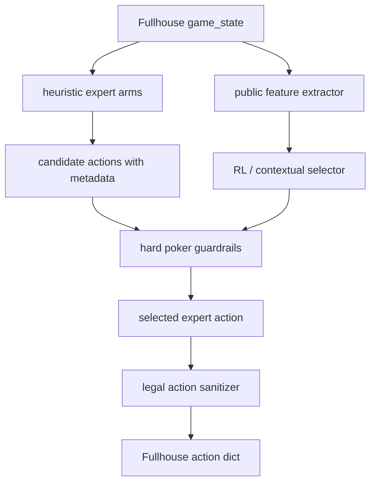
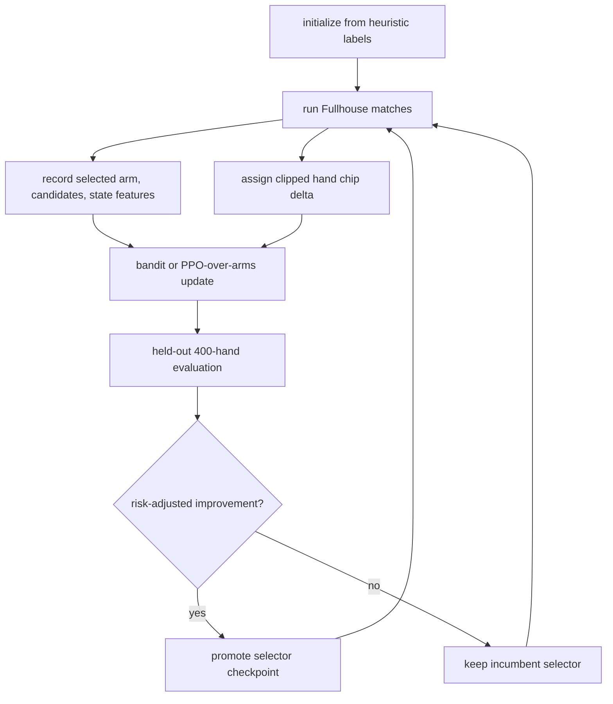

# Heuristic-Guided RL Arm Selector

Reviewed: 2026-05-28.

This is the preferred direction for RL-assisted poker work in this repo. The
first benchmark-only implementation now lives in
`bots/strong_mocks/heuristic_rl_selector`.

The core idea is not "let a PPO network pick raw poker actions." That produced
exactly the wrong failure mode: the network found volatile calls/raises, then
we had to add manual guards afterward. The better design is:

```text
human poker heuristics generate safe expert candidate actions
RL/contextual learning selects or weights those expert arms
final sanitizer enforces Fullhouse legality
```

The RL model should help decide **which valid poker plan fits the current
state**, not invent a low-level action from scratch.

## Architecture



The selector receives the same information as the experts but has a narrower
job:

- choose among candidate arms,
- adjust confidence,
- optionally choose among size families already offered by an expert,
- learn which arm performs better against local opponent populations.

It does **not** output unrestricted fold/call/raise/all-in logits.

## Why This Is Better Than Raw PPO

| Raw PPO action policy | Heuristic-guided arm selector |
| --- | --- |
| Learns from sparse, noisy chip deltas directly into actions. | Learns which already-safe poker plan to trust. |
| Needs safety masks after bad behavior appears. | Expert arms encode validity and strategic intent up front. |
| Overfits action buckets and all-in volatility. | Action space is smaller and semantically meaningful. |
| Hard to debug why it raised or called. | Selected arm names explain intent. |
| Poor sample efficiency in 6-max no-limit. | Better sample efficiency because heuristics carry poker priors. |

This is closer to a population-exploit bot with learned policy selection than
a solver or end-to-end neural poker agent.

## Human-Heuristic Expert Arms

Each arm must return a legal candidate or decline. Arms should also return
metadata: risk, expected fold pressure, value/bluff intent, target opponent
type, and confidence.

| Arm | Human poker idea | Candidate behavior |
| --- | --- | --- |
| `default_tag` | Tight-aggressive baseline, position-aware hand selection. | Open strong ranges, value bet good equity, call by pot odds plus margin. |
| `pot_control` | Avoid bloating pots with medium hands. | Check/call medium made hands, avoid thin raises, fold bad large calls. |
| `value_station` | Calling stations pay off value and punish bluffs. | Bluff rarely; value bet larger and thinner. |
| `anti_maniac` | Let over-aggressive opponents bluff into real hands. | Tighten weak opens, trap/check-call stronger hands, reduce pure bluffs. |
| `pressure_folder` | Nits and folders overfold to pressure. | Steal blinds, c-bet dry boards, barrel scare cards with bounded risk. |
| `pot_odds_breaker` | Threshold bots fold/call around fixed pot-odds cutoffs. | Bluff slightly above half-pot, value bet slightly below threshold sizes. |
| `spr_commit` | Low stack-to-pot ratio changes commitment thresholds. | Commit with strong hands/draws at low SPR, pot-control high SPR. |
| `short_stack_pushfold` | Short stacks need simpler shove/fold logic. | Use push/fold ranges and avoid raise-folding large stack fractions. |
| `range_advantage_cbet` | Preflop aggressor has range/nut advantage on some boards. | C-bet A/K-high dry boards; slow down on low connected or monotone boards. |
| `blocker_bluff` | Blockers make some bluffs more credible. | Rare bluff with nut flush/straight blockers against fold-heavy targets only. |
| `showdown_value` | Some tables overcall rivers. | Thin value with top pair/good kicker or better; do not bluff stations. |
| `strong_unknown_avoidance` | Do not donate to balanced/unknown strong bots. | Avoid marginal wars; focus value extraction on weaker seats. |

These arms should be implemented as poker functions, not as neural outputs.
The network chooses between them.

## Candidate Contract

An expert arm should return a structure like:

```python
{
    "arm": "value_station",
    "action": {"action": "raise", "amount": 850},
    "intent": "value",
    "risk": 0.18,
    "confidence": 0.74,
    "target_type": "station",
    "equity_estimate": 0.68,
}
```

If an arm has no valid idea in the spot, it should return `None`. The selector
only ranks non-`None` candidates.

## Feature Vector

Use compact, public, interpretable features:

| Group | Features |
| --- | --- |
| Street/state | street one-hot, can-check, owed ratio, pot norm, SPR, stack share |
| Table shape | active players, position, players left to act, heads-up/multiway |
| Cards | 169 preflop class score, made-hand class, draw flags, blocker flags |
| Board texture | wet/dry, paired, monotone, ace/king high, straight connectivity |
| Pot odds | required call equity, equity minus pot odds, risk fraction |
| Opponent model | raise/call/fold/all-in rates, pressure-fold suspicion, profile |
| Action line | preflop aggressor, last action, raises this street, delayed probe spot |
| Candidate metadata | arm confidence, risk, intent, proposed size fraction |

Keep the selector small. A linear model, shallow MLP, contextual bandit, or
PPO-over-arms is enough. More capacity should go into better expert arms and
better opponent features before adding more hidden layers.

## Selector Options

### Contextual Bandit

Best first implementation.

```text
context = public state features + candidate metadata
arms = expert names
reward = hand chip delta, risk clipped
```

Use LinUCB, Thompson sampling, or a small epsilon-greedy table over state
clusters. This is easier to debug than PPO and safer with 400-hand matches.

### PPO Over Expert Arms

Acceptable after the bandit version works.

```text
policy output = probability over available expert candidates
value head = expected clipped chip delta
action = selected expert candidate, not raw poker action
```

The PPO ratio is then over named expert choices. This gives far better credit
assignment than raw action buckets because the chosen item has semantic intent.

### Supervised Bootstrap

Start with expert labels:

```text
default_TAG for unknown normal spots
value_station when target profile is station
anti_maniac when target is over-aggressive
pressure_folder when target overfolds
spr_commit when SPR is low
pot_control when medium strength + high risk
```

Then refine by self-play rollouts and held-out evaluation.

## Training Loop



Reward should be clipped and risk-aware:

```text
reward = clip(hand_delta / 1000, -10, 10)
selection_score = mean_delta - bust_penalty * bust_rate - variance_penalty
```

Do not use raw mean chip delta alone.

## Guardrail Philosophy

Guardrails should be part of expert-arm design, not emergency patches after
training:

- `pot_control` simply never proposes a huge call with a medium hand.
- `value_station` never proposes pure bluffs into stations.
- `anti_maniac` avoids bluff-raising maniacs without real equity.
- `short_stack_pushfold` handles low-stack all-ins explicitly.
- the final sanitizer only enforces engine legality, not strategic rescue.

If a guardrail has to block many selected actions, the selector is being
trained on the wrong action space.

## Current Implementation

| File | Role |
| --- | --- |
| `tools/strong_mocks/expert_arms.py` | Generates named human-poker candidate actions and metadata. |
| `tools/strong_mocks/arm_selector_policy.py` | Builds `(state, candidate)` vectors and scores candidates from `policy.npz`. |
| `tools/strong_mocks/train_arm_selector.py` | Trains the selector by heuristic-label bootstrap plus optional Fullhouse rollout updates. |
| `bots/strong_mocks/heuristic_rl_selector/bot.py` | Benchmark-only runtime wrapper. |
| `bots/strong_mocks/heuristic_rl_selector/data/policy.npz` | Current selector artifact generated from heuristic-teacher bootstrap. |
| `tests/test_arm_selector.py` | Focused tests for candidate generation, selector scoring, and bootstrap learning. |

Run a small integration build with:

```bash
poetry run python tools/strong_mocks/train_arm_selector.py \
  --output bots/strong_mocks/heuristic_rl_selector/data/policy.npz \
  --bootstrap-samples 1200 \
  --bootstrap-holdout 300 \
  --bootstrap-epochs 5 \
  --generations 1 \
  --matches-per-generation 6 \
  --hands 40 \
  --opponent-pool rollout \
  --progress \
  --json
```

The current artifact was regenerated after reverting smoke-driven manual
threshold changes. The supervised bootstrap improved held-out heuristic-label
loss from `2.453958` to `1.333221` and agreement from `0.0767` to `0.43`.
The one rollout generation is only a wiring check; its chip delta is not a
statistically meaningful promotion signal.

Validate with:

```bash
poetry run pytest -q tests/test_arm_selector.py
poetry run python sandbox/validator.py bots/strong_mocks/heuristic_rl_selector --json
```

The selector is a benchmark opponent and research scaffold. It is not the
submitted `bots/heuristic` competition bot.

## Completed Build Plan

1. Added `tools/strong_mocks/expert_arms.py`.
   - Move reusable heuristic candidate generation into named arm functions.
   - Keep it benchmark-only first.

2. Added `tools/strong_mocks/arm_selector_policy.py`.
   - Implement feature extraction for `(state, candidate)`.
   - Start with a linear contextual selector.

3. Added `bots/strong_mocks/heuristic_rl_selector/`.
   - Runtime loads selector weights.
   - Expert arms generate candidates.
   - Selector picks one candidate.

4. Added `tools/strong_mocks/train_arm_selector.py`.
   - Supervised bootstrap from deterministic expert labels.
   - Real Fullhouse rollouts.
   - Risk-adjusted checkpoint selection.

5. Initial validation completed:
   - focused unit tests pass,
   - sandbox validator passes,
   - short unrestricted fast-match wiring check has no bot errors.

6. Future statistically meaningful evaluation should cover:
   - reference bots,
   - threshold/bucket/equity mocks,
   - `rollout_search`,
   - existing `ppo_policy`,
   - existing `ppo_deep_policy`.

7. Only after benchmark success, consider whether any ideas belong in
   `bots/heuristic`. The submitted bot should remain heuristic-first and
   validator-safe.

## Relationship To Existing PPO Mocks

`ppo_policy` and `ppo_deep_policy` remain useful as adversarial benchmark
opponents. They should not be treated as the preferred architecture for our
actual bot.

Future RL-assisted work should extend this **heuristic expert-arm selector**,
not add another raw action PPO model with stronger masks.

Do not manually tune selector thresholds from smoke runs. Smoke runs are for
compile, validator, and integration checks only. Threshold or arm-prior changes
need fixed-seed held-out comparisons with enough samples to separate mean
effect from poker variance.
