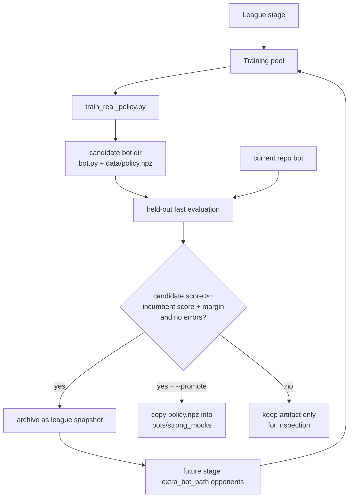

# League Training Framework

Reviewed: 2026-05-27.

## Purpose

`tools/strong_mocks/league_train.py` adds a league-style layer above the real
Fullhouse trainer. The old trainer updates one policy against a sampled
opponent pool. The league layer adds:

- staged train pools,
- held-out evaluation pools,
- incumbent-vs-candidate comparison,
- promotion gates,
- archived candidate bot directories,
- optional promotion into `bots/strong_mocks/*/data/policy.npz`,
- previous promoted candidates as future league opponents.

This is still benchmark-only. It is not part of the submitted heuristic bot.

## Structure

```text
tools/strong_mocks/league_train.py
scripts/train_opponents_league.sh
docs/league-training-framework.md
```

Runtime outputs default to:

```text
/private/tmp/fullhouse_league_training/<run-id>/
  candidates/
    oracle_bootstrap_ppo/
    oracle_bootstrap_bucket/
    public_adversarial_ppo/
    ...
  league_report.json
```

Each candidate directory is a runnable bot directory:

```text
candidate/
  bot.py
  data/policy.npz
```

## League Flow



## Default Stages

| Stage | Train Pool | Held-Out Eval Pools | Purpose |
| --- | --- | --- | --- |
| `oracle_bootstrap` | `oracle` | `public_holdout` | Learn a basic response to simple oracle styles before harder opponents. |
| `public_adversarial` | `adversarial` | `public_holdout`, `mock_holdout` | Train against real local `bot.py` opponents, public-like bots, and pressure bots. |
| `league_mixed` | `mixed` | `public_holdout`, `mock_holdout`, `strong_holdout` | Stress against stronger local models, rollouts, and prior league snapshots. |

Held-out pools are never used as a single undifferentiated score during
training. They are evaluated after candidate training, and promotion depends on
the aggregate score.

## Promotion Rule

The score is:

```text
mean_delta
- risk_weight * stdev_delta
+ min_weight * min_delta
- bust_penalty * bust_rate
- error_penalty * error_rate
```

Default promotion:

```text
candidate_score >= incumbent_score + 250
candidate_error_count == 0
```

Without `--promote`, a winning candidate is archived and can be sampled by
later stages, but repo artifacts are not overwritten.

## Commands

Smoke:

```bash
RUN_ID=league-smoke \
GENERATION_SCALE=0.05 \
MATCH_SCALE=0.05 \
HAND_SCALE=0.10 \
EVAL_SEEDS=1 \
EVAL_HANDS=12 \
PROMOTE=0 \
WORKERS=1 \
scripts/train_opponents_league.sh
```

Laptop run:

```bash
RUN_ID=league-opponents-$(date +%Y%m%d-%H%M%S) \
WORKERS=0 \
PARALLEL_BACKEND=process \
GENERATION_SCALE=1.0 \
MATCH_SCALE=1.0 \
HAND_SCALE=1.0 \
EVAL_SEEDS=8 \
EVAL_HANDS=160 \
PROMOTE=1 \
scripts/train_opponents_league.sh
```

Conservative pre-commit run without overwriting repo artifacts:

```bash
PROMOTE=0 \
WORKERS=0 \
PARALLEL_BACKEND=process \
GENERATION_SCALE=0.5 \
MATCH_SCALE=0.5 \
HAND_SCALE=0.75 \
EVAL_SEEDS=5 \
EVAL_HANDS=120 \
scripts/train_opponents_league.sh
```

## Why This Is Better Than The Previous Wrapper

The previous wrapper trained PPO and bucket policies sequentially against one
sampled pool and exported the final generation. The league layer separates
training from held-out evaluation and compares candidates against incumbents
before promotion.

This reduces two failure modes observed in the previous long run:

- exporting a late bad generation after an earlier good generation,
- mistaking "our heuristic beats the trained opponent" for "the opponent
  improved."

## Validation

Run after changing league code:

```bash
poetry run python -m py_compile tools/strong_mocks/league_train.py tools/strong_mocks/train_real_policy.py
poetry run pytest -q tests/test_league_training.py tests/test_fast_match.py
bash -n scripts/train_opponents_league.sh
```

Use a smoke run with `PROMOTE=0` before any serious run.

Current smoke:

- `py_compile` passed for `league_train.py`, `train_real_policy.py`,
  `training.fast_match`, and `tools.parallel`.
- `pytest -q tests/test_league_training.py tests/test_fast_match.py`: 7 passed.
- `pytest -q`: 15 passed.
- Tiny `oracle_bootstrap` PPO dry run with `PROMOTE=0` completed and wrote
  `/private/tmp/fullhouse_league_training/league-smoke-codex-2/league_report.json`.
