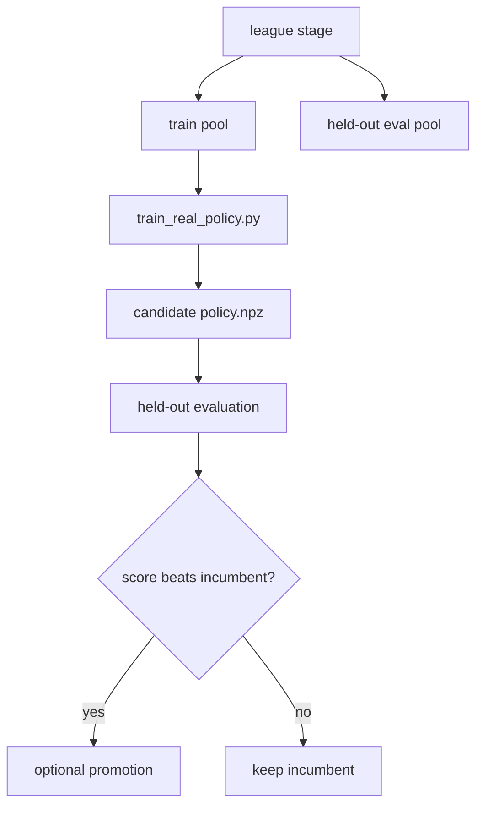

# League Training Framework

Reviewed: 2026-05-28.

This page summarizes `tools/strong_mocks/league_train.py`. Shared training
defaults and promotion policy live in `docs/training-pipelines.md`.

## Purpose

League training wraps `tools/strong_mocks/train_real_policy.py` with staged
opponent pools and held-out evaluations. Use it when one monolithic training
pool is producing brittle artifacts.

## Flow



## When To Use

- PPO or bucket training improves in-sample but fails held-out evaluation.
- You want staged exposure: oracle pools, adversarial pools, then strong mocks.
- You need a promotion gate before replacing a canonical mock artifact.

## Command Shape

```bash
poetry run python tools/strong_mocks/league_train.py --help
```

Use the large wrapper commands in `docs/training-pipelines.md` unless you need
custom staged pools.
