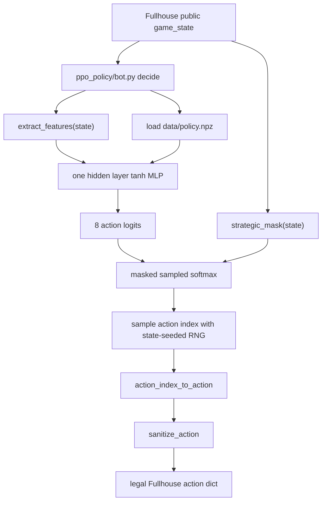
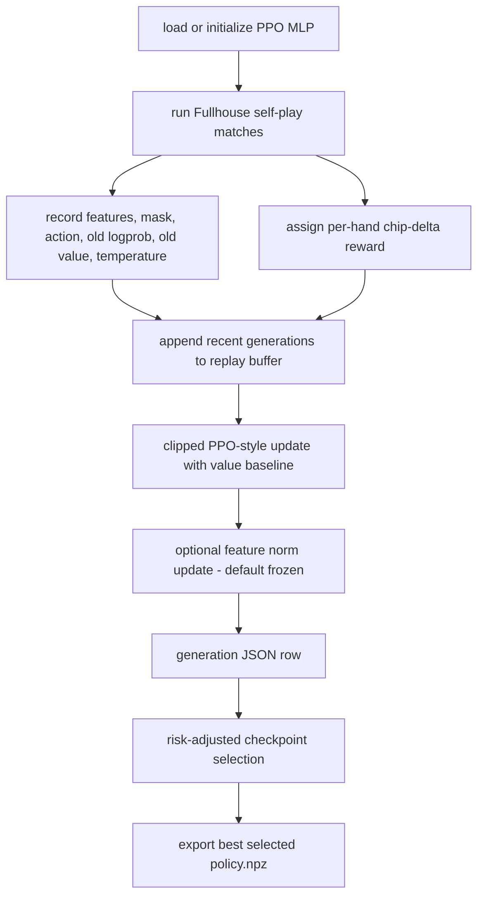

# PPO Strong Mock Bot Logic

Reviewed: 2026-05-28.

This document explains PPO-style strong mocks. `bots/strong_mocks/ppo_policy`
is the original 8-arm benchmark opponent. `bots/strong_mocks/ppo_deep_policy`
is an independent deep variant with more hidden layers and a wider action
space. Both are benchmark-only opponents used for local stress tests and
coevolution. They are not the submitted heuristic bot.

Important correction: raw PPO action policies are not the preferred direction
for our actual bot. If we continue with RL assistance, use the heuristic expert
arm-selector design in `docs/heuristic-rl-arm-selector.md`.

## File Map

| File | Role |
| --- | --- |
| `bots/strong_mocks/ppo_policy/bot.py` | Submission-shaped wrapper that exposes `decide(state)`. |
| `bots/strong_mocks/ppo_policy/data/policy.npz` | Exported model weights and metadata. Generated artifact, not hand-edited. |
| `bots/strong_mocks/ppo_deep_policy/bot.py` | Independent deep PPO wrapper. Does not touch the original `ppo_policy`. |
| `bots/strong_mocks/ppo_deep_policy/data/policy.npz` | Deep PPO artifact with 3 hidden layers by default and 14 action arms. |
| `tools/strong_mocks/policies.py` | Runtime inference helpers for PPO, CFR bucket, rollout, and ensemble mocks. |
| `tools/strong_mocks/deep_policies.py` | Runtime inference helpers for the independent deep PPO mock. |
| `tools/strong_mocks/features.py` | Public-state feature vector used by the model. |
| `tools/strong_mocks/actions.py` | Eight-action abstraction, legalization, and strategic masks. |
| `tools/strong_mocks/deep_actions.py` | Fourteen-action abstraction for the deep PPO mock. |
| `tools/strong_mocks/train_real_policy.py` | Real Fullhouse self-play trainer that exports PPO artifacts. |
| `tools/strong_mocks/train_deep_ppo.py` | Independent deep PPO trainer with oracle bootstrap plus real rollouts. |

## Runtime Decision Flow



The wrapper calls:

```python
decide_model_sampled(state, DATA_DIR, fallback_style="pressure")
```

The runtime intentionally uses sampled softmax instead of deterministic
`argmax`. Training also samples from a temperature-scaled policy, so sampled
inference keeps evaluation closer to the behavior policy that generated the
rollouts. The random draw is seeded from stable state fields, so one identical
state produces one identical sampled action.

## Model Input

The model receives the 32-dimensional vector from
`tools/strong_mocks/features.py`. The features are intentionally public and
cheap:

| Group | Examples |
| --- | --- |
| Street | preflop/flop/turn/river one-hot flags |
| Pot and stack | owed ratio, normalized pot, normalized stack, SPR |
| Table shape | active players, button-relative position estimate |
| Hole cards | high card, low card, pair, suited, gap, preflop strength |
| Board texture | wet board, paired board, monotone board, ace/king board |
| Made/draw signals | pairish hand, flush draw, straight draw |
| Action history | last action flags, raises this street, all-ins this hand |
| Stack context | hero share of remaining table chips |

This feature set is not a solver abstraction. It is a compact policy input for
creating stronger local opponents quickly.

## Action Space

The network does not output arbitrary chip amounts. It outputs one of eight
abstract actions:

| Index | Label | Runtime action |
| --- | --- | --- |
| 0 | `fold` | Fold, or check if checking is free. |
| 1 | `check_call` | Check when possible, otherwise call. |
| 2 | `raise_033` | Raise to current bet plus roughly 0.33 pot. |
| 3 | `raise_050` | Raise to current bet plus roughly 0.50 pot. |
| 4 | `raise_075` | Raise to current bet plus roughly 0.75 pot. |
| 5 | `raise_100` | Raise to current bet plus roughly 1.00 pot. |
| 6 | `raise_150` | Raise to current bet plus roughly 1.50 pot. |
| 7 | `all_in` | Move all-in. |

`sanitize_action()` clamps raises to Fullhouse legal min/max values and falls
back to check/fold when a chosen action is impossible.

## Strategic Mask

The PPO bot uses `strategic_mask(state)`, not a raw legal-action mask. This is
deliberate. A neural mock with no guardrails learns brittle high-variance
actions and can become a poor benchmark.

Current extra guardrails:

- Remove explicit all-in in ordinary deep-stack spots.
- Keep all-in available when short stacked, already committed, or clearly
  strong/draw-heavy.
- When facing a very large call while deep, block `check_call` unless the hand
  has strong preflop strength or a postflop commit signal.
- Still allow ordinary calls, checks, and normal raise sizes when legal.

These masks are benchmark safety rails, not poker-theory claims.

## Model Artifact

`policy.npz` stores:

| Key | Meaning |
| --- | --- |
| `model_type` | `ppo_mlp` for this bot. |
| `w1`, `b1` | Input-to-hidden weights for tanh hidden layer. |
| `w2`, `b2` | Hidden-to-action-logit weights. |
| `wv`, `bv` | Value head used during training, retained for resumability. |
| `mean`, `scale` | Feature normalization used by inference. |
| `action_labels` | Ordered action names. |
| `temperature` | Runtime sampled-softmax temperature. |
| `inference_mode` | `sampled_softmax`. |

The submitted heuristic bot must not depend on this artifact. It is only for
local mock opponents and training.

## Training Flow



The trainer runs multiple train seats in each 6-player match. Opponents can be
oracle styles, rollout mocks, previous snapshots, exported models, or real
local `bot.py` directories. Rewards are clipped chip deltas:

```text
reward = clip((final_stack - hand_start_stack) / reward_scale)
```

Selection is risk-adjusted:

```text
selection_score = mean_train_delta - selection_bust_penalty * train_bust_rate
```

This avoids exporting a checkpoint that wins a few large pots but busts too
often.

## PPO Update Details

The update in `train_real_policy.py` is a compact numpy implementation:

- store behavior `old_logprob` at rollout time,
- store behavior temperature for each decision,
- recompute current probabilities with that same temperature,
- use clipped policy ratios,
- use a learned value head as the baseline,
- normalize advantages inside the batch,
- clip gradients before applying the update,
- keep a short replay window of recent generations.

The trainer is intentionally simpler than a full deep-RL stack. It is designed
to create useful adversarial benchmark opponents, not to produce a GTO poker
agent.

## Known Limitations

- The model sees compact public features, not full card-combo range history.
- Rewards are sparse and high variance because a hand's chip delta is assigned
  to all train-seat decisions in that hand.
- Small evaluation sets are misleading. Use hundreds of 400-hand matches before
  calling a PPO checkpoint stronger.
- PPO artifacts can overfit the local opponent pool. Keep held-out evaluation
  and risk gates.
- The current PPO bot is benchmark-only. Do not upload it as the competition
  bot unless the strategy changes.
- The raw action-policy design is inherently brittle in 6-max no-limit. Future
  RL-assisted work should select among heuristic expert arms instead of
  choosing raw actions.

## Deep PPO Variant

`ppo_deep_policy` was added because the original PPO mock still showed weak
and unstable learning. It deliberately avoids modifying `ppo_policy`, so
currently running training jobs are unaffected.

Differences:

| Area | Original PPO | Deep PPO |
| --- | --- | --- |
| Bot path | `bots/strong_mocks/ppo_policy` | `bots/strong_mocks/ppo_deep_policy` |
| Trainer | `train_real_policy.py --kind ppo` | `train_deep_ppo.py` |
| Default hidden layers | one hidden layer | `96,64,32` |
| Action arms | 8 | 14 |
| Extra features | shared 32 features | shared 32 plus 16 interaction features |
| Bootstrap | optional via existing artifact/resume | supervised oracle bootstrap before rollout PPO |
| Artifact | `model_type=ppo_mlp` | `model_type=deep_ppo_mlp` |

Deep PPO action arms:

```text
fold, check_call, raise_min,
raise_025, raise_033, raise_045, raise_055, raise_067,
raise_085, raise_100, raise_125, raise_160, raise_220,
all_in
```

The extra raise sizes are intended to stress threshold and bucketed opponents
more directly. The deep strategic mask still blocks weak deep-stack all-ins,
large call-offs, and oversized overbets with weak hands.

## Useful Commands

Train PPO through the real Fullhouse trainer:

```bash
OPPONENT_POOL=adversarial \
PPO_GENERATIONS=48 \
PPO_MATCHES_PER_GENERATION=128 \
PPO_HANDS=400 \
WORKERS=0 \
PARALLEL_BACKEND=process \
scripts/train_opponents_real.sh
```

Run alternating PPO/heuristic coevolution:

```bash
WORKERS=0 PARALLEL_BACKEND=process scripts/train_e2e_coevolution.sh
```

Validate the exported mock:

```bash
poetry run python sandbox/validator.py bots/strong_mocks/ppo_policy --json
```

Run focused PPO tests:

```bash
poetry run pytest -q tests/test_real_policy_training.py
```

Train the independent deep PPO mock:

```bash
poetry run python tools/strong_mocks/train_deep_ppo.py \
  --generations 8 \
  --matches-per-generation 32 \
  --hands 120 \
  --hidden 96,64,32 \
  --opponent-pool fast \
  --progress \
  --json
```

Focused deep PPO tests:

```bash
poetry run pytest -q tests/test_deep_ppo.py
```
