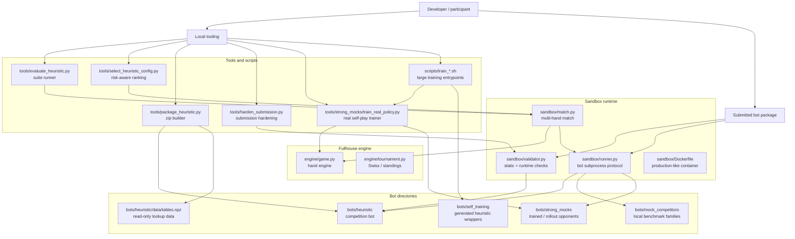
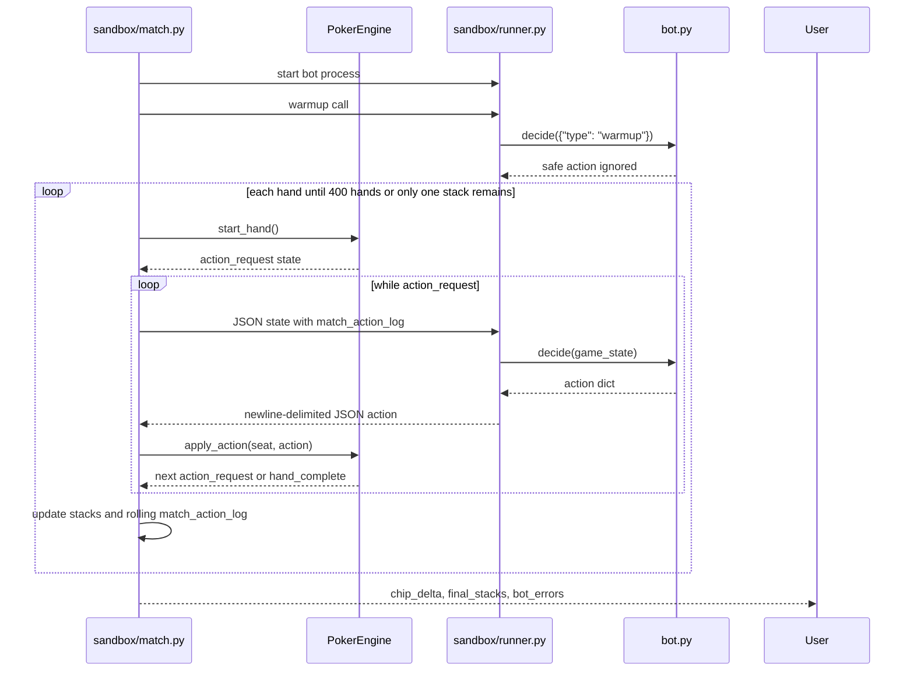

# Fullhouse Engine Project Overview

Reviewed: 2026-05-27.

## What This Repo Is

`fullhouse-engine` is the public local development repo for the Fullhouse Hackathon, a No-Limit Texas Hold'em poker bot competition scheduled for 2026-06-01 through 2026-06-05 in London.

Participants submit a Python bot that exposes exactly one decision function:

```python
def decide(game_state: dict) -> dict:
    return {"action": "call"}
```

The engine calls `decide()` once whenever the bot must act. The bot receives public table state, its own hole cards, board cards, pot and betting state, stack state, and action history. It returns one action dict.

## Main Components

- `engine/game.py`: No-Limit Hold'em hand engine, betting rules, side pots, showdown, and action-state serialization.
- `engine/tournament.py`: Swiss pairing, standings, and finalist selection helpers.
- `sandbox/validator.py`: Submission validator for static checks, package limits, action shape, edge cases, and timeout behavior.
- `sandbox/runner.py`: Runtime process that loads a submitted bot and exchanges newline-delimited JSON actions.
- `sandbox/match.py`: Local match orchestrator for 2-9 bots, with optional Docker sandboxing.
- `sandbox/Dockerfile`: Production-like bot container using Python 3.10 and sandbox-approved libraries.
- `bots/`: Reference bots, starter template, heuristic bot, simple benchmark bots, and mock competitor bots.
- `bots/heuristic/`: Current competition bot, optional read-only `data/tables.npz`, and single-file submission entrypoint.
- `bots/mock_competitors/`: Local-only trained/handwritten benchmark opponents that approximate likely RL/NN/CFR/equity submissions.
- `bots/strong_mocks/`: Benchmark-only stronger opponents with trained MLP, policy-gradient, CFR-like table, rollout, and ensemble policies.
- `bots/self_training/`: Wrapper template for generated heuristic config variants used in local self-training matches.
- `tools/evaluate_heuristic.py`: Seeded benchmark harness for core, stress, and mock suites.
- `tools/select_heuristic_config.py`: Risk-aware config ranking and promotion-screen harness.
- `tools/strong_mocks/`: Shared feature/action abstractions, strong mock trainers, and evolutionary self-training pipeline.
- `tools/strong_mocks/train_real_policy.py`: Fullhouse in-process real
  self-play trainer for PPO-style and CFR+/bucket strong mock policies.
- `tools/parallel.py`: Offline-only process/thread worker helper for seeded benchmark and self-training runs.
- `scripts/train_opponents_real.sh`: Large real-training entrypoint for mock
  opponents.
- `scripts/train_heuristics_selfplay.sh`: Large self-play entrypoint for
  heuristic env-config evolution.
- `tools/package_heuristic.py`: Submission zip builder and validator wrapper for the heuristic bot.
- `tools/build_heuristic_tables.py`: Optional read-only data table builder.
- `tools/harden_submission.py`: Full heuristic submission hardening command for table rebuild, packaging, validation, zip inspection, and sanity matches.
- `tools/train_mock_numpy_policy.py`: Offline trainer for benchmark-only
  numpy-policy mock competitors.
- `demo.py`: Flask demo UI showing local reference-bot matches.
- `tests/`: Engine unit tests.

## Architecture Diagram



## Runtime Flow



## Bot Contract

Valid returned actions:

```python
{"action": "fold"}
{"action": "check"}
{"action": "call"}
{"action": "raise", "amount": 1200}
{"action": "all_in"}
```

Important action semantics:

- `amount` on a raise is the total bet amount, not the incremental raise size.
- Invalid or missing actions default to fold.
- Checking while facing a bet is converted to a call by the engine.
- Raises below the legal minimum are snapped to the minimum legal raise.
- If the snapped raise would commit the stack, the engine treats it as all-in.

## Submission Formats

Supported submissions:

- `bot.py`: single-file bot.
- Bot directory: root `bot.py` plus optional `data/`.
- `bot.zip`: archive with root `bot.py` plus optional `data/`.

Package limits enforced by `sandbox/validator.py`:

- Total submission: 250 MB.
- `data/`: 200 MB.
- `bot.py`: 5 MB.
- `data/` must not contain `.py` files.
- Symlinks are rejected.
- Zip paths must not be absolute or path-traversing.

## Competition Format

From the repo README:

- 2026-06-01: online qualifier.
- Swiss-system tournament, 400 hands per match, usually 6-bot tables.
- Ranking is by cumulative chip delta.
- Top 64 advance.
- 2026-06-02: patch window after qualifier hand histories are available.
- 2026-06-05: finals night at UCL East, single-elimination bracket.
- Submission deadline: 2026-05-31 23:59 UTC.

The library-request deadline in `CONTRIBUTING.md` is 2026-05-25 23:59 UTC, which is already past as of this review date.

## Frozen Areas

`CONTRIBUTING.md` says these files are frozen before the event and should not be changed casually:

- `engine/game.py`
- `sandbox/runner.py`
- `db/schema.sql`

Acceptable contribution areas include bug reports, local demo UI improvements, additional reference bots, and documentation.

## Current Heuristic Bot Status

The active competition branch is `heuristic`. The current promoted default is
the SPR/off-bucket sizing profile documented in
`docs/heuristic-benchmark-results.md`. The old pre-promotion behavior remains
available as the local tuning config `legacy-baseline`.

Use the benchmark docs as the source of truth before changing bot defaults.
The newest mock benchmark expansion adds trained-policy, equity-family,
bucket-family, anti-heuristic, and heads-up pressure suites; use
`tools/select_heuristic_config.py --preset mock-family` for focused checks.
The strong-mock/self-training pipeline adds benchmark-only trained opponents
under `bots/strong_mocks/` and generated multi-heuristic config matches through
`tools/strong_mocks/self_train_heuristic.py`; see
`docs/strong-mock-self-training-pipeline.md`.
The newest postflop feature controls add richer hand flags and candidate-only
blocker/probe lines, but the latest focused screen kept the promoted
`baseline` default unchanged. See `docs/heuristic-benchmark-results.md` before
promoting any of those knobs.
The real-training pipeline adds process-parallel Fullhouse rollouts for
benchmark opponents and adapts compatible CFR+ abstraction ideas from
`jeffelin/CFR_pokerbot`; see `docs/real-training-pipeline-plan.md`.
