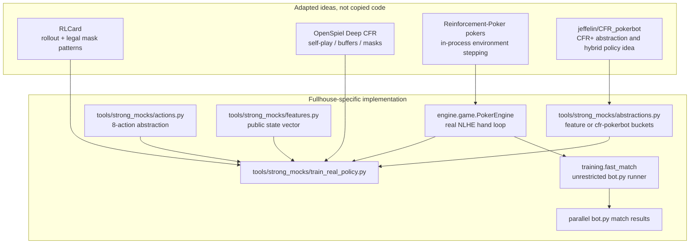
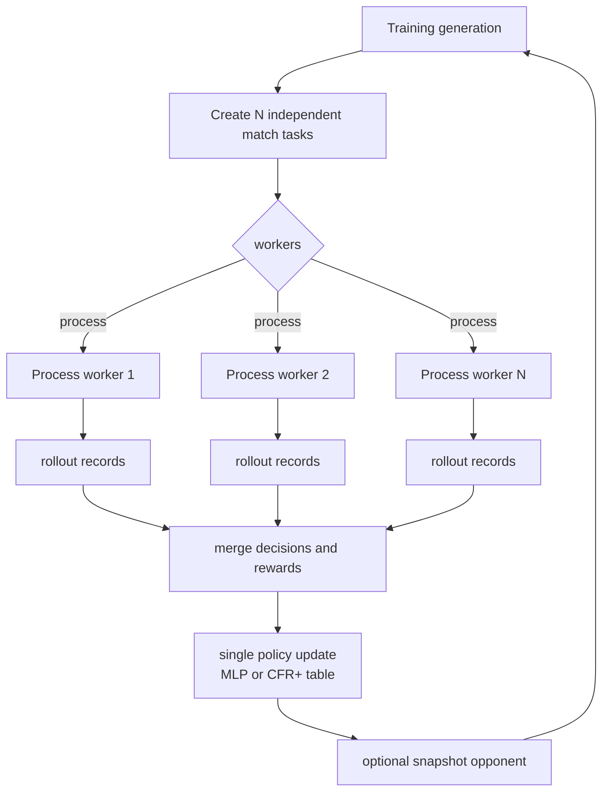

# Real Training Pipeline Plan

Reviewed: 2026-05-27.

## Goal

Replace synthetic-oracle-only mock training with real Fullhouse environment
rollouts where policies learn from actual chip-delta rewards.

This pipeline is still benchmark-only. It trains stronger local opponents and
heuristic variants; it does not change the submitted bot interface or import
training dependencies into `bots/heuristic/bot.py`.

## Public Designs Checked

The implementation ports ideas rather than copying code:

- RLCard: card-game RL toolkit with poker environments and examples for DQN,
  NFSP, CFR, and DMC. Useful ideas: environment rollouts, legal action masks,
  and card-game-specific RL workflows. Source: https://github.com/datamllab/rlcard
- OpenSpiel Deep CFR: uses replay/reservoir buffers, legal-action masks, neural
  advantage/strategy networks, and self-play traversals. Useful ideas:
  strategy/advantage separation, snapshot-like stability, and mini-batch
  training. Source: https://deepwiki.com/google-deepmind/open_spiel/6.3-deep-cfr-with-neural-networks
- Reinforcement-Poker `pokers`: emphasizes a simple `new_state = state + action`
  environment loop and parallel independent states. Useful idea: avoid
  subprocess bot wrappers for training and step the game directly in-process.
  Source: https://github.com/Reinforcement-Poker/pokers
- `deepcfr-texas-no-limit-holdem-6-players`: 6-player NLHE Deep CFR style
  project with coarse action abstraction and neural policy outputs. Useful
  idea: train benchmark opponents with compressed exported policy artifacts,
  not runtime-heavy models. Source:
  https://github.com/dberweger2017/deepcfr-texas-no-limit-holdem-6-players
- `jeffelin/CFR_pokerbot`: MIT Pokerbots 2026 Toss Hold'em project using CFR+,
  explicit board/hand abstraction, Bayesian opponent categories, and a hybrid
  CFR/table/deep-policy selector. Useful ideas: CFR+ positive regret clipping,
  linear average-strategy weighting, explicit abstractions, and modular
  strategy selection. Source: https://github.com/jeffelin/CFR_pokerbot

License note: no external source file is copied into this repo. The trainer
uses local Fullhouse engine APIs and our existing feature/action abstractions.

## Architecture

New real trainer:

```text
tools/strong_mocks/train_real_policy.py
```

It runs `engine.game.PokerEngine` directly instead of launching bot
subprocesses. This gives the trainer access to:

- exact public decision states,
- legal action masks,
- final per-hand stacks,
- per-hand chip-delta rewards,
- many independent matches for process-level parallelism.

Companion fast bot runner:

```text
training/fast_match.py
```

It runs submitted-style `bot.py` directories directly in-process, with no
timeout or resource cap, while still using `engine.game.PokerEngine`. Use it
when training or screening benchmark opponents that already exist as bot
directories rather than as in-memory policy objects.

Supported trainable opponent policies:

| Kind | Export Target | Update Rule | Runtime Bot |
| --- | --- | --- | --- |
| `ppo` | `bots/strong_mocks/ppo_policy/data/policy.npz` | Episodic policy-gradient / REINFORCE-style update over actual chip rewards. | `bots/strong_mocks/ppo_policy` |
| `bucket` | `bots/strong_mocks/cfr_bucket/data/policy.npz` | Bucketed softmax preference update or CFR+ style positive-regret update from actual chip rewards. | `bots/strong_mocks/cfr_bucket` |

Both policies use the existing action abstraction:

```text
fold/check, check/call, 0.33 pot, 0.50 pot, 0.75 pot, 1.00 pot, 1.50 pot, all-in
```

The CFR-style path supports two abstraction modes:

| Abstraction | Purpose |
| --- | --- |
| `feature` | Original compact feature-bucket hash used by existing strong mocks. |
| `cfr-pokerbot` | Fullhouse-compatible adaptation of CFR_pokerbot's explicit abstraction idea: 169 two-card preflop classes, made-hand/draw class, board structure, pot/owed bucket, stack bucket, active players, position, and pressure bucket. |

The CFR_pokerbot repo targets Toss Hold'em, not normal Fullhouse NLHE. Its
three-hole-card toss/discard mechanics, revealed discard state, MIT engine
protocol, and Toss-specific strategy code are incompatible and are not ported.
The compatible parts are adapted as:

- CFR+ positive-regret clipping.
- Linear average-strategy weighting.
- Explicit Fullhouse board/hand abstraction.
- Modular exported artifacts usable by `bots/strong_mocks/ensemble`.



Training lineups include:

- 2 current trainable seats by default.
- Public-style oracle opponents.
- Existing model opponents.
- Rollout-search opponents.
- Previous snapshots of the trainable policy.

This is real self-play because current trainable seats play in the same
Fullhouse match and older snapshots can also be sampled as opponents.

## Parallelization

Training and post-training play/evaluation are parallelized at the independent
match level. This is the highest-leverage boundary because Fullhouse hands are
stateful within a match, but different seeded matches are independent.

Implemented mechanisms:

- `tools/strong_mocks/train_real_policy.py` uses `tools.parallel.map_parallel`
  over matches inside each generation.
- `training/fast_match.py` uses the same helper for unrestricted bot.py
  batches and parity-tested in-process matches.
- `tools/strong_mocks/self_train_heuristic.py` uses the same process/thread
  worker helper over self-training matches.
- `tools/select_heuristic_config.py` and `tools/evaluate_heuristic.py` already
  support `--workers` and `--parallel-backend`.
- The bash scripts default to `WORKERS=0`, which auto-selects up to the local
  CPU count and uses process workers.
- Numpy vectorization is used for neural-policy forward/backward updates and
  bucket table exports.

Default guidance:

```bash
WORKERS=0 PARALLEL_BACKEND=process scripts/train_opponents_real.sh
WORKERS=0 PARALLEL_BACKEND=process scripts/train_heuristics_selfplay.sh
poetry run python -m training.fast_match bots/heuristic bots/strong_mocks/ensemble bots/shark --hands 400 --repeat 32 --workers 0 --parallel-backend process --json
```

Use `PARALLEL_BACKEND=thread` only for short smoke runs where process startup
overhead dominates. Use process workers for serious training because engine
simulation and rollout opponents are CPU-bound.



## Reward

Rewards are assigned after each hand:

```text
reward = (final_stack_after_hand - stack_before_hand) / reward_scale
```

Default:

```text
reward_scale = 1000
reward_clip = [-10, 10]
```

Every trainable decision in the hand receives that hand's chip-delta reward.
This is noisy but real; the trainer relies on many hands and multiple
opponents rather than synthetic labels.

## Why This Is Not A Full Solver

This is not GTO training, Deep CFR, or a complete poker RL research stack.
The purpose is to create stronger local benchmark opponents and candidate
heuristic pressure. The trainer deliberately stays simple:

- no PyTorch/TensorFlow dependency,
- no runtime dependency in submitted bots,
- no off-repo environment mismatch,
- no hidden-card cheating,
- exported `.npz` artifacts stay compatible with current strong mocks.

## Bash Entrypoints

Train real mock opponents:

```bash
scripts/train_opponents_real.sh
```

Train heuristic variants through multi-heuristic self-play:

```bash
scripts/train_heuristics_selfplay.sh
```

Both scripts accept env overrides. Example shorter run:

```bash
PPO_GENERATIONS=4 \
PPO_MATCHES_PER_GENERATION=8 \
BUCKET_GENERATIONS=4 \
BUCKET_MATCHES_PER_GENERATION=8 \
scripts/train_opponents_real.sh
```

Example overnight-ish heuristic run:

```bash
GENERATIONS=16 \
POPULATION=30 \
MATCHES_PER_GENERATION=72 \
HANDS=400 \
scripts/train_heuristics_selfplay.sh
```

## Large Run Defaults

`scripts/train_opponents_real.sh` defaults:

- PPO: 48 generations, 72 matches/generation, 120 hands/match.
- Bucket: 40 generations, 96 matches/generation, 120 hands/match.
- 6-player tables, 2 trainable seats, process parallelism with `WORKERS=0`.
- Bucket training uses `--abstraction cfr-pokerbot --bucket-update cfr-plus`
  by default in the bash script.

`scripts/train_heuristics_selfplay.sh` defaults:

- 16 generations.
- 30 candidate configs.
- 8 elites.
- 72 matches/generation.
- 400 hands/match.
- 2-3 heuristic variants per 6-player table.

These are intended to be large enough to produce useful pressure on a laptop
without assuming cluster resources. Reduce the env vars for smoke tests.

## Acceptance Policy

Do not promote a heuristic default directly from a training result.

After real opponent training:

1. Validate trained bots:

   ```bash
   poetry run python sandbox/validator.py bots/strong_mocks/ppo_policy --json
   poetry run python sandbox/validator.py bots/strong_mocks/cfr_bucket --json
   poetry run python sandbox/validator.py bots/strong_mocks/ensemble --json
   ```

2. Run strong-screen:

   ```bash
   poetry run python tools/select_heuristic_config.py \
     --preset strong-screen \
     --config baseline \
     --seed-count 30 \
     --hands 400 \
     --workers 0 \
     --parallel-backend process \
     --progress \
     --json
   ```

3. Any heuristic default change still needs the existing candidate, promotion,
   and final gates documented in `docs/heuristic-benchmark-results.md`.

## Current Validation

Reviewed: 2026-05-27.

Smoke commands used temp outputs under `/private/tmp` so committed trained
artifacts were not overwritten:

- PPO real rollout: 1 generation, 2 matches, 6 hands, `opponent_pool=fast`,
  output `/private/tmp/fullhouse_real_ppo_smoke/policy.npz`.
- CFR+ bucket rollout: 1 generation, 2 matches, 6 hands,
  `--abstraction cfr-pokerbot --bucket-update cfr-plus`, output
  `/private/tmp/fullhouse_real_bucket_smoke/policy.npz`.
- Process-parallel CFR+ smoke: 1 generation, 2 matches, 4 hands,
  `--workers 2 --parallel-backend process`.

Validation results:

- `py_compile` passed for `abstractions.py`, `policies.py`,
  `train_real_policy.py`, `training/fast_match.py`, self-training, and
  selector tools.
- `bash -n` passed for both training scripts.
- Validators passed for `bots/strong_mocks/ppo_policy`,
  `bots/strong_mocks/cfr_bucket`, `bots/strong_mocks/ensemble`, and
  `bots/heuristic/bot.py`.
- `pytest -q`: 12 passed.
- `pytest -q tests/test_fast_match.py`: 4 passed, covering parity,
  process-parallel equivalence, worker auto-selection, and no-timeout behavior.
- `python -m training.fast_match` CLI smoke passed for a 3-hand match.
- `strong-screen` 1-seed x 12-hand smoke ran with zero heuristic errors. The
  result was negative, as expected for a tiny strong-screen smoke, and is not a
  strategy decision sample.

## Limitations

- Rewards are sparse and high variance.
- Bucket training is closer to contextual bandit preference learning than true
  CFR.
- Policy-gradient updates use sampled action rewards and do not estimate a
  counterfactual value for unchosen legal actions.
- Current feature vectors are public-state abstractions, not full action-range
  encodings.
- Stronger training may overfit to our local opponent pool unless validated
  against reference, mock-family, and final presets.
