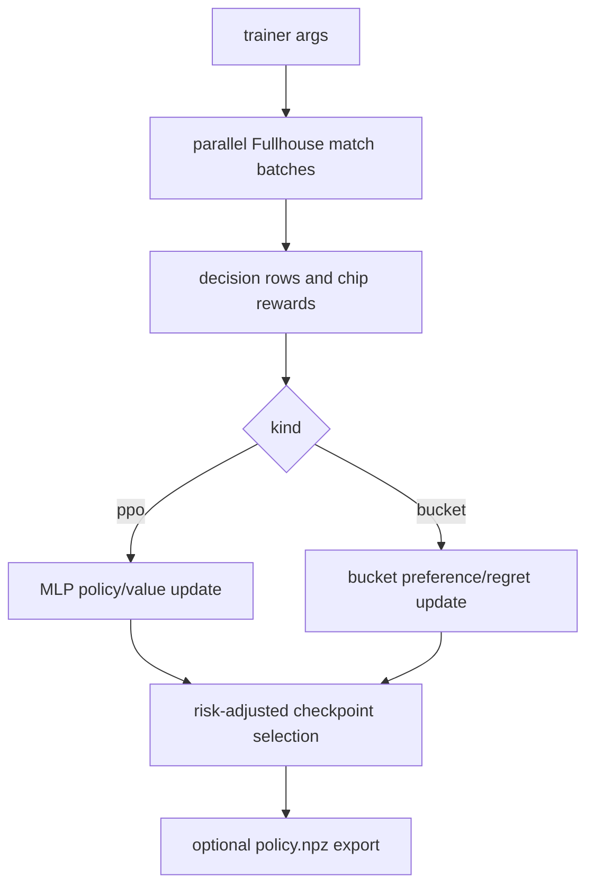

# Real Training Pipeline Plan

Reviewed: 2026-05-28.

This page is retained as a compatibility pointer. The canonical guide for real
training, PPO strong mocks, bucket mocks, parallel runs, and promotion rules is
`docs/training-pipelines.md`.

## Scope

`tools/strong_mocks/train_real_policy.py` trains benchmark-only opponents from
real in-process Fullhouse rollouts. It supports:

| Kind | Output | Use |
| --- | --- | --- |
| `ppo` | `bots/strong_mocks/ppo_policy/data/policy.npz` | MLP policy trained by clipped PPO-style updates. |
| `bucket` | `bots/strong_mocks/cfr_bucket/data/policy.npz` | Bucketed policy/regret table. |

The PPO runtime is documented in `docs/ppo-bot-logic.md`.

## Flow



## Commands

Use the wrapper for normal large runs:

```bash
OPPONENT_POOL=adversarial \
PPO_GENERATIONS=48 \
PPO_MATCHES_PER_GENERATION=128 \
PPO_HANDS=400 \
BUCKET_GENERATIONS=160 \
BUCKET_MATCHES_PER_GENERATION=128 \
BUCKET_HANDS=400 \
WORKERS=0 \
PARALLEL_BACKEND=process \
scripts/train_opponents_real.sh
```

Direct PPO trainer smoke:

```bash
poetry run python tools/strong_mocks/train_real_policy.py \
  --kind ppo \
  --generations 1 \
  --matches-per-generation 2 \
  --hands 8 \
  --opponent-pool fast \
  --json
```

## Current Guidance

- Keep artifacts benchmark-only unless intentionally promoted.
- Prefer repo-local `runs/` outputs over `/private/tmp`.
- Use risk-adjusted selection; raw mean chip delta alone is too noisy.
- Use `docs/training-pipelines.md` for current defaults and promotion gates.
