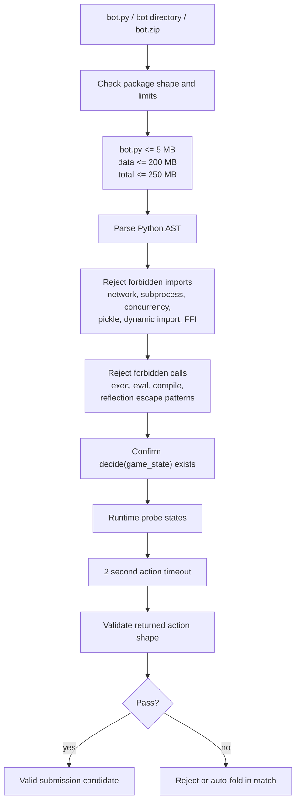

# Bot Restrictions And Sandbox Rules

Reviewed: 2026-05-27.

## Runtime Limits

- `decide(game_state)` has 2 seconds per action.
- Exceptions, crashes, malformed returns, and timeouts auto-fold for that decision or hand.
- Runtime container limits are 768 MB RAM and 0.5 CPU.
- Production-like Docker runs with `--network none`, `--read-only`, `--no-new-privileges`, a non-root user, and a small `/tmp` tmpfs.
- Local non-Docker matches use the same runner protocol but do not enforce every OS-level Docker restriction.

## Allowed Libraries

The sandbox-approved libraries are:

- `eval7`
- `numpy`
- `scipy`
- `treys`
- `scikit-learn`
- Python 3.10 standard library, subject to validator bans

The local repo also uses `flask` for `demo.py` and `pytest` for tests.

## Disallowed Behavior

Bots must not:

- Make external API calls or network calls.
- Use sockets, HTTP clients, DNS lookups, webhooks, or external compute.
- Read another bot's code, files, process memory, or hidden cards.
- Write files during gameplay.
- Spawn subprocesses, shell commands, or OS process-control calls.
- Use threading, multiprocessing, or async tricks to continue work past the decision timeout.
- Use reflection or dynamic escape attempts such as `__import__`, `eval`, `exec`, `compile`, `globals()[...]`, `locals()[...]`, or builtins access tricks.
- Collude with other submitted bots.
- Abuse resources or try to slow opponents.

## Validator Checks

`sandbox/validator.py` performs:

- Syntax parsing.
- Forbidden import detection.
- Forbidden call and reflection pattern detection.
- `decide()` existence check.
- Submission shape and size checks.
- Basic runtime checks across preflop, postflop, river, and short-stack states.
- 2-second action timeout checks.
- Return action shape checks.

Forbidden import roots currently include network, subprocess, serialization, concurrency, FFI, and dynamic import modules such as `socket`, `urllib`, `requests`, `httpx`, `subprocess`, `multiprocessing`, `pickle`, `threading`, `asyncio`, `ctypes`, `runpy`, and `importlib`.

## Submission Validation Flow



## Data Directory Rules

Optional `data/` files may be shipped for lookup tables, blueprints, or weights.

Rules:

- Load data at module-import time only.
- Use `os.environ["BOT_DATA_DIR"]` when available.
- Treat data as read-only.
- Keep `data/` under 200 MB.
- Do not include Python code in `data/`.
- Use `np.load(..., allow_pickle=False)` for numpy lookup data.

Minimal pattern:

```python
import os
import numpy as np

DATA_DIR = os.environ.get("BOT_DATA_DIR", os.path.join(os.path.dirname(__file__), "data"))
TABLE = np.load(os.path.join(DATA_DIR, "table.npz"), allow_pickle=False)

def decide(state):
    return {"action": "check"} if state["can_check"] else {"action": "fold"}
```

## In-Memory State

Bots may keep ordinary Python state in RAM, such as module-level dictionaries, counters, and cached opponent statistics. That memory persists across hands within a single bot process, but it is lost when the process exits, crashes, or a new match starts.

See `docs/bot-state-and-memory.md` for the fields provided to `decide()`, available action history, and safe memory patterns.
