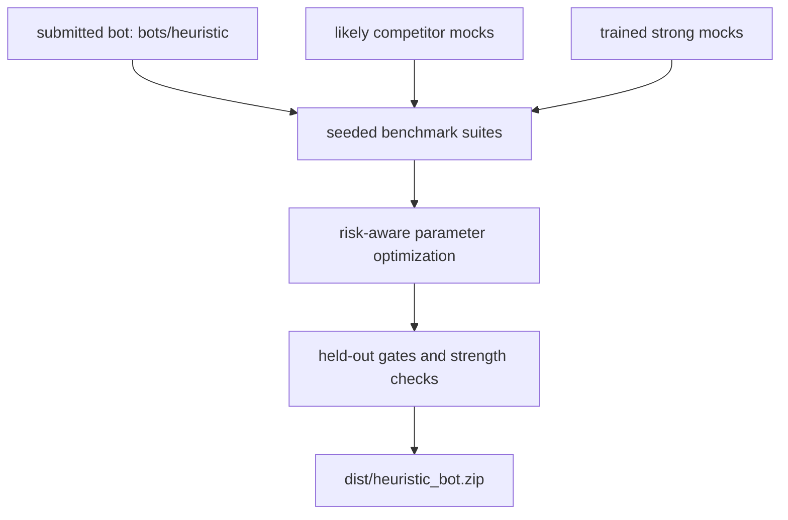

# Strategy And Training Story

Reviewed: 2026-06-02.

This repo's strategy is to submit one compact, legal, interpretable heuristic
bot, then train and tune it offline against opponents that resemble likely
hackathon submissions: RL policies, CFR/bucket policies, equity Monte Carlo
bots, threshold/pot-odds bots, pressure bots, and opponent-modeling bots.

For the second-chance qualifier workflow based on public portal replay data,
see `docs/qualifier-2-strategy.md`. That document is the source of truth for
portal data collection, replay-derived opponent profiles, and Qualifier 2
counter-strategy hypotheses.
For the separate replay-exploit Qualifier 2 candidate, see
`docs/replay-exploit-heuristic.md`.
For public-fork source inspection and source-to-portal match evidence, see
`docs/public-repo-strategy-research.md`.

The submitted bot is `bots/heuristic`. Everything under `bots/strong_mocks`,
`bots/mock_competitors`, `bots/benchmarks`, `tools`, `training`, and `scripts`
is local-only training or evaluation infrastructure.

## Overall Plan



The competition bot stays simple at runtime:

- no model server,
- no file writes,
- no subprocesses,
- no network,
- no dynamic imports,
- one legal `decide(game_state)` entry point.

The sophistication is pushed offline: we build stronger local opponents,
measure the heuristic against them with large samples, and promote only stable
parameter changes.

## Heuristic Bot Adaptations

| Area | What the submitted bot does | Primary code |
| --- | --- | --- |
| Preflop | Uses a 169-class score table plus position, stack, and opponent-profile adjustments. | `bots/heuristic/bot.py`, `tools/generate_preflop_table.py`, `tools/build_heuristic_tables.py` |
| Equity | Uses bounded `eval7` Monte Carlo postflop equity with street-specific sample knobs. | `bots/heuristic/bot.py` |
| Opponent profiles | Tracks public action history to classify maniacs, stations, nits, ABC players, and pressure spots. | `bots/heuristic/bot.py`, `tests/test_heuristic_profiles.py` |
| Risk guards | Raises required equity in high-risk, multiway, large-bet, and bust-prone spots. | `bots/heuristic/bot.py`, `tools/tune_heuristic_thresholds.py` |
| Bet sizing | Uses practical pot-fraction buckets plus low-frequency off-bucket sizes to pressure threshold/bucket bots. | `bots/heuristic/bot.py` |
| Candidate controls | Keeps blocker bluffs, delayed probes, pair-danger discounts, trap checks, and pressure adjustments as env-tunable knobs. | `bots/heuristic/bot.py`, `tools/tune_heuristic_thresholds.py`, `tools/tune_heuristic_full_space.py` |

The key design choice is that every risky behavior remains parameterized. The
bot can be tuned without changing its submission shape.

## Likely Competitor Logic

| Competitor style | Likely behavior | Local approximation |
| --- | --- | --- |
| PPO/RL policy | Learns abstract fold/call/raise/all-in actions from rollouts; can overbluff or over-call if reward attribution is noisy. | `bots/strong_mocks/ppo_policy`, `bots/strong_mocks/ppo_deep_policy`, `tools/strong_mocks/train_real_policy.py`, `tools/strong_mocks/train_deep_ppo.py` |
| CFR/bucket policy | Buckets states by hand strength, board texture, pot odds, and betting context; chooses table-driven actions. | `bots/strong_mocks/cfr_bucket`, `bots/mock_competitors/bucket_*`, `tools/strong_mocks/train_real_policy.py` |
| Equity Monte Carlo | Estimates equity with `eval7` and calls/raises based on pot odds and board texture. | `bots/mock_competitors/equity_*`, `bots/strong_mocks/rollout_search` |
| Threshold/pot-odds bot | Calls or folds around fixed odds/equity thresholds and may be exploitable by sizing. | `bots/benchmarks/threshold_caller`, `bots/mock_competitors/pot_odds_plus`, `bots/ref_bot_2` |
| Pressure bot | Uses frequent raises, half-pot pressure, all-ins, or short-stack aggression. | `bots/benchmarks/half_pot_pressure`, `bots/benchmarks/jammer`, `bots/benchmarks/short_stacker`, `bots/mock_competitors/pressure_heads_up` |
| Opponent modeler | Adjusts to public action frequencies and tries to exploit loose or passive patterns. | `bots/mock_competitors/opponent_modeler`, `bots/mock_competitors/anti_heuristic` |
| Replay-derived portal profile | Uses actual qualifier VPIP/PFR/call/fold/pressure/showdown profiles to approximate the observed field. | `bots/mock_competitors/portal_profile`, `tools/build_portal_profiles.py`, `tools/build_portal_profile_mocks.py`, `tools/evaluate_portal_profile_mocks.py` |
| Public-source qualifier match | Compares public fork bot code against portal replay metrics before adopting counter-specific hypotheses. | `docs/public-repo-strategy-research.md`, `runs/portal_history/all_qualifier_public/strategy_report.json` |
| Reference/simple bots | Baseline field behavior from bundled bots. | `bots/shark`, `bots/mathematician`, `bots/aggressor`, `bots/template` |

These opponents are not assumed to be perfect poker agents. They are designed
to expose common failure modes: weak call-off discipline, threshold sizing
leaks, overfolding, overraising, bucket rigidity, and brittle RL policies.

## Training The Opponents

The mock-opponent training path has three layers:

1. `tools/train_mock_numpy_policy.py` trains lightweight numpy-policy mock
   competitors from synthetic oracle labels.
2. `tools/strong_mocks/train_real_policy.py`,
   `tools/strong_mocks/train_deep_ppo.py`, and
   `tools/strong_mocks/train_arm_selector.py` train stronger benchmark-only
   opponents from real Fullhouse rollouts and heuristic-teacher labels.
3. `tools/strong_mocks/tune_arm_selector_params.py` tunes the selector
   thresholds and risk constants with CEM/racing.
4. `tools/check_strong_mocks.py` verifies every strong mock against
   default/reference bots before those opponents are trusted as a tuning pool.

The serious wrapper is:

```bash
WORKERS=0 PARALLEL_BACKEND=process scripts/train_all_strong_mocks.sh
```

It trains oracle imitation, PPO, bucket/CFR, deep PPO, and heuristic-selector
strong mocks; tunes the selector `params.npz`; then gates `rollout_search` and
`ensemble` together with the learned mocks. The older
`scripts/train_opponents_real.sh` remains available for PPO/bucket-only
experiments.

## Optimizing Heuristic Parameters

There are two parameter paths:

- `tools/tune_heuristic_thresholds.py` compares named hypotheses such as
  conservative, pressure, anti-bucket, pair-danger, and blocker-probe configs.
- `tools/tune_heuristic_full_space.py` searches the full `HEURISTIC_*`
  parameter surface with staged CEM/racing and held-out validation.

The full-space optimizer is the scalable path. It parses about 90 env knobs
from `bots/heuristic/bot.py`, evaluates candidates against strong suites with
common seed blocks, penalizes variance/busts/errors, and writes `best_env.sh`
plus `final_validation.json`.

Method details and references are in
`docs/heuristic-full-space-optimization.md`.

The separate `bots/replay_exploit_heuristic` candidate has its own focused
`REPLAY_EXPLOIT_*` optimizer in `tools/tune_replay_exploit.py`. Use it for
replay-derived guardrail, sizing, call-off, and style-rotation parameters after
calibrating portal mocks with `tools/evaluate_mock_league.py`. Its scorer now
uses both soft bust targets and hard global/worst-suite bust caps, so CEM ranks
survivable candidates ahead of high-mean candidates that collapse in portal
suites. Do not promote constants from small smoke samples.

For a single serious command that trains the strong mocks, tunes the heuristic,
bakes the best tuned env into the zip, and runs final submission validation:

```bash
WORKERS=0 PARALLEL_BACKEND=process scripts/build_tuned_submission.sh
```

## Repo File Map

| Path | Role in the story |
| --- | --- |
| `bots/heuristic/bot.py` | Submitted heuristic poker bot; all promoted runtime logic lives here. |
| `bots/replay_exploit_heuristic/bot.py` | Separate adjustable Qualifier 2 candidate that targets replay-derived overfolder/station hypotheses. |
| `bots/heuristic/data/tables.npz` | Optional read-only generated table used by the submitted bot. |
| `bots/benchmarks/*/bot.py` | Simple exploit-target bots for stress tests: callers, folders, minraisers, jammers, pressure, and short-stack lines. |
| `bots/mock_competitors/*/bot.py` | Likely-submission approximations: bucket policies, equity bots, numpy policies, pressure bots, pot-odds bots, and anti-heuristic bots. |
| `bots/mock_competitors/portal_profile/bot.py` | Replay-profile mock template that reads `data/profile.json` and uses bounded `eval7` equity sampling. |
| `bots/mock_competitors/portal_behavior_clone/bot.py` | Replay-conditioned clone mock template that reads `data/policy.json` action and sizing distributions. |
| `bots/mock_competitors/common.py` | Shared helpers for benchmark-only mock competitors. |
| `bots/strong_mocks/*/bot.py` | Stronger trained or rollout opponents used only for offline evaluation. |
| `bots/self_training/heuristic_variant_template/bot.py` | Wrapper template for generated heuristic env-config variants. |
| `bots/shark`, `bots/mathematician`, `bots/aggressor`, `bots/template`, `bots/ref_bot_2` | Reference/default bots used as baselines and strength gates. |
| `training/fast_match.py` | In-process local match runner for training batches where sandbox subprocess restrictions are unnecessary. |
| `sandbox/validator.py` | Submission-shape validator used before packaging. |
| `sandbox/match.py` | Local sandboxed match runner for official-style benchmarks. |
| `sandbox/runner.py` | Frozen subprocess runner for submitted bots. |
| `tools/evaluate_heuristic.py` | Seeded benchmark suite runner for `bots/heuristic`. |
| `tools/select_heuristic_config.py` | Risk-aware named-config ranking and promotion/final screens. |
| `tools/paired_heuristic_gate.py` | Paired incumbent-vs-candidate gate using identical suite/seed tasks. |
| `tools/tune_heuristic_thresholds.py` | Named env-config definitions and statistically gated comparison runner. |
| `tools/tune_heuristic_full_space.py` | Full-space CEM/racing optimizer for all numeric `HEURISTIC_*` env knobs. |
| `tools/tune_replay_exploit.py` | Focused CEM/racing optimizer for the separate replay-exploit candidate's `REPLAY_EXPLOIT_*` knobs. |
| `tools/paired_replay_exploit_gate.py` | Paired incumbent-vs-replay-candidate gate with candidate bust root-cause labels. |
| `tools/check_strong_mocks.py` | Statistical gate proving strong mocks beat default/reference bots before use. |
| `tools/train_mock_numpy_policy.py` | Synthetic-label trainer for lightweight numpy-policy mock competitors. |
| `tools/strong_mocks/features.py` | Public-state feature vector shared by strong-mock policies. |
| `tools/strong_mocks/actions.py` | Eight-action abstraction and strategic masks for PPO/bucket strong mocks. |
| `tools/strong_mocks/deep_actions.py` | Fourteen-action abstraction for the deep PPO strong mock. |
| `tools/strong_mocks/policies.py` | Runtime inference for oracle, PPO, CFR/bucket, rollout, and ensemble strong mocks. |
| `tools/strong_mocks/deep_policies.py` | Runtime inference for the independent deep PPO mock. |
| `tools/strong_mocks/abstractions.py` | State abstraction for bucket/CFR-like training. |
| `tools/strong_mocks/dataset.py` | Synthetic state and oracle-label generation for training. |
| `tools/strong_mocks/expert_arms.py` | Human-poker expert candidate actions for the arm-selector mock. |
| `tools/strong_mocks/arm_selector_policy.py` | Contextual selector over expert arms. |
| `tools/strong_mocks/arm_selector_params.py` | Bounded selector-parameter registry. |
| `tools/strong_mocks/train_all_strong_mocks.py` | Orchestrates all strong-mock training, selector tuning, and final strength gating. |
| `tools/strong_mocks/train_real_policy.py` | Real Fullhouse rollout trainer for PPO and bucket/CFR-like strong mocks. |
| `tools/strong_mocks/train_deep_ppo.py` | Independent deeper PPO trainer with expanded action arms. |
| `tools/strong_mocks/train_arm_selector.py` | Heuristic expert-arm selector trainer. |
| `tools/strong_mocks/tune_arm_selector_params.py` | CEM/racing tuner for arm-selector parameters. |
| `tools/strong_mocks/tune_rollout_search.py` | CEM/racing tuner for rollout-search f/g equity-to-sizing functions. |
| `tools/strong_mocks/self_train_heuristic.py` | Older generated-wrapper heuristic self-training loop; useful for candidate discovery, not final promotion. |
| `tools/strong_mocks/league_train.py` | Staged strong-mock training with held-out promotion gates. |
| `tools/build_heuristic_tables.py` | Rebuilds optional heuristic lookup data. |
| `tools/generate_preflop_table.py` | Generates explicit preflop score tables. |
| `tools/heuristic_env_overrides.py` | Loads tuned `HEURISTIC_*` env files and bakes them into packaged bot source. |
| `tools/package_heuristic.py` | Builds `dist/heuristic_bot.zip`, optionally with tuned env defaults baked into `bot.py`. |
| `tools/harden_submission.py` | Runs packaging, validation, zip inspection, and sanity matches, optionally against a tuned env file. |
| `tools/plot_training_progress.py` | Converts JSONL training traces to SVG plots. |
| `tools/parallel.py` | Process/thread helper for local benchmark and training workloads. |
| `tools/analyze_hand_history.py` | Post-qualifier hand-history analysis helper. |
| `tools/download_portal_match_history.py` | Supabase REST downloader for public portal metadata and hand-history tables. |
| `tools/download_portal_targeted_history.py` | Targeted/streamed portal replay downloader by rank, bot, or match selection. |
| `tools/analyze_portal_strategy.py` | Portal replay analyzer for bot-level VPIP/PFR/aggression/pressure/showdown tendencies. |
| `tools/build_portal_profiles.py` | Builds profile summaries and profile-level mock configs from portal strategy reports. |
| `tools/build_portal_profile_mocks.py` | Materializes generated profile mock bot directories under `runs/portal_profile_mocks/`. |
| `tools/build_portal_behavior_clones.py` | Materializes replay-conditioned behavior-clone mock bot directories under `runs/portal_behavior_clones/`. |
| `tools/evaluate_portal_profile_mocks.py` | Runs sandbox candidate-vs-profile-mock evaluations from a generated mock manifest. |
| `tools/evaluate_mock_league.py` | Runs built-in or portal-profile mocks against each other to calibrate the opponent pool before tuning. |
| `tools/coevolve_training.py` | Alternating PPO/heuristic coevolution orchestrator. |
| `scripts/train_all_strong_mocks.sh` | Main train/tune/gate wrapper for the complete strong-mock pool. |
| `scripts/train_opponents_real.sh` | Targeted PPO/bucket-only strong-mock training wrapper. |
| `scripts/train_heuristics_selfplay.sh` | Generated-wrapper heuristic self-training wrapper. |
| `scripts/train_e2e_coevolution.sh` | Alternating strong-mock and heuristic coevolution wrapper. |
| `scripts/train_opponents_league.sh` | Staged league-style strong-mock training wrapper. |
| `scripts/build_tuned_submission.sh` | End-to-end strong-mock training, full-space heuristic tuning, tuned-env baking, and submission zip generation. |
| `scripts/run_submission_pipeline.sh` | Final unattended benchmark and zip-preparation wrapper. |
| `tests/*.py` | Regression tests for engine behavior, heuristic profiles, strong-mock trainers, optimizers, gates, docs, and packaging helpers. |

## Implementation Anchors

| Code reference | Why it matters |
| --- | --- |
| [`bots/heuristic/bot.py` tunables](../bots/heuristic/bot.py#L55) | Numeric `HEURISTIC_*` controls exposed for named sweeps and full-space optimization. |
| [`bots/heuristic/bot.py` preflop table](../bots/heuristic/bot.py#L262) | Explicit 169-class preflop table used instead of runtime preflop Monte Carlo. |
| [`bots/heuristic/bot.py` opponent profiles](../bots/heuristic/bot.py#L611) | Public-action profile logic for maniac/station/nit/ABC adaptations. |
| [`bots/heuristic/bot.py` equity estimator](../bots/heuristic/bot.py#L866) | Bounded postflop equity estimate used by call/value/bluff decisions. |
| [`bots/heuristic/bot.py` preflop policy](../bots/heuristic/bot.py#L1130) | Main preflop action policy and raise/call thresholds. |
| [`bots/heuristic/bot.py` postflop policy](../bots/heuristic/bot.py#L1373) | Main postflop value, bluff, sizing, and risk-control policy. |
| [`bots/heuristic/bot.py` decide](../bots/heuristic/bot.py#L1461) | Single submitted-bot entry point. |
| [`tools/tune_heuristic_full_space.py` parameter parser](../tools/tune_heuristic_full_space.py#L119) | Discovers the full numeric `HEURISTIC_*` search space from source. |
| [`tools/tune_heuristic_full_space.py` budget guard](../tools/tune_heuristic_full_space.py#L304) | Enforces meaningful sample sizes before serious optimization runs. |
| [`tools/tune_heuristic_full_space.py` optimizer loop](../tools/tune_heuristic_full_space.py#L344) | Implements staged CEM/racing, artifacts, plots, and final validation. |
| [`tools/tune_replay_exploit.py` tuner](../tools/tune_replay_exploit.py#L1) | Optimizes focused replay-exploit guardrail, sizing, call-off, and style-rotation parameters with staged CEM/racing. |
| [`tools/evaluate_mock_league.py` league runner](../tools/evaluate_mock_league.py#L1) | Calibrates built-in and portal-profile mocks through mock-vs-mock six-max and heads-up leagues. |
| [`tools/check_strong_mocks.py` candidate registry](../tools/check_strong_mocks.py#L19) | Lists all strong-mock opponents that must pass the strength gate. |
| [`tools/check_strong_mocks.py` gate runner](../tools/check_strong_mocks.py#L133) | Enforces default/reference strength checks before trusting strong mocks. |
| [`tools/strong_mocks/tune_rollout_search.py` CLI](../tools/strong_mocks/tune_rollout_search.py#L526) | Searches smooth rollout-search f/g sizing parameters and checks 1024-sample latency against the 2-second action budget. |
| [`docs/rollout-search.md`](rollout-search.md) | Documents rollout-search equity estimation, f/g formulas, tunable parameters, and the final rollout gate. |
| [`tools/select_heuristic_config.py` CLI](../tools/select_heuristic_config.py#L205) | Runs risk-aware named config screens and promotion/final matrices. |
| [`tools/tune_heuristic_thresholds.py` CLI](../tools/tune_heuristic_thresholds.py#L236) | Runs named hypothesis comparisons with budget guards. |
| [`tools/strong_mocks/train_real_policy.py` budget guard](../tools/strong_mocks/train_real_policy.py#L713) | Prevents tiny PPO/bucket training runs from overwriting real artifacts. |
| [`tools/strong_mocks/train_deep_ppo.py` budget guard](../tools/strong_mocks/train_deep_ppo.py#L598) | Applies the same serious-budget rule to the deep PPO mock. |
| [`tools/strong_mocks/train_arm_selector.py` budget guard](../tools/strong_mocks/train_arm_selector.py#L612) | Applies the same serious-budget rule to the expert-arm selector. |
| [`tools/strong_mocks/train_all_strong_mocks.py` budget guard](../tools/strong_mocks/train_all_strong_mocks.py#L79) | Enforces serious budgets across every strong-mock trainer and the final gate. |
| [`tools/strong_mocks/train_all_strong_mocks.py` orchestrator](../tools/strong_mocks/train_all_strong_mocks.py#L492) | Runs all learned strong-mock trainers, selector tuning, and strength gating. |
| [`scripts/train_all_strong_mocks.sh`](../scripts/train_all_strong_mocks.sh#L1) | Main command wrapper for complete strong-mock training and validation. |
| [`scripts/train_opponents_real.sh`](../scripts/train_opponents_real.sh#L1) | Lower-level PPO/bucket-only wrapper. |
| [`scripts/train_heuristics_selfplay.sh`](../scripts/train_heuristics_selfplay.sh#L1) | Wrapper for generated heuristic config self-training and progress plots. |
| [`scripts/run_submission_pipeline.sh`](../scripts/run_submission_pipeline.sh#L1) | Final benchmark and submission zip preparation wrapper. |

## Essential Commands

See `docs/training-pipelines.md` for exact commands, budgets, outputs, and
promotion rules.
