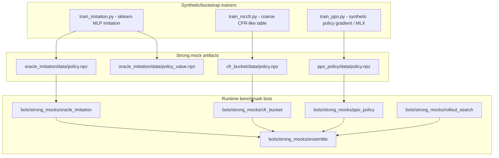
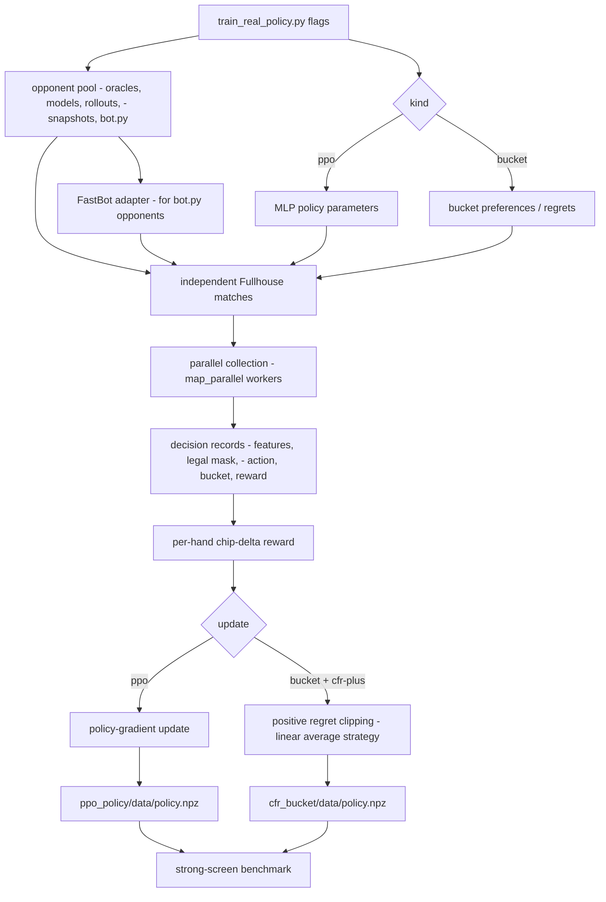
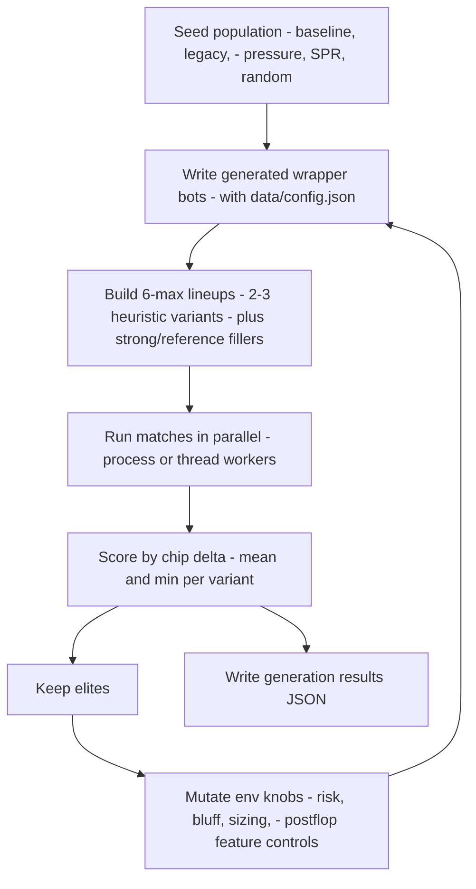

# Strong Mock And Self-Training Pipeline

Reviewed: 2026-05-27.

## Purpose

This pipeline creates stronger local benchmark opponents and evolves heuristic
config variants without changing the submitted bot structure.

The submitted bot remains:

```text
bots/heuristic/bot.py
bots/heuristic/data/tables.npz
```

Do not split `bots/heuristic/bot.py` into helper packages before the event.
The validator and submission package are safer with a single-file bot. Training
and experimental opponents live outside that path.

## Structure

```text
tools/strong_mocks/
  abstractions.py
  features.py
  actions.py
  dataset.py
  policies.py
  train_imitation.py
  train_mccfr.py
  train_ppo.py
  train_real_policy.py
  league_train.py
  self_train_heuristic.py

training/
  fast_match.py

bots/strong_mocks/
  oracle_imitation/
  ppo_policy/
  cfr_bucket/
  rollout_search/
  ensemble/

bots/self_training/
  heuristic_variant_template/
```

The strong mock bots are local benchmark opponents. They are not submission
templates.

`training/fast_match.py` is the unrestricted bot-directory runner for large
training and validation batches. It uses the same `PokerEngine` rules as
`sandbox/match.py`, but imports bots in-process and parallelizes independent
matches without Docker, subprocess, timeout, CPU, or memory limits.

## Refactor Decision

Current decision: no production refactor.

Reasons:

- `bots/heuristic/bot.py` already validates as a submission-shaped bot.
- Runtime imports in a submitted bot are more fragile than local tooling.
- Multiple heuristic variants can be generated as wrapper bot directories that
  set environment overrides and then import `bots.heuristic.bot`.
- Training code can be modular without affecting final packaging.

Future refactor trigger:

- Only split production code if two or more promoted features need shared
  logic that cannot stay readable in one file.
- Before any split, confirm `tools/package_heuristic.py`,
  `tools/harden_submission.py`, and `sandbox/validator.py` still accept the
  final package.

## Strong Mock Training

Generate or refresh default synthetic/bootstrap strong-mock artifacts:

```bash
poetry run python tools/strong_mocks/train_imitation.py --samples 6000 --hidden 32 --seed 4242 --style balanced --output bots/strong_mocks/oracle_imitation/data/policy.npz --json
poetry run python tools/strong_mocks/train_imitation.py --samples 6000 --hidden 32 --seed 4243 --style value --output bots/strong_mocks/oracle_imitation/data/policy_value.npz --json
poetry run python tools/strong_mocks/train_mccfr.py --iterations 180 --batch-size 2048 --bucket-count 4096 --seed 5151 --output bots/strong_mocks/cfr_bucket/data/policy.npz --json
poetry run python tools/strong_mocks/train_ppo.py --backend auto --iterations 64 --batch-size 512 --hidden 32 --seed 6161 --output bots/strong_mocks/ppo_policy/data/policy.npz --json
```

Longer overnight runs can increase samples, iterations, hidden size, and CFR
bucket count. Keep generated files under each bot's `data/` directory and load
with `np.load(..., allow_pickle=False)`.

`train_ppo.py --backend auto` uses MLX on Apple Silicon when available and
falls back to the numpy implementation otherwise. MLX is a dev dependency only;
do not import it from `bots/heuristic/bot.py`.



## Real Fullhouse Training

`tools/strong_mocks/train_real_policy.py` trains benchmark opponents from
actual Fullhouse engine rollouts instead of synthetic oracle labels. It supports:

- `--kind ppo`: policy-gradient updates for the exported MLP policy.
- `--kind bucket`: bucketed policy training for `cfr_bucket`.
- `--bucket-update cfr-plus`: positive-regret clipping and linear
  average-strategy weighting adapted from CFR+ style systems.
- `--abstraction cfr-pokerbot`: Fullhouse-compatible abstraction inspired by
  `jeffelin/CFR_pokerbot`, excluding Toss Hold'em-only mechanics.
- `--workers 0 --parallel-backend process`: process-parallel match collection.
- `--opponent-pool adversarial`: mixes oracle/model/rollout opponents with
  real local `bot.py` opponents loaded through the fast in-process runner.
- `--export-best`: exports the best observed checkpoint instead of the last
  generation.

Real opponent training entrypoint:

```bash
scripts/train_opponents_real.sh
```

Short smoke:

```bash
PPO_GENERATIONS=1 PPO_MATCHES_PER_GENERATION=2 PPO_HANDS=8 \
BUCKET_GENERATIONS=1 BUCKET_MATCHES_PER_GENERATION=2 BUCKET_HANDS=8 \
FAST_SMOKE_REPEAT=1 STRONG_SCREEN_SEEDS=1 WORKERS=1 scripts/train_opponents_real.sh
```

The script validates trained bots, runs a fast unrestricted batch through
`training.fast_match`, and then runs a small parallel strong-screen after
training. For serious training, leave `WORKERS=0` so the helper auto-selects
local process workers.



## Self-Training

## League Training

`tools/strong_mocks/league_train.py` is the preferred framework for stronger
mock opponent training when time allows. It wraps `train_real_policy.py` in
stages:

- `oracle_bootstrap`
- `public_adversarial`
- `league_mixed`

Each stage trains a candidate, evaluates it against held-out pools with
`training.fast_match`, compares it with the incumbent repo artifact, and
promotes only if it clears the score margin and has zero bot errors.

Entry point:

```bash
WORKERS=0 PARALLEL_BACKEND=process scripts/train_opponents_league.sh
```

Use `PROMOTE=0` for dry runs that archive candidates without changing
`bots/strong_mocks/*/data/policy.npz`.

## Self-Training

`tools/strong_mocks/self_train_heuristic.py` evolves named heuristic configs.
Each generated bot directory copies the wrapper template and writes
`data/config.json`.

That config sets environment variables before importing `bots.heuristic.bot`.
Because Fullhouse runs each bot in its own process, 2 or 3 heuristic variants
can sit in the same 6-player match with independent settings.



Smoke command:

```bash
poetry run python tools/strong_mocks/self_train_heuristic.py --run-id smoke --generations 1 --population 4 --elite 2 --matches-per-generation 2 --hands 12 --seed 22 --generated-root /private/tmp/fullhouse_self_training/generated --result-root /private/tmp/fullhouse_self_training/results --json
```

Real local run:

```bash
poetry run python tools/strong_mocks/self_train_heuristic.py --run-id local-$(date +%Y%m%d) --generations 4 --population 10 --elite 3 --matches-per-generation 8 --hands 240 --seed 8080 --workers 0 --parallel-backend process --json
```

For a generation to cover every candidate at least once, use:

```text
matches_per_generation >= ceil(population / max_heuristics)
```

Default `10 / 3` needs at least 4 matches; the default 8 gives repeat samples.

## Parallel Execution

The offline harnesses support independent-match parallelism:

```bash
poetry run python -m training.fast_match bots/heuristic bots/strong_mocks/ensemble bots/shark --hands 400 --repeat 16 --workers 0 --parallel-backend process --json
poetry run python tools/evaluate_heuristic.py --suite strong_mock_6max --seed-count 10 --hands 400 --workers 0 --parallel-backend process --summary-only
poetry run python tools/evaluate_heuristic.py --suite heads_up_shark --seed-count 10 --hands 400 --workers 4 --parallel-backend thread --summary-only
poetry run python tools/select_heuristic_config.py --preset strong-screen --config baseline --workers 0 --parallel-backend process --progress
poetry run python tools/strong_mocks/self_train_heuristic.py --run-id local --generations 4 --population 10 --matches-per-generation 8 --workers 0 --parallel-backend process --json
```

Backend guidance:

- `process`: default recommendation for serious screens. It isolates match
  state, avoids Python GIL contention, and is safest for in-process fast
  matches.
- `thread`: lower overhead for short local validation where most time is spent
  waiting on bot subprocess pipes. Use it only within one config at a time; it
  is less isolated for `training.fast_match`.
- `asyncio`: not implemented because `sandbox.match.run_match()` is synchronous
  and CPU/subprocess blocking. A useful async version would require a separate
  async match orchestrator.

Use `--workers 0` to auto-select up to `os.cpu_count()` workers, capped by the
number of tasks.

## Benchmark Suites

Strong-mock suites are wired into `tools/evaluate_heuristic.py`:

- `strong_mock_6max`
- `strong_hybrid_6max`
- `heads_up_strong_rollout`
- `heads_up_strong_ensemble`

Focused selector preset:

```bash
poetry run python tools/select_heuristic_config.py --preset strong-screen --config baseline --config spr-anti-bucket --seed-count 10 --hands 400 --progress --json
```

Do not promote a default from a smoke run. Use strong-screen results as an
additional stress signal, then confirm with `promotion` or `final` presets.

## Validation Gates

Run after changing this pipeline:

```bash
poetry run python -m py_compile training/fast_match.py tools/parallel.py tools/strong_mocks/*.py tools/evaluate_heuristic.py tools/select_heuristic_config.py bots/self_training/heuristic_variant_template/bot.py
poetry run pytest -q tests/test_fast_match.py
poetry run python sandbox/validator.py bots/strong_mocks/oracle_imitation --json
poetry run python sandbox/validator.py bots/strong_mocks/ppo_policy --json
poetry run python sandbox/validator.py bots/strong_mocks/cfr_bucket --json
poetry run python sandbox/validator.py bots/strong_mocks/rollout_search --json
poetry run python sandbox/validator.py bots/strong_mocks/ensemble --json
poetry run python tools/evaluate_heuristic.py --suite strong_mock_6max --suite heads_up_strong_rollout --seed-count 1 --hands 20 --summary-only
poetry run python tools/evaluate_heuristic.py --suite heads_up_shark --seed-count 2 --hands 8 --workers 2 --parallel-backend thread --summary-only
poetry run python tools/evaluate_heuristic.py --suite heads_up_shark --seed-count 2 --hands 8 --workers 2 --parallel-backend process --summary-only
```

## Current Smoke Results

Reviewed: 2026-05-27.

Trained artifact smoke:

| Artifact | Command Result |
| --- | --- |
| `oracle_imitation/data/policy.npz` | 6,000 samples, balanced style, train accuracy `0.9928` |
| `oracle_imitation/data/policy_value.npz` | 6,000 samples, value style, train accuracy `0.9893` |
| `cfr_bucket/data/policy.npz` | 180 iterations, 2,048 batch, 4,096 buckets |
| `ppo_policy/data/policy.npz` | MLX GPU backend, 64 iterations, oracle agreement `0.6278`, average reward `0.6779` |
| `/private/tmp/fullhouse_policy_tuning_smoke.npz` | MLX GPU backend, 32 iterations, oracle agreement `0.6136`, average reward `0.6748` |

Strong bot validators:

- `oracle_imitation`: passed.
- `ppo_policy`: passed.
- `cfr_bucket`: passed.
- `rollout_search`: passed.
- `ensemble`: passed.

Benchmark smoke:

| Suite | Hands | Mean | Positive | Busts | Errors |
| --- | ---: | ---: | ---: | ---: | ---: |
| `strong_mock_6max` | 20 | 3,070 | 1/1 | 0 | 0 |
| `heads_up_strong_rollout` | 20 | 65 | 1/1 | 0 | 0 |

Selector smoke:

- `strong-screen`, `baseline` vs `spr-anti-bucket`, 1 seed x 12 hands:
  wiring passed with no heuristic errors.
- The short run produced negative values and one bust for both configs, so it
  is an integration check only, not a strategy decision.

Postflop feature self-training smoke:

- `postflop-smoke`, 2 generations, 6 candidates, 3 matches/generation, 80
  hands, process parallelism.
- Generation 0 favored `legacy` and `spr_anti_bucket` variants.
- Generation 1 top mutation remained conservative/legacy-like and used only
  small postflop feature adjustments.
- Decision: keep this as a pipeline validation only. The sample is too small
  to promote heuristic defaults.
