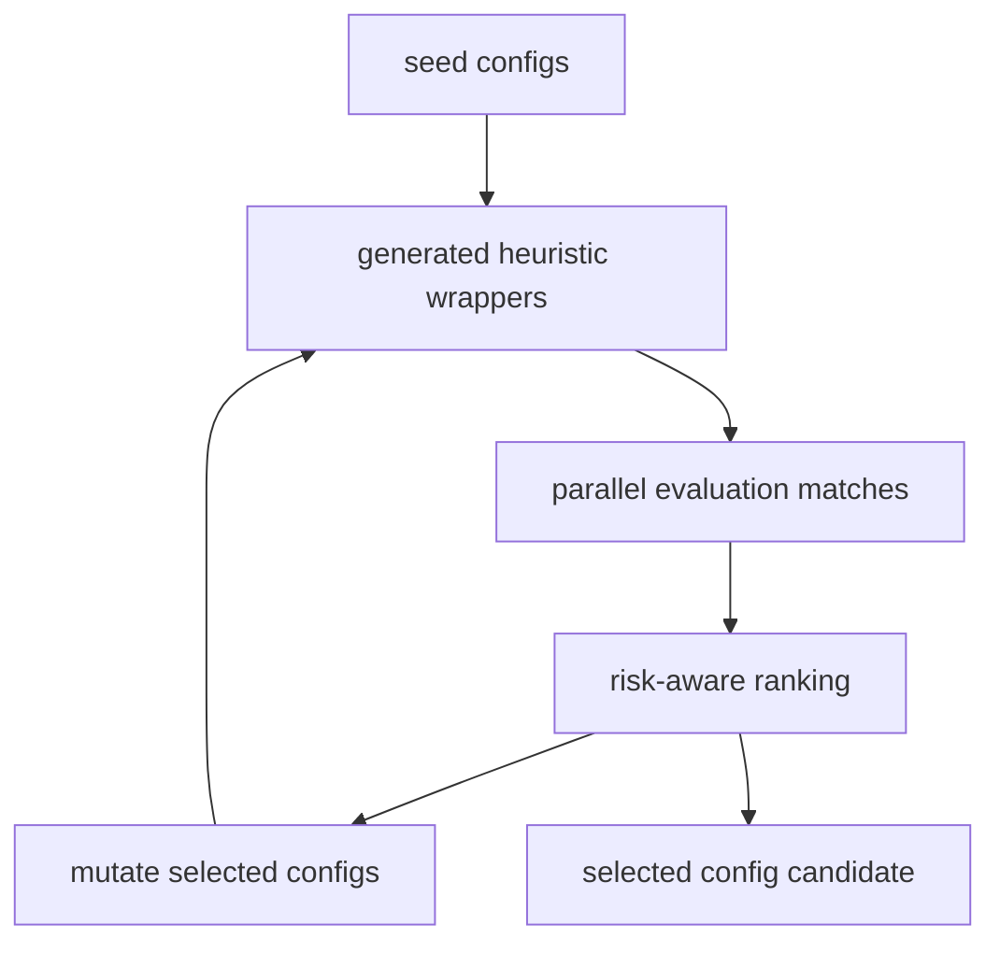

# Strong Mock And Self-Training Pipeline

Reviewed: 2026-05-28.

This page is now a concise route map. The canonical training guide is
`docs/training-pipelines.md`; PPO details are in `docs/ppo-bot-logic.md`.

## Strong Mock Families

| Directory | Purpose |
| --- | --- |
| `bots/strong_mocks/oracle_imitation` | MLP imitation of handcrafted oracle styles. |
| `bots/strong_mocks/ppo_policy` | PPO-style MLP policy trained from Fullhouse rollouts. |
| `bots/strong_mocks/ppo_deep_policy` | Independent deeper PPO-style MLP with 14 action arms. |
| `bots/strong_mocks/cfr_bucket` | Bucketed CFR-like policy table. |
| `bots/strong_mocks/rollout_search` | Runtime rollout/equity pressure opponent. |
| `bots/strong_mocks/ensemble` | Mixed strong-mock opponent for stress screens. |

These are benchmark opponents. They are not the submitted competition bot.
Use `ppo_deep_policy` when experimenting with PPO architecture without touching
the original `ppo_policy` artifact or scripts.

## Self-Training Purpose

`tools/strong_mocks/self_train_heuristic.py` evolves heuristic env-config
variants by running generated wrapper bots against reference, mock, and strong
opponents. It is useful for finding parameter regions to test more rigorously.



## Commands

Normal self-training wrapper:

```bash
WORKERS=0 PARALLEL_BACKEND=process scripts/train_heuristics_selfplay.sh
```

Tiny smoke:

```bash
poetry run python tools/strong_mocks/self_train_heuristic.py \
  --run-id smoke \
  --generations 1 \
  --population 4 \
  --elite 2 \
  --matches-per-generation 2 \
  --hands 12 \
  --json
```

## Current Guidance

- Treat generated configs as candidates, not defaults.
- Promote only after the final benchmark gate.
- Use coevolution when you want heuristic variants to train against the latest
  selected PPO strong mock.
