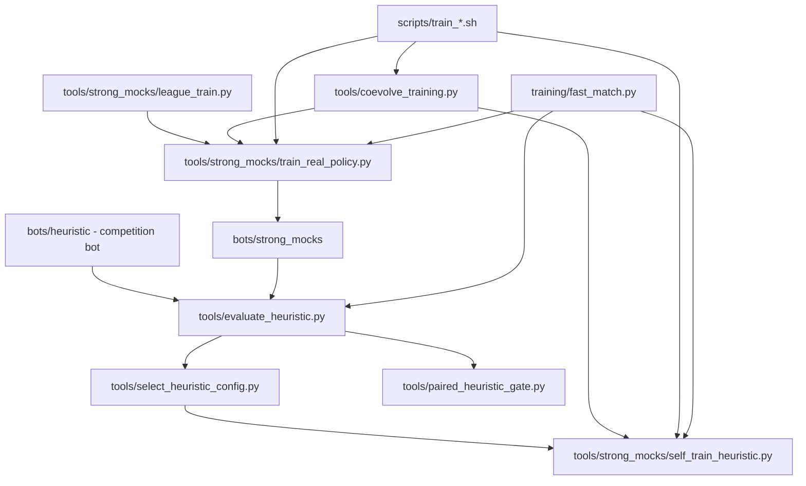
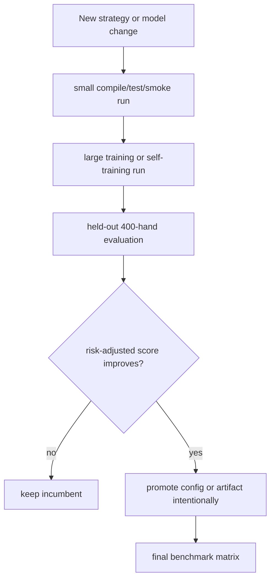

# Training Pipelines

Reviewed: 2026-05-28.

This is the canonical guide for local-only training and benchmark pipelines.
Use it instead of copying details between the older real-training, league,
strong-mock, fast-runner, and coevolution notes.

The competition submission remains `bots/heuristic`. Everything in this file is
offline infrastructure for building better tests, tuning heuristic parameters,
or training benchmark-only mock opponents.

## Pipeline Map



## Entry Points

| Entry point | Use when | Output |
| --- | --- | --- |
| `scripts/run_submission_pipeline.sh` | One-command unattended submission hardening, paired gates, strong/mock screens, final matrix, and zip rebuild. | `runs/submission_pipeline/<run-id>/` plus `dist/heuristic_bot.zip` |
| `scripts/train_e2e_coevolution.sh` | Alternating PPO mock training and heuristic parameter evolution. | `runs/fullhouse_coevolution/<run-id>/` |
| `scripts/train_opponents_real.sh` | Train PPO and bucket/CFR-like strong mocks from real Fullhouse rollouts. | `runs/fullhouse_real_training/<run-id>/` and optional mock artifacts |
| `scripts/train_heuristics_selfplay.sh` | Evolve heuristic env-config variants against mock pools. | `runs/fullhouse_self_training/<run-id>/` |
| `tools/strong_mocks/train_real_policy.py` | Direct low-level PPO or bucket training. | One `policy.npz` artifact plus JSONL logs |
| `tools/strong_mocks/train_deep_ppo.py` | Independent deep PPO mock with 14 action arms. | `bots/strong_mocks/ppo_deep_policy/data/policy.npz` or a custom output |
| `tools/strong_mocks/train_arm_selector.py` | Heuristic expert-arm selector training; preferred RL-assisted architecture. | `bots/strong_mocks/heuristic_rl_selector/data/policy.npz` or a custom output |
| `tools/strong_mocks/tune_arm_selector_params.py` | CEM/racing tuner for selector thresholds and bet-sizing constants. | `runs/arm_selector_param_tuning/<run-id>/` plus optional promoted `params.npz` |
| `tools/paired_heuristic_gate.py` | Paired incumbent-vs-candidate default-promotion checks on identical suite/seed tasks. | JSON report with paired mean/median/p10/win-rate and promotable flag |
| `tools/strong_mocks/league_train.py` | Staged train/eval pools and promotion gates. | League run directory and optional promoted artifact |
| `training/fast_match.py` | Fast unrestricted local matches for training/evaluation. | JSON summaries |

Run outputs are stored under `runs/`, which is git-ignored. Do not put large or
temporary training outputs in `/private/tmp`; repo-local runs are easier to
inspect and resume.

## Recommended Workflow



Default principle: train on one pool, evaluate on a held-out pool, and promote
only after the held-out score and bust rate are acceptable.

The run-and-forget submission command is:

```bash
WORKERS=0 PARALLEL_BACKEND=process scripts/run_submission_pipeline.sh
```

It writes JSON reports, `pipeline.log`, and `SUMMARY.md` under
`runs/submission_pipeline/<run-id>/`, then leaves the upload candidate at
`dist/heuristic_bot.zip`. It does not auto-promote candidate configs; use its
paired-gate report to decide whether a follow-up source change is justified.

For submitted-bot default changes, use paired comparisons after smoke tests:

```bash
poetry run python tools/paired_heuristic_gate.py \
  --incumbent baseline \
  --candidate profile-targeting-off \
  --preset promotion \
  --workers 0 \
  --parallel-backend process \
  --progress \
  --json
```

The gate is intentionally conservative: paired mean and median must improve,
the 10th-percentile paired difference cannot collapse, win rate must clear the
configured threshold, and errors/busts cannot regress beyond the allowed cap.

## Cumulative Runs

The bash wrappers are cumulative by default:

- repeated `RUN_ID=coevolve-current scripts/train_e2e_coevolution.sh` resumes
  from the latest selected heuristic and PPO artifacts recorded in `state.json`,
- set `RESET=1` only when intentionally starting a clean run,
- `PROMOTE_PPO=1` is required before coevolution overwrites the canonical
  `bots/strong_mocks/ppo_policy/data/policy.npz`,
- generated training artifacts should stay out of git unless explicitly
  promoted.

## PPO Strong Mock Training

Read `docs/ppo-bot-logic.md` before changing PPO runtime or training code.
For new RL-assisted strategy work, read
`docs/heuristic-rl-arm-selector.md`; it is the preferred architecture.

Current PPO defaults are intentionally conservative:

- sampled-softmax inference to match rollout behavior,
- recorded behavior temperature for PPO ratio calculations,
- frozen feature normalization by default,
- clipped PPO-style policy update with a value baseline,
- replay over recent generations,
- strategic all-in and large-call-off masks,
- risk-adjusted checkpoint selection with a bust penalty.

If the original PPO mock is being trained in another terminal, do not edit or
overwrite `bots/strong_mocks/ppo_policy`. Use the independent deep variant:

```bash
poetry run python tools/strong_mocks/train_deep_ppo.py \
  --output bots/strong_mocks/ppo_deep_policy/data/policy.npz \
  --hidden 96,64,32 \
  --generations 8 \
  --matches-per-generation 32 \
  --hands 120 \
  --progress \
  --json
```

For the heuristic-guided RL direction, use the arm-selector variant instead of
adding more raw-action PPO masks:

```bash
poetry run python tools/strong_mocks/train_arm_selector.py \
  --output bots/strong_mocks/heuristic_rl_selector/data/policy.npz \
  --bootstrap-samples 12000 \
  --bootstrap-holdout 2400 \
  --bootstrap-epochs 5 \
  --generations 8 \
  --matches-per-generation 40 \
  --hands 160 \
  --opponent-pool fast \
  --workers 0 \
  --parallel-backend process \
  --progress \
  --json
```

Small selector runs are allowed only as integration checks. Do not manually
change thresholds, arm priors, or default constants from smoke-run chip deltas.
Use the large held-out promotion rules below before changing defaults.

For parameter tuning, use CEM/racing rather than manual source edits:

```bash
poetry run python tools/strong_mocks/tune_arm_selector_params.py \
  --run-id arm-selector-cem-$(date +%Y%m%d-%H%M%S) \
  --generations 6 \
  --population 32 \
  --stages 16:400:0.35,64:400:1.0 \
  --workers 0 \
  --parallel-backend process \
  --progress \
  --json
```

The script uses common seed blocks inside each stage and refuses weak final
stage budgets unless `--allow-smoke` is explicitly set. To promote a candidate,
rerun or resume with an intentional output target:

```bash
poetry run python tools/strong_mocks/tune_arm_selector_params.py \
  --run-id arm-selector-cem-reviewed \
  --promote-output bots/strong_mocks/heuristic_rl_selector/data/params.npz \
  --generations 6 \
  --population 32 \
  --stages 16:400:0.35,64:400:1.0 \
  --workers 0 \
  --parallel-backend process \
  --progress \
  --json
```

Do not use `--allow-smoke` with `--promote-output`.

Use large enough samples. For meaningful selection, prefer at least:

```text
128 matches/generation * 400 hands
64-128 held-out evaluation seeds * 400 hands
```

Smaller runs are smoke tests only.

## Main Commands

End-to-end coevolution:

```bash
WORKERS=0 PARALLEL_BACKEND=process scripts/train_e2e_coevolution.sh
```

Clean PPO-fix sanity run:

```bash
RUN_ID=ppo-fix-check \
RESET=1 \
CYCLES=2 \
PPO_ARMS=stable,conservative \
EVAL_SEEDS=64 \
EVAL_HANDS=400 \
WORKERS=0 \
PARALLEL_BACKEND=process \
scripts/train_e2e_coevolution.sh
```

Real opponent training:

```bash
OPPONENT_POOL=adversarial \
PPO_GENERATIONS=48 \
PPO_MATCHES_PER_GENERATION=128 \
PPO_HANDS=400 \
BUCKET_GENERATIONS=160 \
BUCKET_MATCHES_PER_GENERATION=128 \
BUCKET_HANDS=400 \
WORKERS=0 \
PARALLEL_BACKEND=process \
scripts/train_opponents_real.sh
```

Heuristic self-training:

```bash
WORKERS=0 PARALLEL_BACKEND=process scripts/train_heuristics_selfplay.sh
```

## Promotion Rules

Do not promote from a smoke test. A candidate is promotable only if:

- validator and focused tests pass,
- held-out mean improves or risk-adjusted score improves,
- bust rate does not regress materially,
- performance is not driven by one suite or one seed cluster,
- generated artifact/config is intentionally copied into the canonical bot path.

## Validation

```bash
poetry run pytest -q
poetry run python sandbox/validator.py bots/heuristic --json
poetry run python sandbox/validator.py bots/strong_mocks/ppo_policy --json
poetry run python sandbox/validator.py bots/strong_mocks/cfr_bucket --json
bash -n scripts/train_e2e_coevolution.sh
bash -n scripts/train_opponents_real.sh
bash -n scripts/train_heuristics_selfplay.sh
```
