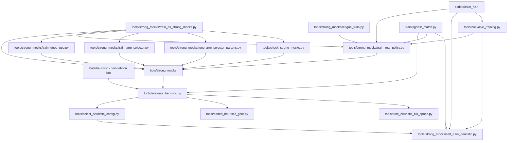
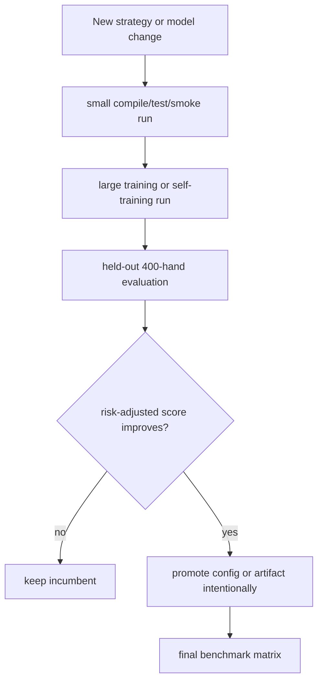

# Training Pipelines

Reviewed: 2026-05-29.

This is the canonical guide for local-only training and benchmark pipelines.
Use it together with `docs/strategy-and-training.md`; the older fragmented
real-training, league, strong-mock, fast-runner, and coevolution notes were
consolidated into these two files.

The competition submission remains `bots/heuristic`. Everything in this file is
offline infrastructure for building better tests, tuning heuristic parameters,
or training benchmark-only mock opponents.

For the overall strategy and file map, see `docs/strategy-and-training.md`.
For the full-space heuristic optimizer design and references, see
`docs/heuristic-full-space-optimization.md`.
For the rollout-search mock's exact equity, f/g sizing, and tuning logic, see
`docs/rollout-search.md`.

## Pipeline Map



## Entry Points

| Entry point | Use when | Output |
| --- | --- | --- |
| `scripts/build_tuned_submission.sh` | Full unattended path: train/gate strong mocks, tune full heuristic env space, bake the best tuned env into the submission zip, then run the submission pipeline. | `runs/tuned_submission/<run-id>/`, `runs/heuristic_full_space_tuning/<run-id>/`, and `dist/heuristic_bot.zip` |
| `scripts/run_submission_pipeline.sh` | One-command unattended submission hardening, paired gates, strong/mock screens, final matrix, and zip rebuild. | `runs/submission_pipeline/<run-id>/` plus `dist/heuristic_bot.zip` |
| `scripts/train_e2e_coevolution.sh` | Alternating PPO mock training and heuristic parameter evolution. | `runs/fullhouse_coevolution/<run-id>/` |
| `scripts/train_all_strong_mocks.sh` | Train oracle imitation, PPO, bucket/CFR, deep PPO, heuristic selector, tune selector params, then gate all seven strong mocks. | `runs/fullhouse_strong_mocks/<run-id>/` plus promoted mock artifacts |
| `scripts/train_opponents_real.sh` | Lower-level PPO and bucket/CFR-only trainer kept for targeted experiments. | `runs/fullhouse_real_training/<run-id>/` and optional mock artifacts |
| `scripts/train_heuristics_selfplay.sh` | Evolve heuristic env-config variants against mock pools and validate the current baseline. | `runs/fullhouse_self_training/<run-id>/` |
| `tools/tune_heuristic_full_space.py` | Search the full `HEURISTIC_*` env parameter space with staged CEM/racing. | `runs/heuristic_full_space_tuning/<run-id>/` |
| `tools/strong_mocks/train_all_strong_mocks.py` | Python orchestrator behind the all-strong-mock script. | `runs/fullhouse_strong_mocks/<run-id>/summary.json` |
| `tools/strong_mocks/train_real_policy.py` | Direct low-level PPO or bucket training. | One `policy.npz` artifact plus JSONL logs |
| `tools/strong_mocks/train_deep_ppo.py` | Independent deep PPO mock with 14 action arms. | `bots/strong_mocks/ppo_deep_policy/data/policy.npz` or a custom output |
| `tools/strong_mocks/train_arm_selector.py` | Heuristic expert-arm selector training; preferred RL-assisted architecture. | `bots/strong_mocks/heuristic_rl_selector/data/policy.npz` or a custom output |
| `tools/strong_mocks/tune_arm_selector_params.py` | CEM/racing tuner for selector thresholds and bet-sizing constants. | `runs/arm_selector_param_tuning/<run-id>/` plus optional promoted `params.npz` |
| `tools/strong_mocks/tune_rollout_search.py` | CEM/racing tuner for rollout-search f/g equity-to-sizing functions. | `runs/rollout_search_tuning/<run-id>/best_params.json` and a generated `best_bot/` wrapper |
| `tools/paired_heuristic_gate.py` | Paired incumbent-vs-candidate default-promotion checks on identical suite/seed tasks. | JSON report with paired mean/median/p10/win-rate and promotable flag |
| `tools/check_strong_mocks.py` | Strength gate for every strong-mock bot against default/reference bots. | JSON report with per-candidate pass/fail and suite breakdowns |
| `tools/strong_mocks/league_train.py` | Staged train/eval pools and promotion gates. | `runs/fullhouse_league_training/<run-id>/` plus optional promoted artifact |
| `training/fast_match.py` | Fast unrestricted local matches for training/evaluation. | JSON summaries |

Run outputs are stored under `runs/`, which is git-ignored. Do not put large or
temporary training outputs in `/private/tmp`; repo-local runs are easier to
inspect and resume.

## Recommended Workflow



Default principle: train on one pool, evaluate on a held-out pool, and promote
only after the held-out score and bust rate are acceptable.

The run-and-forget submission command is:

```bash
WORKERS=0 PARALLEL_BACKEND=process scripts/build_tuned_submission.sh
```

It trains and gates the strong mocks, runs full-space heuristic tuning, writes a
structured `best_env.json`, bakes those tuned `HEURISTIC_*` defaults into the
packaged `bot.py`, runs the submission pipeline against the same tuned env, and
leaves the upload candidate at `dist/heuristic_bot.zip`.

For a 24-hour deadline on the current 8-core laptop, use the deadline profile:

```bash
TRAIN_STRONG_MOCKS=0 \
TUNE_PROFILE=deadline-24h \
SUBMISSION_PROFILE=deadline-24h \
WORKERS=0 \
PARALLEL_BACKEND=process \
scripts/build_tuned_submission.sh
```

This is the smallest non-smoke full-space tuning budget accepted by
`tools/tune_heuristic_full_space.py`: 3 generations, 16 candidates, 4 elites,
and stages `128:400:0.5,256:400:0.25`. It keeps 512 suite/seed tasks per
candidate in stage 1 and 1024 tasks per finalist in stage 2, then runs the
required 1024-task final validation. The deadline submission profile skips the
broad paired, strong, mock-family, and final matrices and instead runs the
rollout-search gate last.

`TRAIN_STRONG_MOCKS=0` is intentional for the 24-hour path: it reuses existing
strong mocks and spends the deadline on heuristic tuning plus the final
rollout-search decision gate. Omit it only if the deadline includes enough time
to retrain and gate the strong-mock pool first.

To rerun only the final packaging and validation from an existing tuning run:

```bash
TRAIN_STRONG_MOCKS=0 \
RUN_TUNING=0 \
HEURISTIC_ENV_FILE=runs/heuristic_full_space_tuning/<run-id>/best_env.json \
WORKERS=0 \
PARALLEL_BACKEND=process \
scripts/build_tuned_submission.sh
```

The lower-level submission pipeline still works directly. When
`HEURISTIC_ENV_FILE` is set, it evaluates that env as `tuned-env` and passes the
same file to `tools/harden_submission.py`, which bakes the values into the zip:

```bash
HEURISTIC_ENV_FILE=runs/heuristic_full_space_tuning/<run-id>/best_env.json \
WORKERS=0 \
PARALLEL_BACKEND=process \
scripts/run_submission_pipeline.sh
```

To optimize rollout search first and use that tuned wrapper in the final
rollout gate, set `ROLLOUT_FINAL_BOT_PATH`:

```bash
ROLLOUT_RUN_ID=rollout-final-$(date +%Y%m%d-%H%M%S) && \
BUILD_RUN_ID=tuned-final-$(date +%Y%m%d-%H%M%S) && \
poetry run python tools/strong_mocks/tune_rollout_search.py \
  --run-id "$ROLLOUT_RUN_ID" \
  --generations 4 \
  --population 12 \
  --elite 3 \
  --stages 4:120:0.5,12:240:0.5 \
  --workers 0 \
  --parallel-backend process \
  --progress \
  --json && \
TRAIN_STRONG_MOCKS=0 \
RUN_ID="$BUILD_RUN_ID" \
TUNE_PROFILE=deadline-24h \
SUBMISSION_PROFILE=deadline-24h \
ROLLOUT_FINAL_BOT_PATH="runs/rollout_search_tuning/${ROLLOUT_RUN_ID}/best_bot" \
WORKERS=0 \
PARALLEL_BACKEND=process \
scripts/build_tuned_submission.sh
```

The final report to inspect is
`runs/submission_pipeline/${BUILD_RUN_ID}-submission/final_rollout_gate.json`.
The packaged zip is still `dist/heuristic_bot.zip`.

For submitted-bot default changes, use paired comparisons after smoke tests:

```bash
poetry run python tools/paired_heuristic_gate.py \
  --incumbent baseline \
  --candidate profile-targeting-off \
  --preset promotion \
  --workers 0 \
  --parallel-backend process \
  --progress \
  --json
```

The gate is intentionally conservative: paired mean and median must improve,
the bootstrap confidence interval lower bound for paired mean difference must
be positive, the 10th-percentile paired difference cannot collapse, win rate
must clear the configured threshold, at least 100 paired match tasks must be
present, and errors/busts cannot regress beyond the allowed cap.

## Cumulative Runs

The bash wrappers are cumulative by default:

- repeated `RUN_ID=coevolve-current scripts/train_e2e_coevolution.sh` resumes
  from the latest selected heuristic and PPO artifacts recorded in `state.json`,
- set `RESET=1` only when intentionally starting a clean run,
- `PROMOTE_PPO=1` is required before coevolution overwrites the canonical
  `bots/strong_mocks/ppo_policy/data/policy.npz`,
- generated training artifacts should stay out of git unless explicitly
  promoted.

## Strong Mock Training

Read `docs/strategy-and-training.md` before changing strong-mock runtime or
training code. PPO, deep PPO, CFR/bucket, rollout, ensemble, and arm-selector
mock roles are summarized there.

The primary command trains and tunes the entire strong-mock pool:

```bash
WORKERS=0 PARALLEL_BACKEND=process scripts/train_all_strong_mocks.sh
```

By default this trains:

- `oracle_imitation` from 200,000 synthetic oracle-labeled states,
- `ppo_policy` for 48 generations * 128 matches * 400 hands,
- `cfr_bucket` for 40 generations * 128 matches * 400 hands,
- `ppo_deep_policy` for 24 generations * 128 matches * 400 hands,
- `heuristic_rl_selector` for 24 generations * 128 matches * 400 hands,
- `heuristic_rl_selector/data/params.npz` with CEM/racing stages
  `16:400:0.35,64:400:1.0`,
- `rollout_search` and `ensemble` through the final strength gate.

The run writes per-stage JSON reports and `summary.json` under:

```text
runs/fullhouse_strong_mocks/<run-id>/
```

The command exits nonzero if the final `tools/check_strong_mocks.py` gate fails.
For wiring checks only, use `ALLOW_SMOKE=1` with tiny budgets; smoke artifacts
are written under the run directory and are not promoted to canonical bot data.

Current PPO defaults inside the strong-mock pool are intentionally conservative:

- sampled-softmax inference to match rollout behavior,
- recorded behavior temperature for PPO ratio calculations,
- frozen feature normalization by default,
- clipped PPO-style policy update with a value baseline,
- replay over recent generations,
- strategic all-in and large-call-off masks,
- risk-adjusted checkpoint selection with a bust penalty.

If the original PPO mock is being trained in another terminal, do not edit or
overwrite `bots/strong_mocks/ppo_policy`. Use the independent deep variant for
isolated experiments:

```bash
poetry run python tools/strong_mocks/train_deep_ppo.py \
  --output bots/strong_mocks/ppo_deep_policy/data/policy.npz \
  --hidden 96,64,32 \
  --bootstrap-samples 60000 \
  --bootstrap-holdout 12000 \
  --generations 24 \
  --matches-per-generation 128 \
  --hands 400 \
  --opponent-pool adversarial \
  --progress \
  --json
```

For the heuristic-guided RL direction, use the arm-selector variant instead of
adding more raw-action PPO masks:

```bash
poetry run python tools/strong_mocks/train_arm_selector.py \
  --output bots/strong_mocks/heuristic_rl_selector/data/policy.npz \
  --bootstrap-samples 60000 \
  --bootstrap-holdout 12000 \
  --bootstrap-epochs 5 \
  --generations 24 \
  --matches-per-generation 128 \
  --hands 400 \
  --opponent-pool adversarial \
  --workers 0 \
  --parallel-backend process \
  --progress \
  --json
```

Small selector runs are allowed only as integration checks when `--allow-smoke`
is used with a non-canonical output path. Do not manually change thresholds,
arm priors, or default constants from smoke-run chip deltas. Use the large
held-out promotion rules below before changing defaults.

For isolated selector-parameter experiments, use CEM/racing rather than manual
source edits:

```bash
poetry run python tools/strong_mocks/tune_arm_selector_params.py \
  --run-id arm-selector-cem-$(date +%Y%m%d-%H%M%S) \
  --generations 6 \
  --population 32 \
  --stages 16:400:0.35,64:400:1.0 \
  --workers 0 \
  --parallel-backend process \
  --progress \
  --json
```

The script uses common seed blocks inside each stage and refuses weak final
stage budgets unless `--allow-smoke` is explicitly set. To promote a candidate,
rerun or resume with an intentional output target:

```bash
poetry run python tools/strong_mocks/tune_arm_selector_params.py \
  --run-id arm-selector-cem-reviewed \
  --promote-output bots/strong_mocks/heuristic_rl_selector/data/params.npz \
  --generations 6 \
  --population 32 \
  --stages 16:400:0.35,64:400:1.0 \
  --workers 0 \
  --parallel-backend process \
  --progress \
  --json
```

Do not use `--allow-smoke` with `--promote-output`.

Use large enough samples. For meaningful selection, prefer at least:

```text
384 matches/generation * 400 hands for heuristic self-training
512 suite/seed tasks per named threshold config
512 suite/seed tasks per tuner stage, 1024 final-stage tasks per candidate
512 default/reference tasks per strong-mock candidate gate
1,000,000 real rollout training hands before exporting trained strong-mock artifacts
128-256 held-out evaluation seeds * 400 hands
```

Smaller runs are smoke tests only.

## Full-Space Heuristic Search

`tools/tune_heuristic_full_space.py` is the scalable search path for the full
heuristic parameter surface. It parses every `_float_env()` and `_int_env()`
knob in `bots/heuristic/bot.py`, excluding only `HEURISTIC_RNG_SEED`, then
uses a diagonal cross-entropy search with staged common-seed racing. The score
is risk-adjusted: mean chip delta is penalized for standard deviation, worst
suite minima, busts, and heuristic errors.

Normal serious run:

```bash
poetry run python tools/tune_heuristic_full_space.py \
  --run-id heuristic-full-space-$(date +%Y%m%d-%H%M%S) \
  --preset strong-screen \
  --generations 6 \
  --population 24 \
  --elite 6 \
  --stages 128:400:0.5,256:400:0.25 \
  --workers 0 \
  --parallel-backend process \
  --progress \
  --json
```

With the default four-suite `strong-screen` preset, each candidate gets at
least 512 suite/seed tasks in the first stage and finalists get 1024 tasks in
the final stage. The tool refuses smaller serious runs unless `--allow-smoke`
is passed. Smoke output is for wiring only; do not promote from it.

Important files:

| File | Meaning |
| --- | --- |
| `param_space.json` | Parsed parameter names, types, defaults, and search bounds. |
| `generation_*.json` | Stage rankings and survivor details for each generation. |
| `best_config.json` | Best risk-adjusted candidate seen so far. |
| `best_env.json` | Structured env overrides used by tuned packaging and pipeline gates. |
| `best_env.sh` | Shell exports for reproducing the best candidate. |
| `final_validation.json` | Independent held-out validation of the selected env. |
| `metrics.jsonl` | Per-generation score trace. |
| `ev_progress.svg` | Progress plot from the metric trace. |
| `summary.json` | Run contract and output locations. |

## Main Commands

End-to-end coevolution:

```bash
WORKERS=0 PARALLEL_BACKEND=process scripts/train_e2e_coevolution.sh
```

The coevolution wrapper now uses serious defaults: each PPO candidate arm gets
at least 1,000,000 rollout hands, heuristic evolution uses 384 matches per
generation, and held-out evaluation uses at least 128 seeds of 400 hands.

Clean PPO-fix sanity run:

```bash
RUN_ID=ppo-fix-check \
RESET=1 \
CYCLES=2 \
PPO_ARMS=stable,conservative \
EVAL_SEEDS=128 \
EVAL_HANDS=400 \
WORKERS=0 \
PARALLEL_BACKEND=process \
scripts/train_e2e_coevolution.sh
```

All strong-mock training:

```bash
WORKERS=0 PARALLEL_BACKEND=process scripts/train_all_strong_mocks.sh
```

This is the main opponent-building path. It trains the learned strong mocks,
tunes the selector parameters, includes the nonlearned rollout and ensemble
wrappers in the final gate, and writes:

```text
runs/fullhouse_strong_mocks/<run-id>/summary.json
runs/fullhouse_strong_mocks/<run-id>/strong_mock_gate.json
```

The final gate covers `oracle_imitation`, `ppo_policy`, `cfr_bucket`,
`ppo_deep_policy`, `heuristic_rl_selector`, `rollout_search`, and `ensemble`
against `shark`, `mathematician`, `aggressor`, `template`, and `pot_odds` in
both six-max and heads-up tasks. A candidate must clear the configured mean,
win-rate, task-count, and zero-error thresholds.

Rollout-search f/g tuning:

```bash
poetry run python tools/strong_mocks/tune_rollout_search.py \
  --generations 4 \
  --population 12 \
  --elite 3 \
  --stages 4:120:0.5,12:240:0.5 \
  --workers 0 \
  --parallel-backend process \
  --progress \
  --json
```

The rollout mock uses 1024 eval7 samples for preflop and postflop equity. The
tuner searches a smooth monotone `f(equity)` raise-size function for spots where
the bot can check and a contextual `g(equity, pot_odds, active_players,
owed/pot)` fold/call/raise-size function when facing a bet. It uses staged
common-seed CEM/racing instead of brute-force threshold grids and fails early if
representative 1024-sample decisions exceed the 2-second action budget.

Targeted PPO/bucket-only training:

```bash
OPPONENT_POOL=adversarial \
PPO_GENERATIONS=48 \
PPO_MATCHES_PER_GENERATION=128 \
PPO_HANDS=400 \
BUCKET_GENERATIONS=160 \
BUCKET_MATCHES_PER_GENERATION=128 \
BUCKET_HANDS=400 \
WORKERS=0 \
PARALLEL_BACKEND=process \
scripts/train_opponents_real.sh
```

This older wrapper trains only PPO and bucket/CFR-like artifacts with at least
400-hand matches, then validates the existing strong-mock wrappers and writes a
strength gate to:

```text
runs/fullhouse_real_training/<run-id>/strong_mock_strength_gate.json
```

Heuristic self-training:

```bash
WORKERS=0 PARALLEL_BACKEND=process scripts/train_heuristics_selfplay.sh
```

By default this runs 16 generations with 384 matches/generation and validates
with 256 held-out `strong-screen` seeds. It writes one run directory:

```text
runs/fullhouse_self_training/<run-id>/
```

Important files:

| File | Meaning |
| --- | --- |
| `summary.json` | Run contract, final population, top-per-generation history, and plot metadata. |
| `metrics.jsonl` | Per-generation `generation_best` and `elite_mean` EV records. |
| `ev_progress.svg` | Progress plot rendered from `metrics.jsonl`. |
| `generation_*.json` | Full per-generation rankings and match results. |
| `population_*.json` | Next-generation populations after elite selection and mutation. |
| `generated/` | Generated heuristic wrapper bots/configs for this run. |
| `baseline_validation.json` | Focused `strong-screen` validation of the current baseline after self-training. |

## Promotion Rules

Do not promote from a smoke test. A candidate is promotable only if:

- validator and focused tests pass,
- held-out mean improves or risk-adjusted score improves,
- bust rate does not regress materially,
- performance is not driven by one suite or one seed cluster,
- generated artifact/config is intentionally copied into the canonical bot path.

## Validation

```bash
poetry run pytest -q
poetry run python sandbox/validator.py bots/heuristic --json
poetry run python sandbox/validator.py bots/strong_mocks/ppo_policy --json
poetry run python sandbox/validator.py bots/strong_mocks/cfr_bucket --json
bash -n scripts/train_e2e_coevolution.sh
bash -n scripts/train_all_strong_mocks.sh
bash -n scripts/train_opponents_real.sh
bash -n scripts/train_heuristics_selfplay.sh
```
